# 1 协程与线程的区别

线程和进程都是同步机制，而协程是异步机制。
线程是抢占式，而协程是非抢占式的。需要用户释放使用权切换到其他协程，因此同一时间其实只有一个协程拥有运行权，相当于单线程的能力。
一个线程可以有多个协程，一个进程也可以有多个协程。
协程不被操作系统内核管理，而完全是由程序控制。线程是被分割的CPU资源，协程是组织好的代码流程，线程是协程的资源。但协程不会直接使用线程，协程直接利用的是执行器关联任意线程或线程池。
协程能保留上一次调用时的状态。


# 2 并行和并发有什么区别？

Parallelism and Concurrency

并发就是在一段时间内，多个任务都会被处理；但在某一时刻，只有一个任务在执行。单核处理器做到的并发，其实是利用时间片的轮转，例如有两个进程 A 和 B，A 运行一个时间片之后，切换到 B，B 运行一个时间片之后又切换到 A。因为切换速度足够快，所以宏观上表现为在一段时间内能同时运行多个程序。

并行就是在同一时刻，有多个任务在执行。这个需要多核处理器才能完成，在微观上就能同时执行多条指令，不同的程序被放到不同的处理器上运行，这个是物理上的多个进程同时进行。


并发和并行


# 3 线程和进程的关系 

## 3.1 什么是进程和线程？

- **进程（Process）** 是指计算机中正在运行的一个程序实例。举例：你打开的微信就是一个进程。
- **线程（Thread）** 也被称为轻量级进程，更加轻量。多个线程可以在同一个进程中同时执行，并且共享进程的资源比如内存空间、文件句柄、网络连接等。举例：你打开的微信里就有一个线程专门用来拉取别人发你的最新的消息。

- 进程切换是一个开销很大的操作，线程切换的成本较低。
- 线程更轻量，一个进程可以创建多个线程。
- 多个线程可以并发处理不同的任务，更有效地利用了多处理器和多核计算机。而进程只能在一个时间干一件事，如果在执行过程中遇到阻塞问题比如 IO 阻塞就会挂起直到结果返回。
- 同一进程内的线程共享内存和文件，因此它们之间相互通信无须调用内核。


## 3.2 为什么要使用多线程?

先从总体上来说：
- **从计算机底层来说：** 线程可以比作是轻量级的进程，是程序执行的最小单位,线程间的切换和调度的成本远远小于进程。另外，多核 CPU 时代意味着多个线程可以同时运行，这减少了线程上下文切换的开销。
- **从当代互联网发展趋势来说：** 现在的系统动不动就要求百万级甚至千万级的并发量，而多线程并发编程正是开发高并发系统的基础，利用好多线程机制可以大大提高系统整体的并发能力以及性能。

再深入到计算机底层来探讨：
- **单核时代**： 在单核时代多线程主要是为了提高单进程利用 CPU 和 IO 系统的效率。 假设只运行了一个 Java 进程的情况，当我们请求 IO 的时候，如果 Java 进程中只有一个线程，此线程被 IO 阻塞则整个进程被阻塞。CPU 和 IO 设备只有一个在运行，那么可以简单地说系统整体效率只有 50%。当使用多线程的时候，一个线程被 IO 阻塞，其他线程还可以继续使用 CPU。从而提高了 Java 进程利用系统资源的整体效率。
- **多核时代**: 多核时代多线程主要是为了提高进程利用多核 CPU 的能力。举个例子：假如我们要计算一个复杂的任务，我们只用一个线程的话，不论系统有几个 CPU 核心，都只会有一个 CPU 核心被利用到。而创建多个线程，这些线程可以被映射到底层多个 CPU 上执行，在任务中的多个线程没有资源竞争的情况下，任务执行的效率会有显著性的提高，约等于（单核时执行时间/CPU 核心数）

## 3.3 进程和线程的区别是什么？

下图是 Java 内存区域，我们从 JVM 的角度来说一下线程和进程之间的关系吧！

[](https://img2023.cnblogs.com/blog/1843652/202304/1843652-20230413085153985-1715310371.png)

从上图可以看出：一个进程中可以有多个线程，多个线程共享进程的**堆**和**方法区 (JDK1.8 之后的元空间)**资源，但是每个线程有自己的**程序计数器**、**虚拟机栈** 和 **本地方法栈**。

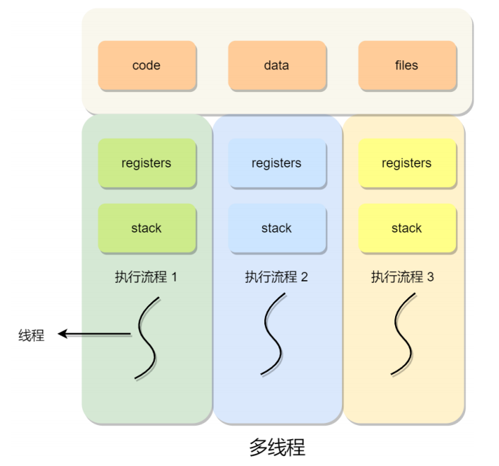

**线程是进程当中的⼀条执⾏流程。**

同⼀个进程内多个线程之间可以共享代码段、数据段、打开的⽂件等资源，但每个线程各⾃都有⼀套独⽴的寄存器和栈，这样可以确保线程的控制流是相对独⽴的。

**总结：**
- 线程是进程划分成的更小的运行单位,一个进程在其执行的过程中可以产生多个线程。
- 线程和进程最大的不同在于基本上各进程是独立的，而各线程则不一定，因为同一进程中的线程极有可能会相互影响。
- 线程执行开销小，但不利于资源的管理和保护；而进程正相反。

线程与进程的⽐较如下：
- 调度：**进程是资源（包括内存、打开的⽂件等）分配的单位**，**线程是 CPU 调度的单位**；
- 资源：进程拥有⼀个完整的资源平台，⽽线程只独享必不可少的资源，如寄存器和栈；
- 拥有资源：线程同样具有就绪、阻塞、执⾏三种基本状态，同样具有状态之间的转换关系；
- 系统开销：线程能减少并发执⾏的时间和空间开销——创建或撤销进程时，系统都要为之分配或回收系统资源，如内存空间，I/O 设备等，OS 所付出的开销显著大于在创建或撤销线程时的开销，进程切换的开销也远大于线程切换的开销。


# 4 进程与线程的切换流程

进程切换分两步：

1、切换**页表**以使用新的地址空间，一旦去切换上下文，处理器中所有已经缓存的内存地址一瞬间都作废了。

2、切换内核栈和硬件上下文。

对于linux来说，线程和进程的最大区别就在于地址空间，对于线程切换，第1步是不需要做的，第2步是进程和线程切换都要做的。

因为每个进程都有自己的虚拟地址空间，而线程是共享所在进程的虚拟地址空间的，因此同一个进程中的线程进行线程切换时不涉及虚拟地址空间的转换。


## 4.1 什么是进程上下文切换？

对于单核单线程 CPU 而言，在某一时刻只能执行一条 CPU 指令。上下文切换 (Context Switch) 是一种将 CPU 资源从一个进程分配给另一个进程的机制。从用户角度看，计算机能够并行运行多个进程，这恰恰是操作系统通过快速上下文切换造成的结果。在切换的过程中，操作系统需要先存储当前进程的状态 (包括内存空间的指针，当前执行完的指令等等)，再读入下一个进程的状态，然后执行此进程。

## 4.2 线程上下文切换了解吗？

这还得看线程是不是属于同⼀个进程：
- 当两个线程不是属于同⼀个进程，则切换的过程就跟进程上下⽂切换⼀样；
- **当两个线程是属于同⼀个进程，因为虚拟内存是共享的，所以在切换时，虚拟内存这些资源就保持不动，只需要切换线程的私有数据、寄存器等不共享的数据**；

所以，线程的上下⽂切换相⽐进程，开销要⼩很多。


# 5 进程


## 5.1 **为什么虚拟地址空间切换会比较耗时？**

进程都有自己的虚拟地址空间，把虚拟地址转换为物理地址需要查找页表，页表查找是一个很慢的过程，因此通常使用Cache来缓存常用的地址映射，这样可以加速页表查找，这个Cache就是TLB（translation Lookaside Buffer，TLB本质上就是一个Cache，是用来加速页表查找的）。

由于每个进程都有自己的虚拟地址空间，那么显然每个进程都有自己的页表，那么**当进程切换后页表也要进行切换，页表切换后TLB就失效了**，Cache失效导致命中率降低，那么虚拟地址转换为物理地址就会变慢，表现出来的就是程序运行会变慢，而线程切换则不会导致TLB失效，因为线程无需切换地址空间，因此我们通常说线程切换要比较进程切换块，原因就在这里。

## 5.2 PCB 是什么？包含哪些信息？

**PCB（Process Control Block）** 即进程控制块，是操作系统中用来管理和跟踪进程的数据结构，每个进程都对应着一个独立的 PCB。你可以将 PCB 视为进程的大脑。

当操作系统创建一个新进程时，会为该进程分配一个唯一的进程 ID，并且为该进程创建一个对应的进程控制块。当进程执行时，PCB 中的信息会不断变化，操作系统会根据这些信息来管理和调度进程。

PCB 主要包含下面几部分的内容：
- 进程的描述信息，包括进程的名称、标识符等等；
- 进程的调度信息，包括进程阻塞原因、进程状态（就绪、运行、阻塞等）、进程优先级（标识进程的重要程度）等等；
- 进程对资源的需求情况，包括 CPU 时间、内存空间、I/O 设备等等。
- 进程打开的文件信息，包括文件描述符、文件类型、打开模式等等。
- 处理机的状态信息（由处理机的各种寄存器中的内容组成的），包括通用寄存器、指令计数器、程序状态字 PSW、用户栈指针。


## 5.3 进程有哪些状态？


我们一般把进程大致分为 5 种状态，这一点和线程很像！

- **创建状态(new)** ：进程正在被创建，尚未到就绪状态。
- **就绪状态(ready)** ：进程已处于准备运行状态，即进程获得了除了处理器之外的一切所需资源，一旦得到处理器资源(处理器分配的时间片)即可运行。
- **运行状态(running)** ：进程正在处理器上运行(单核 CPU 下任意时刻只有一个进程处于运行状态)。
- **阻塞状态(waiting)** ：又称为等待状态，进程正在等待某一事件而暂停运行如等待某资源为可用或等待 IO 操作完成。即使处理器空闲，该进程也不能运行。
- **结束状态(terminated)** ：进程正在从系统中消失。可能是进程正常结束或其他原因中断退出运行。

[](https://img2023.cnblogs.com/blog/1843652/202304/1843652-20230413085153914-631370785.png)


----


当一个进程开始运行时，它可能会经历下面这几种状态：
调度程序: scheduler

上图中各个状态的意义：
- 运⾏状态（_Runing_）：该时刻进程占⽤ CPU；
- 就绪状态（_Ready_）：可运⾏，由于其他进程处于运⾏状态⽽暂时停⽌运⾏；
- 阻塞状态（_Blocked_）：该进程正在等待某⼀事件发⽣（如等待输⼊/输出操作的完成）⽽暂时停⽌运⾏，这时，即使给它 CPU 控制权，它也⽆法运⾏；


进程3种状态

当然，进程还有另外两个基本状态：
- 创建状态（_new_）：进程正在被创建时的状态；
- 结束状态（_Exit_）：进程正在从系统中消失时的状态；


进程5种状态

## 5.4 僵尸进程和孤儿进程
Zombie Process and Orphan Process 

我们知道在unix/linux中，正常情况下，子进程是通过父进程创建的，子进程在创建新的进程。子进程的结束和父进程的运行是一个异步过程,即父进程永远无法预测子进程 到底什么时候结束。 当一个 进程完成它的工作终止之后，它的父进程需要调用wait()或者waitpid()系统调用取得子进程的终止状态。


在 Unix/Linux 系统中，子进程通常是通过 fork()系统调用创建的，该调用会创建一个新的进程，该进程是原有进程的一个副本。子进程和父进程的运行是相互独立的，它们各自拥有自己的 PCB，即使父进程结束了，子进程仍然可以继续运行。

当一个进程调用 exit()系统调用结束自己的生命时，内核会释放该进程的所有资源，包括打开的文件、占用的内存等，但是该进程对应的 PCB 依然存在于系统中。这些信息只有在父进程调用 wait()或 waitpid()系统调用时才会被释放，以便让父进程得到子进程的状态信息。

这样的设计可以让父进程在子进程结束时得到子进程的状态信息，并且可以防止出现“僵尸进程”（即子进程结束后 PCB 仍然存在但父进程无法得到状态信息的情况）。


1  僵尸进程 
僵尸进程是已完成且处于终止状态，但在进程表中却仍然存在的进程。
僵尸进程一般发生有父子关系的进程中，一个子进程的进程描述符在子进程退出时不会释放

一个进程使用fork创建子进程，如果子进程退出，而父进程并没有调用wait或waitpid获取子进程的状态信息，那么子进程的进程描述符仍然保存在系统中。这种进程称之为僵死进程。

只有当父进程通过 wait() 或 waitpid() 获取了子进程信息后才会释放。如果子进程退出，而父进程并没有调用 wait() 或 waitpid()，那么子进程的进程描述符仍然保存在系统中。

子进程已经终止，但是其父进程仍在运行，且父进程没有调用 wait()或 waitpid()等系统调用来获取子进程的状态信息，释放子进程占用的资源，导致子进程的 PCB 依然存在于系统中，但无法被进一步使用。这种情况下，子进程被称为“僵尸进程”。避免僵尸进程的产生，父进程需要及时调用 wait()或 waitpid()系统调用来回收子进程。

2  孤儿进程
一个父进程退出，而它的一个或多个子进程还在运行，那么那些子进程将成为孤儿进程。孤儿进程将被init进程(进程号为1)所收养，并由init进程对它们完成状态收集工作。因为孤儿进程会被 init 进程收养，所以孤儿进程不会对系统造成危害。

一个进程的父进程已经终止或者不存在，但是该进程仍在运行。这种情况下，该进程就是孤儿进程。孤儿进程通常是由于父进程意外终止或未及时调用 wait()或 waitpid()等系统调用来回收子进程导致的。为了避免孤儿进程占用系统资源，操作系统会将孤儿进程的父进程设置为 init 进程（进程号为 1），由 init 进程来回收孤儿进程的资源。


### 5.4.1 问题及危害

unix提供了一种机制可以保证只要父进程想知道子进程结束时的状态信息， 就可以得到。
这种机制就是: 在每个进程退出的时候,内核释放该进程所有的资源,包括打开的文件,占用的内存等。 但是仍然为其保留一定的信息(包括进程号the process ID,退出状态the termination status of the process,运行时间the amount of CPU time taken by the process等)。直到父进程通过wait / waitpid来取时才释放。 但这样就导致了问题，如果进程不调用wait / waitpid的话， 那么保留的那段信息就不会释放，其进程号就会一直被占用，但是系统所能使用的进程号是有限的，如果大量的产生僵死进程，将因为没有可用的进程号而导致系统不能产生新的进程. 此即为僵尸进程的危害，应当避免。

孤儿进程是没有父进程的进程，孤儿进程这个重任就落到了init进程身上，init进程就好像是一个民政局，专门负责处理孤儿进程的善后工作。每当出现一个孤儿进程的时候，内核就把孤 儿进程的父进程设置为init，而init进程会循环地wait()它的已经退出的子进程。这样，当一个孤儿进程凄凉地结束了其生命周期的时候，init进程就会代表党和政府出面处理它的一切善后工作。因此孤儿进程并不会有什么危害。

任何一个子进程 (init除外) 在exit()之后，并非马上就消失掉，而是留下一个称为僵尸进程(Zombie)的数据结构，等待父进程处理。这是每个 子进程在结束时都要经过的阶段。如果子进程在exit()之后，父进程没有来得及处理，这时用ps命令就能看到子进程的状态是“Z”。如果父进程能及时 处理，可能用ps命令就来不及看到子进程的僵尸状态，但这并不等于子进程不经过僵尸状态。  如果父进程在子进程结束之前退出，则子进程将由init接管。init将会以父进程的身份对僵尸状态的子进程进行处理。

僵尸进程危害场景：

例如有个进程，它定期的产生一个子进程，这个子进程需要做的事情很少，做完它该做的事情之后就退出了，因此这个子进程的生命周期很短，但是，父进程只管生成新的子进程，至于子进程 退出之后的事情，则一概不闻不问，这样，系统运行上一段时间之后，系统中就会存在很多的僵死进程，倘若用ps命令查看的话，就会看到很多状态为Z的进程。 严格地来说，僵死进程并不是问题的根源，罪魁祸首是产生出大量僵死进程的那个父进程。因此，当我们寻求如何消灭系统中大量的僵死进程时，答案就是把产生大 量僵死进程的那个元凶枪毙掉（也就是通过kill发送SIGTERM或者SIGKILL信号啦）。枪毙了元凶进程之后，它产生的僵死进程就变成了孤儿进 程，这些孤儿进程会被init进程接管，init进程会wait()这些孤儿进程，释放它们占用的系统进程表中的资源，这样，这些已经僵死的孤儿进程 就能瞑目而去了


### 5.4.2 如何查看是否有僵尸进程？


Linux 下可以使用 Top 命令查找，`zombie` 值表示僵尸进程的数量，为 0 则代表没有僵尸进程。

[](https://img2023.cnblogs.com/blog/1843652/202304/1843652-20230413085154019-1535701095.jpg)

下面这个命令可以定位僵尸进程以及该僵尸进程的父进程：

```bash
ps -A -ostat,ppid,pid,cmd |grep -e '^[Zz]'
```
### 5.4.3 僵尸进程解决办法

**（1）通过信号机制**
　　子进程退出时向父进程发送SIGCHILD信号，父进程处理SIGCHILD信号。在信号处理函数中调用wait进行处理僵尸进程。测试程序如下所示：

```C++
#include <stdio.h>
#include <unistd.h>
#include <errno.h>
#include <stdlib.h>
#include <signal.h>

static void sig_child(int signo);

int main()
{
    pid_t pid;
    //创建捕捉子进程退出信号
    signal(SIGCHLD,sig_child);
    pid = fork();
    if (pid < 0)
    {
        perror("fork error:");
        exit(1);
    }
    else if (pid == 0)
    {
        printf("I am child process,pid id %d.I am exiting.\n",getpid());
        exit(0);
    }
    printf("I am father process.I will sleep two seconds\n");
    //等待子进程先退出
    sleep(2);
    //输出进程信息
    system("ps -o pid,ppid,state,tty,command");
    printf("father process is exiting.\n");
    return 0;
}

static void sig_child(int signo)
{
     pid_t        pid;
     int        stat;
     //处理僵尸进程
     while ((pid = waitpid(-1, &stat, WNOHANG)) >0)
            printf("child %d terminated.\n", pid);
}
```


（2）fork两次
　　《Unix 环境高级编程》8.6节说的非常详细。原理是将子进程成为孤儿进程，从而其的父进程变为init进程，通过init进程可以处理僵尸进程。测试程序如下所示：
fork 一次就创建一次子进程 

``` c++
#include <stdio.h>
#include <stdlib.h>
#include <unistd.h>
#include <errno.h>

int main()
{
    pid_t  pid;
    //创建第一个子进程
    pid = fork();
    if (pid < 0)
    {
        perror("fork error:");
        exit(1);
    }
    //第一个子进程
    else if (pid == 0)
    {
        //子进程再创建子进程
        printf("I am the first child process.pid:%d\tppid:%d\n",getpid(),getppid());
        pid = fork();
        if (pid < 0)
        {
            perror("fork error:");
            exit(1);
        }
        //第一个子进程退出
        else if (pid >0)
        {
            printf("first procee is exited.\n");
            exit(0);
        }
        //第二个子进程
        //睡眠3s保证第一个子进程退出，这样第二个子进程的父亲就是init进程里
        sleep(3);
        printf("I am the second child process.pid: %d\tppid:%d\n",getpid(),getppid());
        exit(0);
    }
    //父进程处理第一个子进程退出
    if (waitpid(pid, NULL, 0) != pid)
    {
        perror("waitepid error:");
        exit(1);
    }
    exit(0);
    return 0;
}
```

## 5.5 进程有哪些调度算法？

进程调度是操作系统中的核心功能之一，它负责决定哪些进程在何时使用 CPU。这一决定基于系统中的进程调度算法。
Scheduling Algorithm

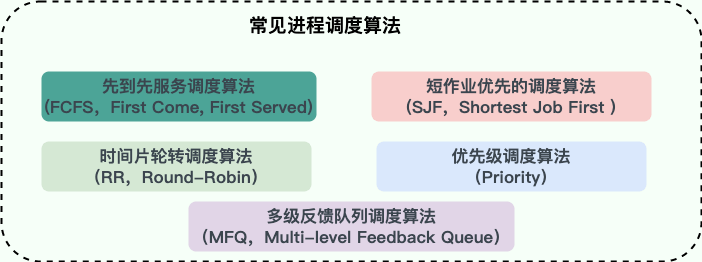


这是一个很重要的知识点！为了确定首先执行哪个进程以及最后执行哪个进程以实现最大 CPU 利用率，计算机科学家已经定义了一些算法，它们是：

- **先到先服务调度算法(FCFS，First Come, First Served)** : 从就绪队列中选择一个最先进入该队列的进程为之分配资源，使它立即执行并一直执行到完成或发生某事件而被阻塞放弃占用 CPU 时再重新调度。
- **短作业优先的调度算法(SJF，Shortest Job First)** : 从就绪队列中选出一个估计运行时间最短的进程为之分配资源，使它立即执行并一直执行到完成或发生某事件而被阻塞放弃占用 CPU 时再重新调度。
- **时间片轮转调度算法（RR，Round-Robin）** : 时间片轮转调度是一种最古老，最简单，最公平且使用最广的算法。每个进程被分配一个时间段，称作它的时间片，即该进程允许运行的时间。
- **多级反馈队列调度算法（MFQ，Multi-level Feedback Queue）** ：前面介绍的几种进程调度的算法都有一定的局限性。如**短进程优先的调度算法，仅照顾了短进程而忽略了长进程** 。多级反馈队列调度算法既能使高优先级的作业得到响应又能使短作业（进程）迅速完成。，因而它是目前**被公认的一种较好的进程调度算法**，UNIX 操作系统采取的便是这种调度算法。
- **优先级调度算法（Priority）** ： 为每个流程分配优先级，首先执行具有最高优先级的进程，依此类推。具有相同优先级的进程以 FCFS 方式执行。可以根据内存要求，时间要求或任何其他资源要求来确定优先级。


①、**先来先服务**

这是最简单的调度算法，也称为先进先出（FIFO）。进程按照请求 CPU 的顺序进行调度。这种方式易于实现，但可能会导致较短的进程等待较长进程执行完成，从而产生“饥饿”现象。


②、**短作业优先**

选择预计运行时间最短的进程优先执行。这种方式可以减少平均等待时间和响应时间，但缺点是很难准确预知进程的执行时间，并且可能因为短作业一直在执行，导致长作业持续被推迟执行。


三分恶面渣逆袭：短作业优先

③、**优先级调度**

在这种调度方式中，每个进程都被分配一个优先级。CPU 首先分配给优先级最高的进程。优先级调度可以是非抢占式的或抢占式的。在非抢占式优先级调度中，进程一旦开始执行将一直运行直到完成；在抢占式优先级调度中，更高优先级的进程可以中断正在执行的低优先级进程。


三分恶面渣逆袭：优先级调度

④、**时间片轮转**

时间片轮转调度为每个进程分配一个固定的时间段，称为时间片，进程可以在这个时间片内运行。如果进程在时间片结束时还没有完成，它将被放回队列的末尾。时间片轮转是公平的调度方式，可以保证所有进程得到公平的 CPU 时间，适用于共享系统。


三分恶面渣逆袭：时间片轮转

⑤、**最短剩余时间优先**

这是短作业优先的一种改进形式，它是抢占式的。即如果一个新进程的预计执行时间比当前运行进程的剩余时间短，调度器将暂停当前的进程，并切换到新进程。这种方法也可以最小化平均等待时间，但同样面临预测执行时间的困难。

⑥ **多级反馈队列**

一个进程需要执行100 哥时间片，如果采用时间片轮转调度算法，那么需要交互 100 次。

多级队列就是为这种需要连续执行多个时间片的进程考虑，它设置了多个队列，每个队列的时间片大小不同，比如 2,4,6,8······。进程在第一个队列没执行完，就会被移到下一个队列。

这种方式下，之前的进程只需要交换 7 次就可以了。每个队列优先权不一样，最上面的队列优先权最高。因此只有上一个队列没有进程在排队，才能调度当前队列上的进程。

可以将这种调度算法看成是时间片轮转调度算法与优先级调度算法的结合。


DIDA-lJ-多级反馈队列

# 6 进程间通信的方式？

https://blog.csdn.net/universsky2015/article/details/120235397

推荐阅读：[编程十万问：进程间通信的方式有哪些？](https://www.nowcoder.com/discuss/536674147976470528)

进程是计算机系统分配资源的最小单位(严格说来是线程)。每个进程都有自己的一部分独立的系统资源，彼此是隔离的。为了能使不同的进程互相访问资源并进行协调工作，才有了进程间通信。通常，使用进程间通信的两个应用可以被分为客户端和服务器(见主从式架构)，客户端进程请求数据，服务端响应客户端的数据请求。有一些应用本身既是服务器又是客户端，这在分布式计算中，时常可以见到。这些进程可以运行在同一计算机上或网络连接的不同计算机上。

IPC对微内核和nano内核的设计过程非常重要。 微内核减少了内核提供的功能数量。 然后通过IPC与服务器通信获得这些功能，与普通的宏内核相比，IPC的数量大幅增加。

一、进程间通信的概念

每个进程各自有不同的用户地址空间，任何一个进程的全局变量在另一个进程中都看不到，所以进程之间要交换数据必须通过内核，在内核中开辟一块缓冲区，进程1把数据从用户空间拷到内核缓冲区，进程2再从内核缓冲区把数据读走，内核提供的这种机制称为进程间通信(IPC，InterProcess Communication)

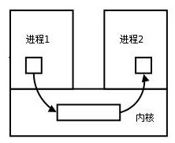

----


进程间通信（IPC，Inter-Process Communication）的方式有管道 pipe、信号 signal、消息队列 Message queue 、共享内存 shared memory、信号量和套接字 socket


编程十万问：进程间通信

|Method|Short Description|Provided by ([operating systems](https://en.wikipedia.org/wiki/Operating_system "Operating system") or other environments)|
|---|---|---|
|[File](https://en.wikipedia.org/wiki/Computer_file "Computer file")|A record stored on disk, or a record synthesized on demand by a file server, which can be accessed by multiple processes.|Most operating systems|
|Communications file|A unique form of IPC in the late-1960s that most closely resembles [Plan 9](https://en.wikipedia.org/wiki/Plan_9_from_Bell_Labs "Plan 9 from Bell Labs")'s [9P protocol](https://en.wikipedia.org/wiki/9P_(protocol) "9P (protocol)")|[Dartmouth Time-Sharing System](https://en.wikipedia.org/wiki/Dartmouth_Time-Sharing_System "Dartmouth Time-Sharing System")|
|[Signal](https://en.wikipedia.org/wiki/Signal_(computing) "Signal (computing)"); also [Asynchronous System Trap](https://en.wikipedia.org/wiki/Asynchronous_System_Trap "Asynchronous System Trap")|A system message sent from one process to another, not usually used to transfer data but instead used to remotely command the partnered process.|Most operating systems|
|[Socket](https://en.wikipedia.org/wiki/Network_socket "Network socket")|Data sent over a network interface, either to a different process on the same computer or to another computer on the network. Stream-oriented ([TCP](https://en.wikipedia.org/wiki/Transmission_Control_Protocol "Transmission Control Protocol"); data written through a socket requires formatting to preserve message boundaries) or more rarely message-oriented ([UDP](https://en.wikipedia.org/wiki/User_Datagram_Protocol "User Datagram Protocol"), [SCTP](https://en.wikipedia.org/wiki/SCTP "SCTP")).|Most operating systems|
|[Unix domain socket](https://en.wikipedia.org/wiki/Unix_domain_socket "Unix domain socket")|Similar to an internet socket, but all communication occurs within the kernel. Domain sockets use the file system as their address space. Processes reference a domain socket as an [inode](https://en.wikipedia.org/wiki/Inode "Inode"), and multiple processes can communicate with one socket|All POSIX operating systems and Windows 10[[3]](https://en.wikipedia.org/wiki/Inter-process_communication#cite_note-3)|
|[Message queue](https://en.wikipedia.org/wiki/Message_queue "Message queue")|A data stream similar to a socket, but which usually preserves message boundaries. Typically implemented by the operating system, they allow multiple processes to read and write to the [message queue](https://en.wikipedia.org/wiki/Message_queue "Message queue") without being directly connected to each other.|Most operating systems|
|[Anonymous pipe](https://en.wikipedia.org/wiki/Anonymous_pipe "Anonymous pipe")|A unidirectional data channel using [standard input and output](https://en.wikipedia.org/wiki/Stdin "Stdin"). Data written to the write-end of the pipe is buffered by the operating system until it is read from the read-end of the pipe. Two-way communication between processes can be achieved by using two pipes in opposite "directions".|All [POSIX](https://en.wikipedia.org/wiki/POSIX "POSIX") systems, Windows|
|[Named pipe](https://en.wikipedia.org/wiki/Named_pipe "Named pipe")|A pipe that is treated like a file. Instead of using standard input and output as with an anonymous pipe, processes write to and read from a named pipe, as if it were a regular file.|All POSIX systems, Windows, AmigaOS 2.0+|
|[Shared memory](https://en.wikipedia.org/wiki/Shared_memory_(interprocess_communication) "Shared memory (interprocess communication)")|Multiple processes are given access to the same block of [memory](https://en.wikipedia.org/wiki/Memory_(computing) "Memory (computing)"), which creates a shared buffer for the processes to communicate with each other.|All POSIX systems, Windows|
|[Message passing](https://en.wikipedia.org/wiki/Message_passing "Message passing")|Allows multiple programs to communicate using message queues and/or non-OS managed channels. Commonly used in concurrency models.|Used in [LPC](https://en.wikipedia.org/wiki/Local_Inter-Process_Communication "Local Inter-Process Communication"), [RPC](https://en.wikipedia.org/wiki/Remote_procedure_call "Remote procedure call"), [RMI](https://en.wikipedia.org/wiki/Remote_method_invocation "Remote method invocation"), and [MPI](https://en.wikipedia.org/wiki/Message_Passing_Interface "Message Passing Interface") paradigms, [Java RMI](https://en.wikipedia.org/wiki/Java_RMI "Java RMI"), [CORBA](https://en.wikipedia.org/wiki/CORBA "CORBA"), [COM](https://en.wikipedia.org/wiki/Component_Object_Model "Component Object Model"), [DDS](https://en.wikipedia.org/wiki/Data_Distribution_Service "Data Distribution Service"), [MSMQ](https://en.wikipedia.org/wiki/Microsoft_Message_Queuing "Microsoft Message Queuing"), [MailSlots](https://en.wikipedia.org/wiki/MailSlot "MailSlot"), [QNX](https://en.wikipedia.org/wiki/QNX "QNX"), others|
|[Memory-mapped file](https://en.wikipedia.org/wiki/Memory-mapped_file "Memory-mapped file")|A file mapped to [RAM](https://en.wikipedia.org/wiki/RAM "RAM") and can be modified by changing memory addresses directly instead of outputting to a stream. This shares the same benefits as a standard [file](https://en.wikipedia.org/wiki/File_(computing) "File (computing)").|All POSIX systems, Windows|

---

**优缺点**：
- 管道：速度慢，容量有限；  
- Socket：任何进程间都能通讯，但速度慢；  
- 消息队列：容量受到系统限制，且要注意第一次读的时候，要考虑上一次没有读完数据的问题；  
- 信号量：不能传递复杂消息，只能用来同步；  
- 共享内存区：能够很容易控制容量，速度快，但要保持同步，比如一个进程在写的时候，另一个进程要注意读写的问题，相当于线程中的线程安全，当然，共享内存区同样可以用作线程间通讯，不过没这个必要，线程间本来就已经共享了同一进程内的一块内存。

## 6.1 管道 Pipe

- **管道/匿名管道(Pipes)** ：用于具有亲缘关系的父子进程间或者兄弟进程之间的通信。
- **有名管道(Named Pipes)** : 匿名管道由于没有名字，只能用于亲缘关系的进程间通信。为了克服这个缺点，提出了有名管道。有名管道严格遵循**先进先出(first in first out)**。有名管道以磁盘文件的方式存在，可以实现本机任意两个进程通信。

管道可以理解成不同进程之间的传话筒，一方发声，一方接收，声音的介质可以是空气或者电缆。

**进程间的管道就是内核中的一串缓存**，从管道的一端写入数据，另一端读取。数据只能单向流动，遵循先进先出（FIFO）的原则。


编程十万问：管道

### 6.1.1 **匿名管道** anonymous pipe：

允许具有亲缘关系的进程（如父子进程）进行通信。


特点:
- 管道是半双工的，数据只能向一个方向流动；需要双方通信时，需要建立起两个管道。
- 只能用于父子进程或者兄弟进程之间(具有亲缘关系的进程);
- 单独构成一种独立的文件系统：管道对于管道两端的进程而言，就是一个文件，但它不是普通的文件，它不属于某种文件系统，而是自立门户，单独构成一种文件系统，并且只存在与内存中。
- 数据的读出和写入：一个进程向管道中写的内容被管道另一端的进程读出。写入的内容每次都添加在管道缓冲区的末尾，并且每次都是从缓冲区的头部读出数据。


管道的实质：
- 管道的实质是一个内核缓冲区，进程以先进先出的方式从缓冲区存取数据，管道一端的进程顺序的将数据写入缓冲区，另一端的进程则顺序的读出数据。
- 该缓冲区可以看做是一个循环队列，读和写的位置都是自动增长的，不能随意改变，一个数据只能被读一次，读出来以后在缓冲区就不复存在了。
- 当缓冲区读空或者写满时，有一定的规则控制相应的读进程或者写进程进入等待队列，当空的缓冲区有新数据写入或者满的缓冲区有数据读出来时，就唤醒等待队列中的进程继续读写。

管道的局限：
- 管道的主要局限性正体现在它的特点上：
    - 只支持单向数据流；
    - 只能用于具有亲缘关系的进程之间；
    - 没有名字；
    - 管道的缓冲区是有限的(管道制存在于内存中，在管道创建时，为缓冲区分配一个页面大小)；
    - 管道所传送的是无格式字节流，这就要求管道的读出方和写入方必须事先约定好数据的格式，比如多少字节算作一个消息(或命令、或记录)等等；

### 6.1.2 **命名管道** named pipe

允许无亲缘关系的进程通信，通过在文件系统中创建一个特殊类型的文件来实现。
缺点：管道的效率低，不适合进程间频繁地交换数据。

匿名管道，由于没有名字，只能用于亲缘关系的进程间通信。为了克服这个缺点，提出了有名管道(FIFO)。
有名管道不同于匿名管道之处在于它提供了一个路径名与之关联，以有名管道的文件形式存在于文件系统中，这样，即使与有名管道的创建进程不存在亲缘关系的进程，只要可以访问该路径，就能够彼此通过有名管道相互通信，因此，通过有名管道不相关的进程也能交换数据。
值的注意的是，有名管道严格遵循先进先出(first in first out),对匿名管道及有名管道的读总是从开始处返回数据，对它们的写则把数据添加到末尾。它们不支持诸如lseek()等文件定位操作。有名管道的名字存在于文件系统中，内容存放在内存中。


### 6.1.3 匿名管道和有名管道总结

(1)管道是特殊类型的文件，在满足先入先出的原则条件下可以进行读写，但不能进行定位读写。
(2)匿名管道是单向的，只能在有亲缘关系的进程间通信；有名管道以磁盘文件的方式存在，可以实现本机任意两个进程通信。
(3)无名管道阻塞问题：无名管道无需显示打开，创建时直接返回文件描述符，在读写时需要确定对方的存在，否则将退出。如果当前进程向无名管道的一端写数据，必须确定另一端有某一进程。如果写入无名管道的数据超过其最大值，写操作将阻塞，如果管道中没有数据，读操作将阻塞，如果管道发现另一端断开，将自动退出。
(4)有名管道阻塞问题：有名管道在打开时需要确实对方的存在，否则将阻塞。即以读方式打开某管道，在此之前必须一个进程以写方式打开管道，否则阻塞。此外，可以以读写(O_RDWR)模式打开有名管道，即当前进程读，当前进程写，不会阻塞。


## 6.2 信号 signal

信号是一种比较复杂的通信方式，用于通知接收进程某个事件已经发生；

信号可以理解成以前的 BB 机，用于通知接收进程某件事情发生了，是一种较为简单的通信方式，主要用于处理异步事件。
比如`kill -9 1050`就表示给 PID 为 1050 的进程发送`SIGKIL`信号。

信号是Linux系统中用于进程间互相通信或者操作的一种机制，信号可以在任何时候发给某一进程，而无需知道该进程的状态。
如果该进程当前并未处于执行状态，则该信号就有内核保存起来，直到该进程回复执行并传递给它为止。
如果一个信号被进程设置为阻塞，则该信号的传递被延迟，直到其阻塞被取消是才被传递给进程。

这里顺带普及一下 Linux 中常用的信号：
- SIGHUP：当我们退出终端（Terminal）时，由该终端启动的所有进程都会接收到这个信号，系统缺省状态下对该信号的处理是终止进程。。
- SIGINT：程序终止（interrupt）信号。按 `Ctrl+C` 时发出，大家应该在操作终端时有过这种操作。
- SIGQUIT：和 SIGINT 类似，按 `Ctrl+\` 键将发出该信号。它会产生核心转储文件，将内存映像和程序运行时的状态记录下来。
- SIGKILL：强制杀死进程，本信号不能被阻塞和忽略。
- SIGTERM：与 SIGKILL 不同的是该信号可以被阻塞和处理。通常用来要求程序自己正常退出。
- SIGBUS和SIGSEGV：进程访问非法地址
- SIGFPE：运算中出现致命错误，如除零操作、数据溢出等。
- SIGALRM：定时器信号。
- SIGCLD：子进程退出信号。如果其父进程没有忽略该信号也没有处理该信号，则子进程退出后将形成僵尸进程。


**信号来源**
信号是软件层次上对中断机制的一种模拟，是一种异步通信方式，信号可以在用户空间进程和内核之间直接交互，内核可以利用信号来通知用户空间的进程发生了哪些系统事件，信号事件主要有两个来源：

    硬件来源：用户按键输入Ctrl+C退出、硬件异常如无效的存储访问等。
    软件终止：终止进程信号、其他进程调用kill函数、软件异常产生信号。

**信号生命周期和处理流程**
(1)信号被某个进程产生，并设置此信号传递的对象(一般为对应进程的pid)，然后传递给操作系统；
(2)操作系统根据接收进程的设置(是否阻塞)而选择性的发送给接收者，如果接收者阻塞该信号(且该信号是可以阻塞的)，操作系统将暂时保留该信号，而不传递，直到该进程解除了对此信号的阻塞(如果对应进程已经退出，则丢弃此信号)，如果对应进程没有阻塞，操作系统将传递此信号。
(3)目的进程接收到此信号后，将根据当前进程对此信号设置的预处理方式，暂时终止当前代码的执行，保护上下文(主要包括临时寄存器数据，当前程序位置以及当前CPU的状态)、转而执行中断服务程序，执行完成后在回复到中断的位置。当然，对于抢占式内核，在中断返回时还将引发新的调度。


## 6.3 消息队列 message queue

In computer science, message passing is a technique for invoking behavior (i.e., running a program) on a computer. The invoking program sends a message to a process (which may be an actor or object) and relies on that process and its supporting infrastructure to then select and run some appropriate code. Message passing differs from conventional programming where a process, subroutine, or function is directly invoked by name. Message passing is key to some models of concurrency and object-oriented programming.

消息队列是消息的链表,具有特定的格式,存放在内存中并由消息队列标识符标识。管道和消息队列的通信数据都是先进先出的原则。与管道（无名管道：只存在于内存中的文件；命名管道：存在于实际的磁盘介质或者文件系统）不同的是消息队列存放在内核中，只有在内核重启(即，操作系统重启)或者显式地删除一个消息队列时，该消息队列才会被真正的删除。消息队列可以实现消息的随机查询,消息不一定要以先进先出的次序读取,也可以按消息的类型读取.比 FIFO 更有优势。消息队列克服了信号承载信息量少，管道只能承载无格式字 节流以及缓冲区大小受限等缺点

消息队列是保存在内核中的消息链表，按照消息的类型进行消息传递，具有较高的可靠性和稳定性。

消息队列是存放在内核中的消息链表，每个消息队列由消息队列标识符表示。
与管道(无名管道：只存在于内存中的文件；命名管道：存在于实际的磁盘介质或者文件系统)不同的是消息队列存放在内核中，只有在内核重启(即，操作系统重启)或者显示地删除一个消息队列时，该消息队列才会被真正的删除。
另外与管道不同的是，消息队列在某个进程往一个队列写入消息之前，并不需要另外某个进程在该队列上等待消息的到达。


**消息队列特点总结**
(1)消息队列是消息的链表,具有特定的格式,存放在内存中并由消息队列标识符标识.
(2)消息队列允许一个或多个进程向它写入与读取消息.
(3)管道和消息队列的通信数据都是先进先出的原则。
(4)消息队列可以实现消息的随机查询,消息不一定要以先进先出的次序读取,也可以按消息的类型读取.比管道FIFO更有优势。
(5)消息队列克服了信号承载信息量少，管道只能承载无格式字 节流以及缓冲区大小受限等缺。
(6)目前主要有两种类型的消息队列：POSIX消息队列以及System V消息队列，系统V消息队列目前被大量使用。系统V消息队列是随内核持续的，只有在内核重起或者人工删除时，该消息队列才会被删除

消息传递是一种通信范型，在这种模型中，由一个传信者，将消息(messages)送给一个，或多个收信者。消息的形式，根据操作系统与编程语言的支持，而有所不同，常见的有方法(method)，信号(signals)与数据包(data packets)。

著名的消息传递系统有开放网络运算远程过程调用(ONC RPC)、CORBA、Java RMI、Distributed COM、SOAP。

**缺点**
消息体有一个最大长度的限制，不适合比较大的数据传输；存在用户态与内核态之间的数据拷贝开销。


## 6.4 共享内存 shared memory

使得多个进程可以访问同一块内存空间，不同进程可以及时看到对方进程中对共享内存中数据的更新。这种方式需要依靠某种同步操作，如互斥锁和信号量等。可以说这是最有用的进程间通信方式。

允许两个或多个进程共享一个给定的内存区，一个进程写⼊的东西，其他进程⻢上就能看到. 
共享内存是最快的进程间通信方式，它是针对其他进程间通信方式运行效率低而专门设计的. 

使得多个进程可以可以直接读写同一块内存空间，是最快的可用IPC形式。是针对其他通信机制运行效率较低而设计的。

为了在多个进程间交换信息，内核专门留出了一块内存区，可以由需要访问的进程将其映射到自己的私有地址空间。进程就可以直接读写这一块内存而不需要进行数据的拷贝，从而大大提高效率。

由于多个进程共享一段内存，因此需要依靠某种同步机制(如信号量)来达到进程间的同步及互斥。延伸阅读：Linux支持的主要三种共享内存方式：mmap()系统调用、Posix共享内存，以及System V共享内存实践

> 内存映射文件(Memory-mapped file)，或称“文件映射”、“映射文件”，是一段虚内存逐字节对应于一个文件或类文件的资源，使得应用程序处理映射部分如同访问主内存。


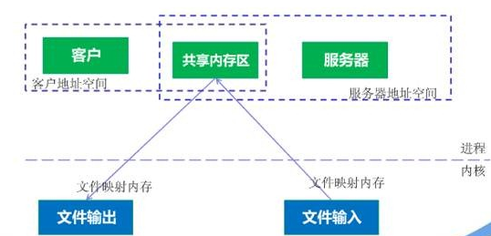


**缺点**
当多进程竞争同一个共享资源时，会造成数据错乱的问题。

## 6.5 信号量 semaphore

信号量是一个计数器，用于多进程对共享数据的访问，信号量的意图在于进程间同步。这种通信方式主要用于解决与同步相关的问题并避免竞争条件。

信号量可以理解成红绿灯，红灯停（信号量为零），绿灯行（信号量非零）。**它本质上是一个计数器**，用来控制对共享资源的访问数量。


它常作为一种锁机制，防止某进程正在访问共享资源时，其他进程也访问该资源。Java 中的 [java.util.concurrent.Semaphore 类](https://javabetter.cn/thread/CountDownLatch.html#semaphore) 就实现了类似的功能。

信号量是一个计数器，用于多进程对共享数据的访问，信号量的意图在于进程间同步。
为了获得共享资源，进程需要执行下列操作：
- 创建一个信号量：这要求调用者指定初始值，对于二值信号量来说，它通常是1，也可是0。
- 等待一个信号量 (进程希望获取资源时, 会执行 **P操作**, wait操作, 减操作)：该操作会测试这个信号量的值，
    - 信号量是非负整型变量, 不可能小于0 
    - 如果等于0，表示没有可用资源 就阻塞。 0 代表没有信号量了, 没有可用资源了, 进程调用不了这个信号了.  进程进入等待状态，直到信号量的值变为大于 0. 
    - 如果 大于0, 表示有资源可以用, 那进程就把这个信号拿走去用了, 信号量的值减1 
- 挂出一个信号量 (当进程释放资源时，它会执行 **V操作 **)
        - 该操作将信号量的值加1，也称为V操作。如果有其他进程因为等待该资源而被阻塞，这时会唤醒其中一个进程。


为了正确地实现信号量，信号量值的测试及减1操作应当是原子操作。为此，信号量通常是在内核中实现的。Linux环境中，有三种类型：Posix(可移植性操作系统接口)有名信号量(使用Posix IPC名字标识)、Posix基于内存的信号量(存放在共享内存区中)、System V信号量(在内核中维护)。这三种信号量都可用于进程间或线程间的同步。


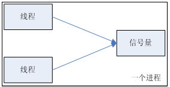


信号量与普通整型变量的区别：
    (1)信号量是非负整型变量，除了初始化之外，它只能通过两个标准原子操作：wait(semap) ,, signal(semap) ; 来进行访问；
    (2)操作也被成为PV原语(P来源于荷兰语proberen"测试"，V来源于荷兰语verhogen"增加"，P表示通过的意思，V表示释放的意思)，而普通整型变量则可以在任何语句块中被访问

信号量与互斥量之间的区别：
    (1)互斥量用于线程的互斥，信号量用于线程的同步。这是互斥量和信号量的根本区别，也就是互斥和同步之间的区别。互斥 mutually exclusive：是指某一资源同时只允许一个访问者对其进行访问，具有唯一性和排它性。但互斥无法限制访问者对资源的访问顺序，即访问是无序的。同步 Synchronous：是指在互斥的基础上(大多数情况)，通过其它机制实现访问者对资源的有序访问。
    在大多数情况下，同步已经实现了互斥，特别是所有写入资源的情况必定是互斥的。少数情况是指可以允许多个访问者同时访问资源
    (2)互斥量值只能为0/1，信号量值可以为非负整数。
    也就是说，一个互斥量只能用于一个资源的互斥访问，它不能实现多个资源的多线程互斥问题。信号量可以实现多个同类资源的多线程互斥和同步。当信号量为单值信号量是，也可以完成一个资源的互斥访问。
    (3)互斥量的加锁和解锁必须由同一线程分别对应使用，信号量可以由一个线程释放，另一个线程得到。

## 6.6 套接字 Socket

与其他通信机制不同的是，它可用于不同机器间的进程通信

此方法主要用于在客户端和服务器之间通过网络进行通信。套接字是支持 TCP/IP 的网络通信的基本操作单元，可以看做是不同主机之间的进程进行双向通信的端点，简单的说就是通信的两方的一种约定，用套接字中的相关函数来完成通信过程。

 套接字是一种通信机制，凭借这种机制，客户/服务器(即要进行通信的进程)系统的开发工作既可以在本地单机上进行，也可以跨网络进行。也就是说它可以让不在同一台计算机但通过网络连接计算机上的进程进行通信。

套接字是支持TCP/IP的网络通信的基本操作单元，可以看做是不同主机之间的进程进行双向通信的端点，简单的说就是通信的两方的一种约定，用套接字中的相关函数来完成通信过程。

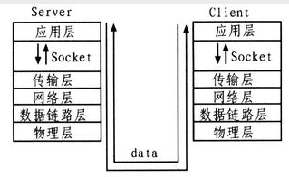

这个和 Java 中的 Socket 很相似，提供网络通信的端点，可以让不同机器上运行的进程之间进行双向通信。


套接字特性
套接字的特性由3个属性确定，它们分别是：域、端口号、协议类型。
(1)套接字的域 
它指定套接字通信中使用的网络介质，最常见的套接字域有两种：一是AF_INET，它指的是Internet网络。当客户使用套接字进行跨网络的连接时，它就需要用到服务器计算机的IP地址和端口来指定一台联网机器上的某个特定服务，所以在使用socket作为通信的终点，服务器应用程序必须在开始通信之前绑定一个端口，服务器在指定的端口等待客户的连接。另一个域AF_UNIX，表示UNIX文件系统，它就是文件输入/输出，而它的地址就是文件名。

(2)套接字的端口号
每一个基于TCP/IP网络通讯的程序(进程)都被赋予了唯一的端口和端口号，端口是一个信息缓冲区，用于保留Socket中的输入/输出信息，端口号是一个16位无符号整数，范围是0-65535，以区别主机上的每一个程序(端口号就像房屋中的房间号)，低于256的端口号保留给标准应用程序，比如pop3的端口号就是110，每一个套接字都组合进了IP地址、端口，这样形成的整体就可以区别每一个套接字。

(3)套接字协议类型
因特网提供三种通信机制，一是流套接字，流套接字在域中通过TCP/IP连接实现，同时也是AF_UNIX中常用的套接字类型。流套接字提供的是一个有序、可靠、双向字节流的连接，因此发送的数据可以确保不会丢失、重复或乱序到达，而且它还有一定的出错后重新发送的机制。二个是数据报套接字，它不需要建立连接和维持一个连接，它们在域中通常是通过UDP/IP协议实现的。它对可以发送的数据的长度有限制，数据报作为一个单独的网络消息被传输,它可能会丢失、复制或错乱到达，UDP不是一个可靠的协议，但是它的速度比较高，因为它并一需要总是要建立和维持一个连接。三是原始套接字，原始套接字允许对较低层次的协议直接访问，比如IP、 ICMP协议，它常用于检验新的协议实现，或者访问现有服务中配置的新设备，因为RAW SOCKET可以自如地控制Windows下的多种协议，能够对网络底层的传输机制进行控制，所以可以应用原始套接字来操纵网络层和传输层应用。比如，我们可以通过RAW SOCKET来接收发向本机的ICMP、IGMP协议包，或者接收TCP/IP栈不能够处理的IP包，也可以用来发送一些自定包头或自定协议的IP包。网络监听技术很大程度上依赖于SOCKET_RAW。

**原始套接字与标准套接字的区别在于：**  
原始套接字可以读写内核没有处理的IP数据包，而流套接字只能读取TCP协议的数据，数据报套接字只能读取UDP协议的数据。因此，如果要访问其他协议发送数据必须使用原始套接字。


**套接字通信的建立**

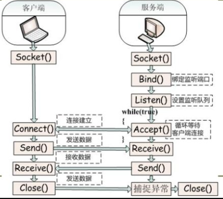

服务器端
(1)首先服务器应用程序用系统调用socket来创建一个套接字，它是系统分配给该服务器进程的类似文件描述符的资源，它不能与其他的进程共享。
(2)然后，服务器进程会给套接字起个名字 (变成了 命名套接字)，我们使用系统调用bind来给套接字命名。然后服务器进程就开始等待客户连接到这个套接字。
(3)接下来，系统调用listen来创建一个队列并将其用于存放来自客户的进入连接。
(4)最后，服务器通过系统调用accept来接受客户的连接。它会创建一个与原有的命名套接不同的新套接字，这个套接字只用于与这个特定客户端进行通信，而命名套接字(即原先的套接字)则被保留下来继续处理来自其他客户的连接(建立客户端和服务端的用于通信的流，进行通信)。

客户端
(1)客户应用程序首先调用socket来创建一个未命名的套接字，然后将服务器的命名套接字作为一个地址来调用connect与服务器建立连接。
(2)一旦连接建立，我们就可以像使用底层的文件描述符那样用套接字来实现双向数据的通信(通过流进行数据传输)。延伸阅读 ：Java socket编程


# 7 线程


## 7.1 线程有哪些实现方式

主要有三种线程的实现⽅式：

内核态线程实现：在内核空间实现的线程，由内核直接管理直接管理线程。


⽤户态线程实现：在⽤户空间实现线程，不需要内核的参与，内核对线程无感知。

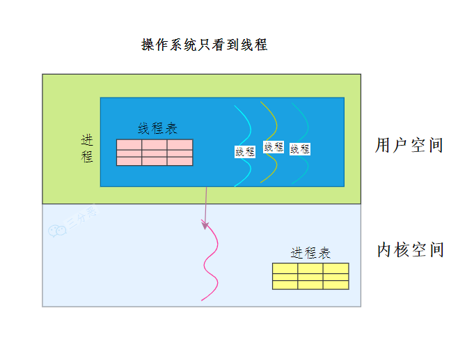


**混合线程实现**：现代操作系统基本都是将两种方式结合起来使用。
用户态的执行系统负责进程内部线程在非阻塞时的切换；内核态的操作系统负责阻塞线程的切换。
即我们同时实现内核态和用户态线程管理。
其中内核态线程数量较少，而用户态线程数量较多。每个内核态线程可以服务一个或多个用户态线程。

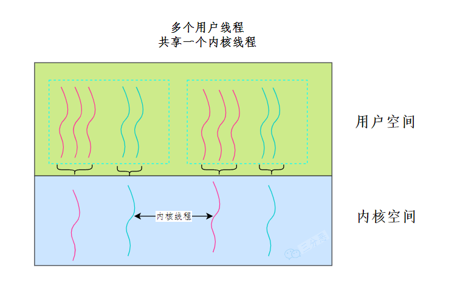


# 8 线程间的同步方式 

https://blog.csdn.net/weixin_44759105/article/details/111452760

## 8.1 背景

如果没有进程间的同步保障机制会发⽣什么样的问题？
发生竞争条件问题，即多个进程并发访问和操作同一数据并且执行结果与特定的访问顺序有关。

那么，避免发⽣竞争条件的关键问题是什么？
答： 确保操作共享数据的代码段的执⾏同步(互斥运⾏)，不能让多个进程同时运⾏操作共享数据的代码段

## 8.2 临界区问题

每个进程拥有操作共享数据的代码段（程序段），⽽这代码段称为临界区
当一个进程在临界区内执行时，其他进程不允许在他们的临界区内执行

解决竞争条件问题的关键是：
    确保单个进程在临界区内执⾏
    确保其他进程也可以进⼊临界区

在进入临界区前，每个进程应请求许可，实现这一请求的代码区称为进入区。
临界区之后可以有退出区，其他代码为剩余区
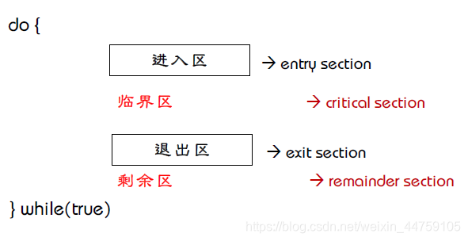


临界区问题：设计一个协议以便协作进程

解决临界区问题需要满⾜如下条件：
1. 互斥（Mutual Exclusion ）
    某⼀个进程进⼊了临界区，其他进程就不能进⼊
2. 进步（Progress）
    如果没有进程在临界区执⾏，且有进程需要进入临界区，那么只有那些不在剩余区的进程可参加选择，且必须确保⼀个进程进⼊临界区（选择不能无限推迟）
3. 有限等待（Bounded Waiting）
    ⼀个进程从请求进⼊临界区，直到该请求被允许，必须是等待有限的时间


同步解决的多线程操作共享资源的问题，目的是不管线程之间的执行如何穿插，最后的结果都是正确的。
我们前面知道线程和进程的关系：线程是进程当中的⼀条执⾏流程。所以说下面的一些同步机制不止针对线程，同样也可以针对进程。


**临界区**：我们把对共享资源访问的程序片段称为`临界区`，我们希望这段代码是`互斥 mutually exclusive`的，保证在某时刻只能被一个线程执行，也就是说一个线程在临界区执行时，其它线程应该被阻止进入临界区。
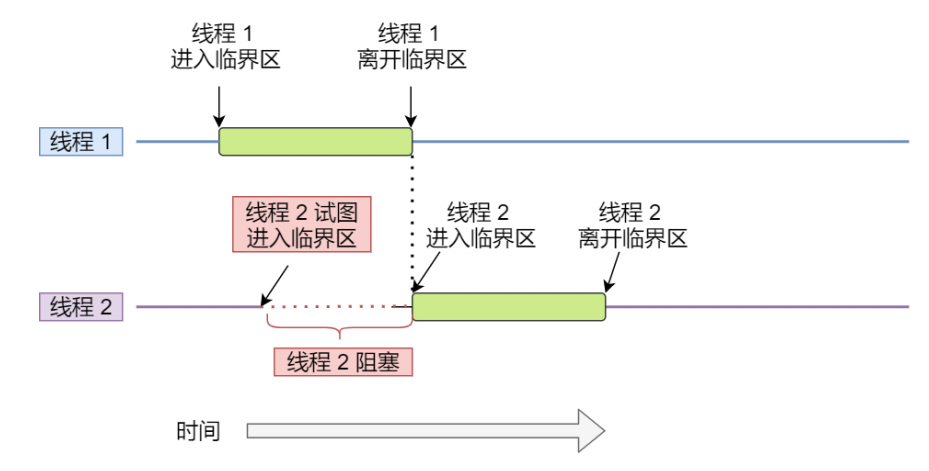

临界区不仅针对线程，同样针对进程。


临界区同步的一些实现方式


## 8.3 锁
使⽤加锁操作和解锁操作可以解决并发线程/进程的互斥问题。
任何想进⼊临界区的线程，必须先执⾏加锁操作。若加锁操作顺利通过，则线程可进⼊临界区；在完成对临界资源的访问后再执⾏解锁操作，以释放该临界资源。
加锁和解锁锁住的是什么呢？可以是`临界区对象`，也可以只是一个简单的`互斥量`，例如互斥量是`0`无锁，`1`表示加锁。

临界区: Critical section

根据锁的实现不同，可以分为`忙等待锁`和`⽆忙等待锁`。
`忙等待锁`就是加锁失败的线程，会不断尝试获取锁，也被称为自旋锁，它会一直占用 CPU。
`⽆忙等待锁`就是加锁失败的线程，会进入阻塞状态，放弃 CPU，等待被调度。

**互斥锁(Mutex)** ：
采用互斥对象机制，只有拥有互斥对象的线程才有访问公共资源的权限。因为互斥对象只有一个，所以可以保证公共资源不会被多个线程同时访问。比如 Java 中的 `synchronized` 关键词和各种 `Lock` 都是这种机制。

临界区问题基于硬件解决方案不但复杂，而且程序员不能直接使用，因此，操作系统设计人员构建软件工具，来解决临界区问题。

最简单的工具就是互斥锁。
采用互斥锁保护临界区，从而防止竞争条件。也就是说，一个进程进入临界区应得到锁，在退出时释放锁。

**读写锁（Read-Write Lock)**
允许多个线程同时读取共享资源，但只有一个线程可以对共享资源进行写操作。

## 8.4 信号量


它允许同一时刻多个线程访问同一资源，但是需要控制同一时刻访问此资源的最大线程数量

信号量是操作系统提供的⼀种协调共享资源访问的⽅法。
通常**信号量表示资源的数量**，对应的变量是⼀个整型（ sem ）变量。
另外，还有**两个原⼦操作的系统调⽤函数来控制信号量的**，分别是：
- _P_ 操作：将 sem 减 1 ，相减后，如果 sem < 0 ，则进程/线程进⼊阻塞等待，否则继续，表明 P 操作可能会阻塞；
- _V_ 操作：将 sem 加 1 ，相加后，如果 sem <= 0 ，唤醒⼀个等待中的进程/线程，表明 V 操作不会阻塞；
P 操作是⽤在进⼊临界区之前，V 操作是⽤在离开临界区之后，这两个操作是必须成对出现的。

- 等待一个信号量 (进程希望获取资源时, 会执行 **P操作**, wait操作, 减操作)：该操作会测试这个信号量的值，
    - 信号量是非负整型变量, 不可能小于0 
    - 如果等于0，表示没有可用资源 就阻塞。 0 代表没有信号量了, 没有可用资源了, 进程调用不了这个信号了.  进程进入等待状态，直到信号量的值变为大于 0. 
    - 如果 大于0, 表示有资源可以用, 那进程就把这个信号拿走去用了, 信号量的值减1 
- 挂出一个信号量 (当进程释放资源时，它会执行 **V操作 **)
    - 该操作将信号量的值加1，也称为V操作。如果有其他进程因为等待该资源而被阻塞，这时会唤醒其中一个进程。

----


本节讨论一个更鲁棒的工具，它的功能类似互斥锁，但其提供了更高级的方法，以便进程能同步活动。

一个信号量S是一个整型变量，除初始化外，只能通过两个标准原⼦操作来访问信号量

wait(S) : P(S) --> S- -
```
wait (S) {
	while (S<=0);//wait
	//no operation
	S--;
}
```

signal(S) : V(S) --> S++

```
signal (S) {
	S++;
}
```


**信号量的使用**
⼆进制信号量(binary semaphore)，类似于互斥锁，实际上在没有互斥锁的系统上，可用来提供互斥。
    适⽤于单资源的共享， mutex值为资源数量，初始化为1
    信号量的值只能为0 或1


**计数信号量(counting semaphore)**
    适⽤于多资源共享，共享资源的数量为n
    wait( n ) 操作为减，signal( n ) 操作为加，当n为0时表明所有资源都被占⽤

可以适⽤于优先约束（precedence constraint）例⼦，假设要求P1的语句S1完成之后，执⾏P2的语句S2, 共享信号量synch，并初始化为0


**信号量的实现**
信号量的实现关键是保障wait( ) 和signal( ) 操作的原⼦执⾏，即必须保障没有两个进程能同时对同⼀信号量执⾏wait( )和signal( )操作。

*保障⽅法*
    单处理器环境下，禁⽌中断
    多处理器环境下，禁⽌每个处理器的中断。但这种⽅法即困难⼜危险

问题：忙等待（busy waiting），⾃旋锁（spinlock）（与忙等待类似）

**⽆忙等待的信号量实现**
为了解决忙等待的问题，让忙等待的进程挂起（blocking），可以进⼊临界区时，让进程重新启动（wakeup）。

挂起的含义是进程从运⾏状态（running）转换成等待状态（waiting）
重启的含义是进程从等待状态转换成就绪状态

比较：
忙等待 vs 挂起-重启
答：没有谁好谁坏之分，这取决于上下文切换和临界区长度。

死锁
死锁：两个或多个进程⽆限地等待⼀个事件，⽽该事件只能由这些等待进程之⼀来产⽣

讥饿
饥饿：⽆限期的等待，即进程在信号量内⽆限期的等待

什么时候会发生？
在信号量的先进后出等待队列中可能发生

## 8.5 经典同步问题

本节给出多个同步问题，举例说明大量并发控制问题，这些问题用于测试几乎所有新提出的同步方案。
在我们的解决方案中，使用信号量，因为这是讨论这类解决方案的传统方式。

1.有限缓冲问题(bounded buffer problem)
有界缓冲问题常用于说明同步原语（方案）能力，这里给出该解决方案的一种通用结构，而不是局限于特定实现。
假定缓冲池中有n 个缓冲项, 每个缓冲项能存⼀个数据项
    当缓冲池满的时候，不能生产（full）
    当缓冲池控的时候，不能消费（empty）
    消费的时候不能生产，生产的时候不能消费（互斥）

那么设信号量
    信号量empty: 表⽰空缓冲项的个数，初始化为n
    信号量full ：表⽰满缓冲项的个数，初始化为0
    信号量mutex : 提供对缓冲池的生产和消费的互斥，初始化为1，作为互斥锁使用

----


2.读者–作者问题(reader and writer problem)

假设一个数据库为多个并发进程所共享，有的进程只能读数据库，其他进程可读可写数据库。为区分这两类进程，我们称前者为读者，后者为作者
显然一个作者和其它进程同时访问数据库时，会发生混乱。
这一同步问题称为读者-作者问题，被提出后一直作为测试几乎所有新的同步原语

读者-作者问题，如何确保同步？
    读的时候不能写，写的时候不能读
    多位读者可以同时访问数据，需要知道读者数量
    只能由⼀个作者写数据，不能多个作者写数据

解决：
    作者与作者之间互斥，以及读和写互斥（信号量rw_mutex，初始化为1，读者和作者进程共享）
    跟踪正在读的读者（信号量readcount，初始化为0）
    保证更新readcount时的互斥（信号量mutex，初始化为1）

----

3.哲学家就餐问题(dining philosophers problem)

    5个哲学家们⽤⼀⽣来思考和吃饭
    一人⼀碗⽶饭
    5只筷⼦
    同时有两只筷⼦才能吃饭

哲学家就餐问题是一个经典同步问题，这个代表性的例子满足：在多进程之间分配多个资源，而且不会出现死锁和饥饿


## 8.6 管程

信号量虽然是一种方便有效的进程同步机制，但
由于发⽣如下操作错误，可能会出现死锁、饥饿

    交换wait() 和signal() 操作顺序
    ⽤wait() 替代了signal() 操作
    省略了wait() 或signal() 操作
    …

为处理这种错误，研究人员开发了一些高级语言工具。
本节介绍一种重要的、高级的同步工具，管程

抽象管程的语法
```
//管程类型表示不能有各种进程使用，只有内部函数才能访问内部变量和参数
monitor monitor_name
{
	// shared variable declarations
	condition x;//可以有多个条件变量
	
	function P1 (…) { …. }//方法
	…
	…
	…
	function Pn (…) {……}
	
	
	initialization code ( ….) { … }//初始化代码
}


```


管程
管程是⼀种⽤于多线程互斥访问共享资源的程序结构
    采⽤⾯向对象⽅法，简化了进程间的同步控制
    任⼀时刻最多只有⼀个线程执⾏管程代码
    正在管程中的线程可临时放弃管程的互斥访问，等待事件出现时恢复


为什么要引⼊管程？
    把分散在各进程中的临界区集中起来进⾏管理
    防⽌进程有意或⽆意的违法同步操作
    便于⽤⾼级语⾔来书写程序，也便于程序正确性验证。


管程的使⽤
    在对象/模块中， 收集相关共享数据
    定义访问共享数据的⽅法


管程的组成
    ⼀个锁：控制管程代码的互斥访问
    0或多个条件变量：管理共享数据的并发访问
    每个条件变量对应于⼀个等待队列，每个条件变量只有wait()和signal() 操作


条件变量
条件变量是当调用管程过程的进程无法运行时，用于阻塞进程的一种信号量
    当进程在管程过程中发现⽆法继续时，它在某些条件变量condition 上执⾏wait 操作，调用这一操作的进程会被挂起（加入condition的等待队列）
    另⼀个进程可以通过对其伙伴在等待的同⼀个条件变量condition上执⾏signal操作来唤醒等待的进程，如果没有，则如同没有操作


哲学家就餐问题的管程解决方案
下面通过哲学家就餐问题的无死锁解决方案说明管程概念。
这个解答强加了限制：只有一个哲学家的两根筷子都可用时，才能拿起使用。
为解决，制定如下规定

1. 区分哲学家所处的三个状态
    THINKING, HUNGRY, EATING
    enum { THINKING; HUNGRY, EATING) state [5]
2. 采用枚举节省空间
    哲学家i 只有在其两个邻居不进餐时，才能拿起筷⼦进餐
    (state[(i+4)%5] != EATING) and (state[(i+1)%5] != EATING)
3. 声明条件变量-哲学家
    condition self[5]，提供wait() 和signal()操作


## 8.7 其他

- **屏障（Barrier）** ：屏障是一种同步原语，用于等待多个线程到达某个点再一起继续执行。当一个线程到达屏障时，它会停止执行并等待其他线程到达屏障，直到所有线程都到达屏障后，它们才会一起继续执行。比如 Java 中的 `CyclicBarrier` 是这种机制。
- **事件(Event)** :Wait/Notify：通过通知操作的方式来保持多线程同步，还可以方便的实现多线程优先级的比较操作。


# 9 死锁

## 9.1 什么是死锁？

deadlock in a computing context occurs when two or more processes are unable to proceed because each is waiting for the other to release a resource, which neither can do. Here are four methods to prevent deadlocks:


死锁（Deadlock）描述的是这样一种情况：多个进程/线程同时被阻塞，它们中的一个或者全部都在等待某个资源被释放。由于进程/线程被无限期地阻塞，因此程序不可能正常终止。

在两个或者多个并发线程中，如果每个线程持有某种资源，而又等待其它线程释放它或它们现在保持着的资源，在未改变这种状态之前都不能向前推进，称这一组线程产生了死锁。通俗的讲就是两个或多个线程无限期的阻塞、相互等待的一种状态。


假设有两个进程 A 和 B，以及两个资源 X 和 Y，它们的分配情况如下：

|进程|占用资源|需求资源|
|---|---|---|
|A|X|Y|
|B|Y|X|

此时，进程 A 占用资源 X 并且请求资源 Y，而进程 B 已经占用了资源 Y 并请求资源 X。两个进程都在等待对方释放资源，无法继续执行，陷入了死锁状态。
## 9.2 死锁产生有哪些条件？

死锁产生需要**同时**满足四个条件：
- **互斥条件 Mutual Exclusion**：指线程对己经获取到的资源进行它性使用，即该资源同时只由一个线程占用。如果此时还有其它线程请求获取获取该资源，则请求者只能等待，直至占有资源的线程释放该资源。
- **请求并持有条件**/**占有并等待** Hold and Wait：指一个 线程己经持有了至少一个资源，但又提出了新的资源请求，而新资源己被其它线程占有，所以当前线程会被阻塞，但阻塞 的同时并不释放自己已经获取的资源。
- **不可剥夺条件**/**非抢占 No Preemption**：指线程获取到的资源在自己使用完之前不能被其它线程抢占，只有在自己使用完毕后才由自己释放该资源。
- **环路等待条件**/**循环等待 Circular Wait**：指在发生死锁时，必然存在一个线程——资源的环形链，即线程集合 {T0，T1，T2,…… ，Tn} 中 T0 正在等待一 T1 占用的资源，Tl1 正在等待 T2 用的资源，…… Tn 在等待己被 T0 占用的资源。

注意 ⚠️ ：这四个条件是产生死锁的 必要条件 ，也就是说只要系统发生死锁，这些条件必然成立，而只要上述条件之一不满足，就不会发生死锁。

1. **Mutual Exclusion**: At least one resource must be held in a non-shareable mode; that is, only one process can use the resource at any given time. If another process requests that resource, it must wait until the resource is released.
    
2. **Hold and Wait**: A process must be holding at least one resource and waiting to acquire additional resources that are currently held by other processes. This condition can lead to a scenario where processes are waiting for resources held by other processes, creating a circular wait situation.
    
3. **No Preemption**: Resources cannot be forcibly taken away from a process. If a process is holding a resource and another process requires it, the only way to obtain it is to wait until the holding process voluntarily releases it.
    
4. **Circular Wait**: There exists a set of processes {P1, P2, ..., Pn} where P1 is waiting for a resource held by P2, P2 is waiting for a resource held by P3, and so on until Pn is waiting for a resource held by P1, creating a circular dependency among the processes.

## 9.3 模拟产生死锁的代码

下面通过一个实际的例子来模拟下图展示的线程死锁：

[](https://img2023.cnblogs.com/blog/1843652/202304/1843652-20230413085153987-1715872011.png)


```java
public class DeadLockDemo {
    private static Object resource1 = new Object();//资源 1
    private static Object resource2 = new Object();//资源 2

    public static void main(String[] args) {
        new Thread(() -> {
            synchronized (resource1) {
                System.out.println(Thread.currentThread() + "get resource1");
                try {
                    Thread.sleep(1000);
                } catch (InterruptedException e) {
                    e.printStackTrace();
                }
                System.out.println(Thread.currentThread() + "waiting get resource2");
                synchronized (resource2) {
                    System.out.println(Thread.currentThread() + "get resource2");
                }
            }
        }, "线程 1").start();

        new Thread(() -> {
            synchronized (resource2) {
                System.out.println(Thread.currentThread() + "get resource2");
                try {
                    Thread.sleep(1000);
                } catch (InterruptedException e) {
                    e.printStackTrace();
                }
                System.out.println(Thread.currentThread() + "waiting get resource1");
                synchronized (resource1) {
                    System.out.println(Thread.currentThread() + "get resource1");
                }
            }
        }, "线程 2").start();
    }
}

```


output
```
Thread[线程 1,5,main]get resource1
Thread[线程 2,5,main]get resource2
Thread[线程 1,5,main]waiting get resource2
Thread[线程 2,5,main]waiting get resource1
```

线程 A 通过 synchronized (resource1) 获得 resource1 的监视器锁，然后通过Thread.sleep(1000);
让线程 A 休眠 1s 为的是让线程 B 得到执行然后获取到 resource2 的监视器锁。
线程 A 和线程 B 休眠结束了都开始企图请求获取对方的资源，然后这两个线程就会陷入互相等待的状态，这也就产生了死锁。

## 9.4 解决死锁的方法

解决死锁的方法可以从多个角度去分析，一般的情况下，有**预防，避免，检测和解除四种**
- **预防** 是采用某种策略，**限制并发进程对资源的请求**，从而使得死锁的必要条件在系统执行的任何时间上都不满足。
- **避免**则是系统在分配资源时，根据资源的使用情况**提前做出预测**，从而**避免死锁的发生**
- **检测**是指系统设有**专门的机构**，当死锁发生时，该机构能够检测死锁的发生，并精确地确定与死锁有关的进程和资源。
- **解除** 是与检测相配套的一种措施，用于**将进程从死锁状态下解脱出来**。

### 9.4.1 死锁的预防

产⽣死锁的有四个必要条件：互斥条件、持有并等待条件、不可剥夺条件、环路等待条件。

避免死锁，破坏其中的一个就可以。

**消除互斥条件**
这个是没法实现，因为很多资源就是只能被一个线程占用，例如锁。

**消除请求并持有条件**
消除这个条件的办法很简单，就是一个线程一次请求其所需要的所有资源。

**消除不可剥夺条件**
占用部分资源的线程进一步申请其他资源时，如果申请不到，可以主动释放它占有的资源，这样不可剥夺这个条件就破坏掉了。

**消除环路等待条件**
可以靠按序申请资源来预防。所谓按序申请，是指资源是有线性顺序的，申请的时候可以先申请资源序号小的，再申请资源序号大的，这样线性化后就不存在环路了。

引起思索的条件 
1. **Mutual Exclusion**: At least one resource must be held in a non-shareable mode; that is, only one process can use the resource at any given time. If another process requests that resource, it must wait until the resource is released.
    
2. **Hold and Wait**: A process must be holding at least one resource and waiting to acquire additional resources that are currently held by other processes. This condition can lead to a scenario where processes are waiting for resources held by other processes, creating a circular wait situation.
    
3. **No Preemption**: Resources cannot be forcibly taken away from a process. If a process is holding a resource and another process requires it, the only way to obtain it is to wait until the holding process voluntarily releases it.
    
4. **Circular Wait**: There exists a set of processes {P1, P2, ..., Pn} where P1 is waiting for a resource held by P2, P2 is waiting for a resource held by P3, and so on until Pn is waiting for a resource held by P1, creating a circular dependency among the processes.

-----

死锁四大必要条件上面都已经列出来了，很显然，只要破坏四个必要条件中的任何一个就能够预防死锁的发生。

破坏第一个条件 **互斥条件**：使得资源是可以同时访问的，这是种简单的方法，磁盘就可以用这种方法管理，但是我们要知道，有很多资源 **往往是不能同时访问的** ，所以这种做法在大多数的场合是行不通的。

破坏第三个条件 **非抢占** ：也就是说可以采用 **剥夺式调度算法**，但剥夺式调度方法目前一般仅适用于 **主存资源** 和 **处理器资源** 的分配，并不适用于所有的资源，会导致 **资源利用率下降**。

所以一般比较实用的 **预防死锁的方法**，是通过考虑破坏第二个条件和第四个条件。

**1、静态分配策略**
静态分配策略可以破坏死锁产生的第二个条件（占有并等待）。所谓静态分配策略，就是指一个进程必须在执行前就申请到它所需要的全部资源，并且知道它所要的资源都得到满足之后才开始执行。进程要么占有所有的资源然后开始执行，要么不占有资源，不会出现占有一些资源等待一些资源的情况。

静态分配策略逻辑简单，实现也很容易，但这种策略 **严重地降低了资源利用率**，因为在每个进程所占有的资源中，有些资源是在比较靠后的执行时间里采用的，甚至有些资源是在额外的情况下才使用的，这样就可能造成一个进程占有了一些 **几乎不用的资源而使其他需要该资源的进程产生等待** 的情况。

**2、层次分配策略**
层次分配策略破坏了产生死锁的第四个条件(循环等待)。在层次分配策略下，所有的资源被分成了多个层次，一个进程得到某一次的一个资源后，它只能再申请较高一层的资源；当一个进程要释放某层的一个资源时，必须先释放所占用的较高层的资源，按这种策略，是不可能出现循环等待链的，因为那样的话，就出现了已经申请了较高层的资源，反而去申请了较低层的资源，不符合层次分配策略，证明略。


1. **Lock Ordering**: Establish a global ordering of resource types and ensure that resources are always acquired in the same order by processes. This prevents circular waits because processes will always request resources in a predefined sequence.
    
2. **Resource Allocation Graph** **: Use a resource allocation graph to detect and prevent deadlocks. Each process and resource is represented as a node, and edges represent requests and assignments. If the graph contains no cycles, then no deadlock can occur. If a cycle is detected, the system can preempt resources or force a process to release resources to break the cycle.
    
3. **Timeouts**: Set timeouts for resource requests. If a process cannot acquire a resource within a specified time, it releases all resources it currently holds and retries later. This prevents processes from being indefinitely blocked by resource unavailability.
    
4. **Resource Preemption**: Allow resources to be preempted from processes. If a process holds resources and requests additional resources that cannot be granted immediately, the system may preempt some of the held resources from the process to satisfy the request. This approach requires careful consideration to avoid excessive resource thrashing.


### 9.4.2 死锁的避免 (不重要 )

上面提到的 **破坏** 死锁产生的四个必要条件之一就可以成功 **预防系统发生死锁** ，但是会导致 **低效的进程运行** 和 **资源使用率** 。而死锁的避免相反，它的角度是允许系统中**同时存在四个必要条件** ，只要掌握并发进程中与每个进程有关的资源动态申请情况，做出 **明智和合理的选择** ，仍然可以避免死锁，因为四大条件仅仅是产生死锁的必要条件。

我们将系统的状态分为 **安全状态** 和 **不安全状态** ，每当在未申请者分配资源前先测试系统状态，若把系统资源分配给申请者会产生死锁，则拒绝分配，否则接受申请，并为它分配资源。

> 如果操作系统能够保证所有的进程在有限的时间内得到需要的全部资源，则称系统处于安全状态，否则说系统是不安全的。很显然，系统处于安全状态则不会发生死锁，系统若处于不安全状态则可能发生死锁。

那么如何保证系统保持在安全状态呢？通过算法，其中最具有代表性的 **避免死锁算法** 就是 Dijkstra 的银行家算法，银行家算法用一句话表达就是：当一个进程申请使用资源的时候，**银行家算法** 通过先 **试探** 分配给该进程资源，然后通过 **安全性算法** 判断分配后系统是否处于安全状态，若不安全则试探分配作废，让该进程继续等待，若能够进入到安全的状态，则就 **真的分配资源给该进程**。

银行家算法详情可见：[《一句话+一张图说清楚——银行家算法》](https://blog.csdn.net/qq_33414271/article/details/80245715) 。

操作系统教程书中讲述的银行家算法也比较清晰，可以一看.

死锁的避免(银行家算法)改善了 **资源使用率低的问题** ，但是它要不断地检测每个进程对各类资源的占用和申请情况，以及做 **安全性检查** ，需要花费较多的时间。

### 9.4.3 死锁的检测 (不重要 )

对资源的分配加以限制可以 **预防和避免** 死锁的发生，但是都不利于各进程对系统资源的**充分共享**。解决死锁问题的另一条途径是 **死锁检测和解除** (这里突然联想到了乐观锁和悲观锁，感觉死锁的检测和解除就像是 **乐观锁** ，分配资源时不去提前管会不会发生死锁了，等到真的死锁出现了再来解决嘛，而 **死锁的预防和避免** 更像是悲观锁，总是觉得死锁会出现，所以在分配资源的时候就很谨慎)。

这种方法对资源的分配不加以任何限制，也不采取死锁避免措施，但系统 **定时地运行一个 “死锁检测”** 的程序，判断系统内是否出现死锁，如果检测到系统发生了死锁，再采取措施去解除它。


##### 9.4.3.1.1 进程-资源分配图

操作系统中的每一刻时刻的**系统状态**都可以用**进程-资源分配图**来表示，进程-资源分配图是描述进程和资源申请及分配关系的一种有向图，可用于**检测系统是否处于死锁状态**。

用一个方框表示每一个资源类，方框中的黑点表示该资源类中的各个资源，每个键进程用一个圆圈表示，用 **有向边** 来表示**进程申请资源和资源被分配的情况**。

图中 2-21 是**进程-资源分配图**的一个例子，其中共有三个资源类，每个进程的资源占有和申请情况已清楚地表示在图中。在这个例子中，由于存在 **占有和等待资源的环路** ，导致一组进程永远处于等待资源的状态，发生了 **死锁**。

[](https://img2023.cnblogs.com/blog/1843652/202304/1843652-20230413085153924-1446297197.jpg)

进程-资源分配图中存在环路并不一定是发生了死锁。因为循环等待资源仅仅是死锁发生的必要条件，而不是充分条件。图 2-22 便是一个有环路而无死锁的例子。虽然进程 P1 和进程 P3 分别占用了一个资源 R1 和一个资源 R2，并且因为等待另一个资源 R2 和另一个资源 R1 形成了环路，但进程 P2 和进程 P4 分别占有了一个资源 R1 和一个资源 R2，它们申请的资源得到了满足，在有限的时间里会归还资源，于是进程 P1 或 P3 都能获得另一个所需的资源，环路自动解除，系统也就不存在死锁状态了。

##### 9.4.3.1.2 死锁检测步骤

知道了死锁检测的原理，我们可以利用下列步骤编写一个 **死锁检测** 程序，检测系统是否产生了死锁。

1. 如果进程-资源分配图中无环路，则此时系统没有发生死锁
2. 如果进程-资源分配图中有环路，且每个资源类仅有一个资源，则系统中已经发生了死锁。
3. 如果进程-资源分配图中有环路，且涉及到的资源类有多个资源，此时系统未必会发生死锁。如果能在进程-资源分配图中找出一个 **既不阻塞又非独立的进程** ，该进程能够在有限的时间内归还占有的资源，也就是把边给消除掉了，重复此过程，直到能在有限的时间内 **消除所有的边** ，则不会发生死锁，否则会发生死锁。(消除边的过程类似于 **拓扑排序**)


### 9.4.4 死锁的解除

当死锁检测程序检测到存在死锁发生时，应设法让其解除，让系统从死锁状态中恢复过来，常用的解除死锁的方法有以下四种：

1. **立即结束所有进程的执行，重新启动操作系统** ：这种方法简单，但以前所在的工作全部作废，损失很大。
2. **撤销涉及死锁的所有进程，解除死锁后继续运行** ：这种方法能彻底打破**死锁的循环等待**条件，但将付出很大代价，例如有些进程可能已经计算了很长时间，由于被撤销而使产生的部分结果也被消除了，再重新执行时还要再次进行计算。
3. **逐个撤销涉及死锁的进程，回收其资源直至死锁解除。**
4. **抢占资源** ：从涉及死锁的一个或几个进程中抢占资源，把夺得的资源再分配给涉及死锁的进程直至死锁解除。

## 9.5 活锁和饥饿锁了解吗？

**饥饿锁：**
饥饿锁，这个饥饿指的是资源饥饿，某个线程一直等不到它所需要的资源，从而无法向前推进，就像一个人因为饥饿无法成长。

**活锁：**
在活锁状态下，处于活锁线程组里的线程状态可以改变，但是整个活锁组的线程无法推进。
活锁可以用两个人过一条很窄的小桥来比喻：为了让对方先过，两个人都往旁边让，但两个人总是让到同一边。这样，虽然两个人的状态一直在变化，但却都无法往前推进。


## 9.6 OS 忙等待、让权等待、自旋锁、互斥锁的概念

在介绍临界区互斥问题的时候，提到了忙等待和让权等待的概念。
在解决临界区互斥问题的硬件解决方案中有一种利用TSL指令实现互斥的方案，里面提到了加锁的概念，查阅资料发现加锁有自旋锁和互斥锁两种。

忙碌等待（也称自旋；_英語_：Busy waiting、busy-looping、spinning）是一种以进程反复检查一个条件是否为真为根本的技术，条件可能为键盘输入或某个锁

忙等待 busy waiting
让权等待
自旋锁 spinlock
互斥锁 mutex

### 9.6.1 首先，什么是忙等待？什么是让权等待？

忙等待：可以与自旋锁、轮询等同，进程不断申请进入临界区，直到被允许。像 while(judge)
让权等待：进程申请进入临界区，不被允许则睡眠（阻塞、等待）。像 sleep()
          睡眠是阻塞的一种方式，睡眠的进程会sleep一段时间，醒来后继续运行。

两者比较，忙等待一直占用CPU，一直申请进入临界区操作，进程处于运行态；
                  让权等待申请一次后被拒，则主动让出CPU，进程处于阻塞态

### 9.6.2 那么，什么是自旋锁？什么是互斥锁？

锁：指进入临界区的判断标志，
    比如变量LOCK，若LOCK=0，表示当前临界区无进程，申请的进程可以进入，若LOCK=1，表示当前临界区有进程，申请的进程都不允许进入

自旋锁：代码说明：`while(LOCK==1); LOCK=1;`（只是简单地说明意思，并不一定是这样的）
      实际上，自旋锁是硬件实现的，会“锁总线”，将这两行代码变成一个原子操作（命令TSL或XCHG），以保证不会被中断，实现互斥。

互斥锁：代码说明：`while(LOCK==1) {sleep; } LOCK=1;`（只是简单地说明意思，并不一定是这样的）
      同上，硬件实现，原子操作

两者比较，使用自旋锁会导致忙等待，使用互斥锁会导致进程让权等待
     自旋锁的忙等会浪费CPU，长时间的浪费可能导致死锁。
      所以，自旋锁适用于临界区操作时间短的多进程，操作时间短可以减少忙等的时间。
      而互斥锁由于需要进程调度且睡眠时间较长，所以适用于临界区操作时间长的。

### 9.6.3 另外，自旋锁只适用于多处理器的情况，在单处理器中相当于空操作。why？

如果是单处理器，

对于非抢占式（没有时间片，只有结束或者阻塞的时候，才会释放CPU，让其他进程运行），

不会发生一个获得锁的进程被迫释放CPU的情况，所以进程会按照优先级完成临界区的操作，终止进程，让出CPU给下个进程。这种情况下，没有自旋的发生，自旋锁也就没用了。

对于抢占式（没有时间片，在运行过程中，会被高优先级的进程抢占CPU），

会发生一个获得锁的进程被抢占被迫释放CPU的情况，如果发生抢占，临界区的锁还在被抢占的进程手里，抢占CPU的进程没有获得锁，只能一直自旋，形成死锁。（所以自旋锁都设置了自旋时间的上限，以防止这种情况的发生）

为了应对抢占式可能形成死锁的情况，对自旋锁进行优化，使得单处理器的自旋锁可以禁止进程抢占，将抢占式变成非抢占式，而非抢占式又没有自旋，所以单处理器的自旋相当于空操作5

