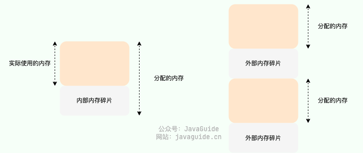
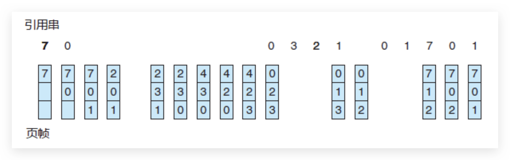
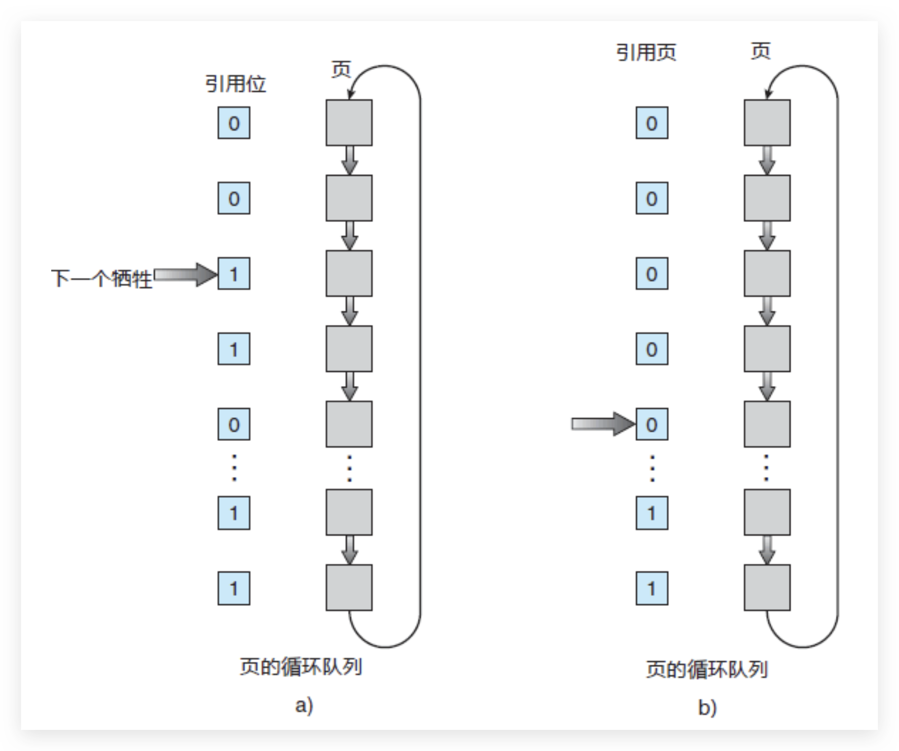

# 1 内存管理主要做了什么？

操作系统的内存管理非常重要，主要负责下面这些事情：

- **内存的分配与回收** ：对进程所需的内存进行分配和释放，malloc 函数：申请内存，free 函数：释放内存。
- **地址转换** ：将程序中的虚拟地址转换成内存中的物理地址。
- **内存扩充** ：当系统没有足够的内存时，利用虚拟内存技术或自动覆盖技术，从逻辑上扩充内存。
- **内存映射** ：将一个文件直接映射到进程的进程空间中，这样可以通过内存指针用读写内存的办法直接存取文件内容，速度更快。
- **内存优化** ：通过调整内存分配策略和回收算法来优化内存使用效率。
- **内存安全** ：保证进程之间使用内存互不干扰，避免一些恶意程序通过修改内存来破坏系统的安全性。

# 2 内存碎片

内存碎片是由内存的申请和释放产生的，通常分为下面两种：

- **内部内存碎片(Internal Memory Fragmentation，简称为内存碎片)** ：已经分配给进程使用但未被使用的内存。导致内部内存碎片的主要原因是，当采用固定比例比如 2 的幂次方进行内存分配时，进程所分配的内存可能会比其实际所需要的大。举个例子，一个进程只需要 65 字节的内存，但为其分配了 128（2^7） 大小的内存，那 63 字节的内存就成为了内部内存碎片。
- **外部内存碎片(External Memory Fragmentation，简称为外部碎片)** ：由于未分配的连续内存区域太小，以至于不能满足任意进程所需要的内存分配请求，这些小片段且不连续的内存空间被称为外部碎片。也就是说，外部内存碎片指的是那些并未分配给进程但又不能使用的内存。我们后面介绍的分段机制就会导致外部内存碎片。

内存碎片会导致内存利用率下降，如何减少内存碎片是内存管理要非常重视的一件事情。

# 3 常见的内存管理方式有哪些？ memory management strategies

内存管理方式可以简单分为下面两种：
- **连续内存管理 Contiguous Memory Allocation** ：为一个用户程序分配一个连续的内存空间，内存利用率一般不高。
- **非连续内存管理 non-contiguous** ：允许一个程序使用的内存分布在离散或者说不相邻的内存中，相对更加灵活一些。

Contiguous Memory Allocation is a memory management strategy where a process is allocated a single, unbroken block of memory. 
Unlike non-contiguous methods that can lead to fragmentation, contiguous allocation ensures that the entirety of a process's memory requirements exists in one contiguous space.

## 3.1 连续内存管理

**块式管理** 是早期计算机操作系统的一种连续内存管理方式，存在严重的内存碎片问题。块式管理会将内存分为几个固定大小的块，每个块中只包含一个进程。如果程序运行需要内存的话，操作系统就分配给它一块，如果程序运行只需要很小的空间的话，分配的这块内存很大一部分几乎被浪费了。这些在每个块中未被利用的空间，我们称之为内部内存碎片。除了内部内存碎片之外，由于两个内存块之间可能还会有外部内存碎片，这些不连续的外部内存碎片由于太小了无法再进行分配。

在 Linux 系统中，连续内存管理采用了 **伙伴系统（Buddy System）算法** 来实现，这是一种经典的连续内存分配算法，可以有效解决外部内存碎片的问题。伙伴系统的主要思想是将内存按 2 的幂次划分（每一块内存大小都是 2 的幂次比如 2^6=64 KB），并将相邻的内存块组合成一对伙伴（注意：**必须是相邻的才是伙伴**）。

当进行内存分配时，伙伴系统会尝试找到大小最合适的内存块。如果找到的内存块过大，就将其一分为二，分成两个大小相等的伙伴块。如果还是大的话，就继续切分，直到到达合适的大小为止。

假设两块相邻的内存块都被释放，系统会将这两个内存块合并，进而形成一个更大的内存块，以便后续的内存分配。这样就可以减少内存碎片的问题，提高内存利用率。

虽然解决了外部内存碎片的问题，但伙伴系统仍然存在内存利用率不高的问题（内部内存碎片）。这主要是因为伙伴系统只能分配大小为 2^n 的内存块，因此当需要分配的内存大小不是 2^n 的整数倍时，会浪费一定的内存空间。举个例子：如果要分配 65 大小的内存快，依然需要分配 2^7=128 大小的内存块。

对于内部内存碎片的问题，Linux 采用 **SLAB** 进行解决。由于这部分内容不是本篇文章的重点，这里就不详细介绍了。

## 3.2 非连续内存管理

非连续内存管理存在下面 3 种方式：
- **段式管理** ：以段(—段连续的物理内存)的形式管理/分配物理内存。应用程序的虚拟地址空间被分为大小不等的段，段是有实际意义的，每个段定义了一组逻辑信息，例如有主程序段 MAIN、子程序段 X、数据段 D 及栈段 S 等。
- **页式管理** ：把物理内存分为连续等长的物理页，应用程序的虚拟地址空间划也被分为连续等长的虚拟页，现代操作系统广泛使用的一种内存管理方式。
- **段页式管理机制** ：结合了段式管理和页式管理的一种内存管理机制，把物理内存先分成若干段，每个段又继续分成若干大小相等的页。

# 4 虚拟内存 

## 4.1 什么是虚拟内存？

我们实际的物理内存主要是主存，但是物理主存空间有限，所以一般现代操作系统都会想办法把一部分内存块放到磁盘中，用到的时候再装入主存，但是对用户程序而言，是不需要注意实际的物理内存的，为什么呢？因为有`虚拟内存`的机制。
虚拟内存(Virtual Memory) 是计算机系统内存管理非常重要的一个技术，本质上来说它只是逻辑存在的，是一个假想出来的内存空间，主要作用是作为进程访问主存（物理内存）的桥梁并简化内存管理。

**简单说，虚拟内存是操作系统提供的⼀种机制，将不同进程的虚拟地址和不同内存的物理地址映射起来。**
每个进程都有自己独立的地址空间，再由操作系统映射到到实际的物理内存。

于是，这⾥就引出了两种地址的概念：
程序所使⽤的内存地址叫做**虚拟内存地址**（_Virtual Memory Address_）
实际存在硬件⾥⾯的空间地址叫**物理内存地址**（_Physical Memory Address_）。

总结来说，虚拟内存主要提供了下面这些能力：
- **隔离进程** ：物理内存通过虚拟地址空间访问，虚拟地址空间与进程一一对应。每个进程都认为自己拥有了整个物理内存，进程之间彼此隔离，一个进程中的代码无法更改正在由另一进程或操作系统使用的物理内存。
- **提升物理内存利用率** ：有了虚拟地址空间后，操作系统只需要将进程当前正在使用的部分数据或指令加载入物理内存。
- **简化内存管理** ：进程都有一个一致且私有的虚拟地址空间，程序员不用和真正的物理内存打交道，而是借助虚拟地址空间访问物理内存，从而简化了内存管理。
- **多个进程共享物理内存**：进程在运行过程中，会加载许多操作系统的动态库。这些库对于每个进程而言都是公用的，它们在内存中实际只会加载一份，这部分称为共享内存。
- **提高内存使用安全性** ：控制进程对物理内存的访问，隔离不同进程的访问权限，提高系统的安全性。
- **提供更大的可使用内存空间** ： 可以让程序拥有超过系统物理内存大小的可用内存空间。这是因为当物理内存不够用时，可以利用磁盘充当，将物理内存页（通常大小为 4 KB）保存到磁盘文件（会影响读写速度），数据或代码页会根据需要在物理内存与磁盘之间移动。

## 4.2 没有虚拟内存有什么问题？

如果没有虚拟内存的话，程序直接访问和操作的都是物理内存，看似少了一层中介，但多了很多问题。

**具体有什么问题呢？** 这里举几个例子说明(参考虚拟内存提供的能力回答这个问题)：
1. 用户程序可以访问任意物理内存，可能会不小心操作到系统运行必需的内存，进而造成操作系统崩溃，严重影响系统的安全。
2. 同时运行多个程序容易崩溃。比如你想同时运行一个微信和一个 QQ 音乐，微信在运行的时候给内存地址 1xxx 赋值后，QQ 音乐也同样给内存地址 1xxx 赋值，那么 QQ 音乐对内存的赋值就会覆盖微信之前所赋的值，这就可能会造成微信这个程序会崩溃。
3. 程序运行过程中使用的所有数据或指令都要载入物理内存，根据局部性原理，其中很大一部分可能都不会用到，白白占用了宝贵的物理内存资源。
4. ......

## 4.3 什么是虚拟地址和物理地址？

**物理地址（Physical Address）** 是真正的物理内存中地址，更具体点来说是内存地址寄存器中的地址。程序中访问的内存地址不是物理地址，而是 **虚拟地址（Virtual Address）** 。

也就是说，我们编程开发的时候实际就是在和虚拟地址打交道。比如在 C 语言中，指针里面存储的数值就可以理解成为内存里的一个地址，这个地址也就是我们说的虚拟地址。

操作系统一般通过 CPU 芯片中的一个重要组件 **MMU(Memory Management Unit，内存管理单元)** 将虚拟地址转换为物理地址，这个过程被称为 **地址翻译/地址转换（Address Translation）** 。

通过 MMU 将虚拟地址转换为物理地址后，再通过总线传到物理内存设备，进而完成相应的物理内存读写请求。

MMU 将虚拟地址翻译为物理地址的主要机制有两种: **分段机制** 和 **分页机制** 。

## 4.4 什么是虚拟地址空间和物理地址空间？

- 虚拟地址空间是虚拟地址的集合，是虚拟内存的范围。每一个进程都有一个一致且私有的虚拟地址空间。
- 物理地址空间是物理地址的集合，是物理内存的范围。

## 4.5 虚拟地址与物理内存地址是如何映射的？

MMU 将虚拟地址翻译为物理地址的主要机制有 3 种:

1. 分段机制
2. 分页机制
3. 段页机制

其中，现代操作系统广泛采用分页机制，需要重点关注！

# 5 分段机制  **Segmentation**

**分段机制（Segmentation）** 以段(—段 **连续** 的物理内存)的形式管理/分配物理内存。==应用程序的虚拟地址空间被分为大小不等的段==，段是有实际意义的，每个段定义了一组逻辑信息，例如有主程序段 MAIN、子程序段 X、数据段 D 及栈段 S 等。

## 5.1 什么是内存分段？

程序是由若⼲个逻辑分段组成的，如可由代码分段、数据分段、栈段、堆段组成。不同的段是有不同的属性的，所以就⽤分段（Segmentation）的形式把这些段分离出来。
分段机制下的虚拟地址由两部分组成，**段号**和**段内偏移量**。
虚拟地址和物理地址通过段表映射，段表主要包括**段号**、`段的界限`。

虚拟地址、段表、物理地址

我们来看一个映射，虚拟地址：段 3、段偏移量 500 ----> 段基地址 7000+段偏移量 500 ----> 物理地址：8700+。

段虚拟地址映射

## 5.2 段表有什么用？地址翻译过程是怎样的？

分段管理通过 **段表（Segment Table）** 映射虚拟地址和物理地址。

分段机制下的虚拟地址由两部分组成：
- **段号** ：标识着该虚拟地址属于整个虚拟地址空间中的哪一个段。
- **段内偏移量** ：相对于该段起始地址的偏移量。

具体的地址翻译过程如下：

1. MMU 首先解析得到虚拟地址中的段号；
2. 通过段号去该应用程序的段表中取出对应的段信息（找到对应的段表项）；
3. 从段信息中取出该段的起始地址（物理地址）加上虚拟地址中的段内偏移量得到最终的物理地址。

段表中还存有诸如段长(可用于检查虚拟地址是否超出合法范围)、段类型（该段的类型，例如代码段、数据段等）等信息。

**通过段号一定要找到对应的段表项吗？得到最终的物理地址后对应的物理内存一定存在吗？**

不一定。段表项可能并不存在：

- **段表项被删除** ：软件错误、软件恶意行为等情况可能会导致段表项被删除。
- **段表项还未创建** ：如果系统内存不足或者无法分配到连续的物理内存块就会导致段表项无法被创建。

## 5.3 分段机制为什么会导致内存外部碎片？

分段机制容易出现外部内存碎片，即在段与段之间留下碎片空间(不足以映射给虚拟地址空间中的段)。从而造成物理内存资源利用率的降低。

举个例子：假设可用物理内存为 5G 的系统使用分段机制分配内存。现在有 4 个进程，每个进程的内存占用情况如下：

- 进程 1：0~1G（第 1 段）
- 进程 2：1~3G（第 2 段）
- 进程 3：3~4.5G（第 3 段）
- 进程 4：4.5~5G（第 4 段）

此时，我们关闭了进程 1 和进程 4，则第 1 段和第 4 段的内存会被释放，空闲物理内存还有 1.5G。由于这 1.5G 物理内存并不是连续的，导致没办法将空闲的物理内存分配给一个需要 1.5G 物理内存的进程。

# 6 分页机制 paging 

分页机制（Paging） 把主存（物理内存）分为连续等长的物理页，应用程序的虚拟地址空间划也被分为连续等长的虚拟页。现代操作系统广泛采用分页机制。

注意：这里的页是连续等长的，不同于分段机制下不同长度的段。

在分页机制下，应用程序虚拟地址空间中的任意虚拟页可以被映射到物理内存中的任意物理页上，因此可以实现物理内存资源的离散分配。分页机制按照固定页大小分配物理内存，使得物理内存资源易于管理，可有效避免分段机制中外部内存碎片的问题。

## 6.1 内存分页: 页表有什么用？地址翻译过程是怎样的？

**分⻚是把整个虚拟和物理内存空间切成⼀段段固定尺⼨的⼤⼩**。这样⼀个连续并且尺⼨固定的内存空间，我们叫**⻚**（_Page_）。在 Linux 下，每⼀⻚的⼤⼩为 4KB 。
访问分页系统中内存数据需要两次的内存访问 ：一次是从内存中访问页表，从中找到指定的物理页号，加上页内偏移得到实际物理地址，第二次就是根据第一次得到的物理地址访问内存取出数据。

分页管理通过 **页表（Page Table）** 映射虚拟地址和物理地址。我这里画了一张基于单级页表进行地址翻译的示意图。

在分页机制下，每个应用程序都会有一个对应的页表。

分页机制下的虚拟地址由两部分组成：

- **页号** ：通过虚拟页号可以从页表中取出对应的物理页号；
- **页内偏移量** ：物理页起始地址+页内偏移量=物理内存地址。

具体的地址翻译过程如下：

1. MMU 首先解析得到虚拟地址中的虚拟页号；
2. 通过虚拟页号去该应用程序的页表中取出对应的物理页号（找到对应的页表项）；
3. 用该物理页号对应的物理页起始地址（物理地址）加上虚拟地址中的页内偏移量得到最终的物理地址。

页表中还存有诸如访问标志（标识该页面有没有被访问过）、页类型（该段的类型，例如代码段、数据段等）等信息。

**通过虚拟页号一定要找到对应的物理页号吗？找到了物理页号得到最终的物理地址后对应的物理页一定存在吗？**

不一定！可能会存在 **页缺失** 。也就是说，物理内存中没有对应的物理页或者物理内存中有对应的物理页但虚拟页还未和物理页建立映射（对应的页表项不存在）。关于页缺失的内容，后面会详细介绍到。

## 6.2 多级页表知道吗？

操作系统可能会有非常多进程，如果只是使用简单分页，可能导致的后果就是页表变得非常庞大。
所以，引入了多级页表的解决方案。

所谓的多级页表，就是把我们原来的单级页表再次分页，这里利用了`局部性原理`，除了顶级页表，其它级别的页表一来可以在需要的时候才被创建，二来内存紧张的时候还可以被置换到磁盘中。

----

以 32 位的环境为例，虚拟地址空间范围共有 2^32（4G）。假设 一个页的大小是 2^12（4KB），那页表项共有 4G / 4K = 2^20 个。每个页表项为一个地址，占用 4 字节，`2^20 * 2^2/1024*1024`= 4MB。也就是说一个程序啥都不干，页表大小就得占用 4M。

系统运行的应用程序多起来的话，页表的开销还是非常大的。而且，绝大部分应用程序可能只能用到页表中的几项，其他的白白浪费了。

为了解决这个问题，操作系统引入了 **多级页表** ，多级页表对应多个页表，每个页表也前一个页表相关联。32 位系统一般为二级页表，64 位系统一般为四级页表。

这里以二级页表为例进行介绍：二级列表分为一级页表和二级页表。一级页表共有 1024 个页表项，一级页表又关联二级页表，二级页表同样共有 1024 个页表项。二级页表中的一级页表项是一对多的关系，二级页表按需加载（只会用到很少一部分二级页表），进而节省空间占用。

假设只需要 2 个二级页表，那两级页表的内存占用情况为: 4KB（一级页表占用） + 4KB * 2（二级页表占用） = 12 KB。

多级页表属于时间换空间的典型场景，利用增加页表查询的次数减少页表占用的空间。

## 6.3 快表_TLB_Translation Lookaside Buffer

同样利用了`局部性原理`，即在⼀段时间内，整个程序的执⾏仅限于程序中的某⼀部分。相应地，执⾏所访问的存储空间也局限于某个内存区域。

利⽤这⼀特性，把最常访问的⼏个⻚表项存储到访问速度更快的硬件，于是计算机科学家们，就在 CPU 芯⽚中，加⼊了⼀个专⻔存放程序最常访问的⻚表项的 Cache，这个 Cache 就是 TLB（_Translation Lookaside Buffer_） ，通常称为⻚表缓存、转址旁路缓存、快表等。

为了提高虚拟地址到物理地址的转换速度，操作系统在 **页表方案** 基础之上引入了 **转址旁路缓存(Translation Lookasjde Buffer，TLB，也被称为快表) ** 。

在主流的 AArch64 和 x86-64 体系结构下，TLB 属于 (Memory Management Unit，内存管理单元) 内部的单元，本质上就是一块高速缓存（Cache），缓存了虚拟页号到物理页号的映射关系，你可以将其简单看作是存储着键（虚拟页号）值（物理页号）对的哈希表。

使用 TLB 之后的地址翻译流程是这样的：
1. 用虚拟地址中的虚拟页号作为 key 去 TLB 中查询；
2. 如果能查到对应的物理页的话，就不用再查询页表了，这种情况称为 TLB 命中（TLB hit)。
3. 如果不能查到对应的物理页的话，还是需要去查询主存中的页表，同时将页表中的该映射表项添加到 TLB 中，这种情况称为 TLB 未命中（TLB miss)。
4. 当 TLB 填满后，又要登记新页时，就按照一定的淘汰策略淘汰掉快表中的一个页。

由于页表也在主存中，因此在没有 TLB 之前，每次读写内存数据时 CPU 要访问两次主存。有了 TLB 之后，对于存在于 TLB 中的页表数据只需要访问一次主存即可。

TLB 的设计思想非常简单，但命中率往往非常高，效果很好。这就是因为被频繁访问的页就是其中的很小一部分。

看完了之后你会发现快表和我们平时经常在开发系统中使用的缓存（比如 Redis）很像，的确是这样的，操作系统中的很多思想、很多经典的算法，你都可以在我们日常开发使用的各种工具或者框架中找到它们的影子。

# 7 分段和分页的异同

**共同点** ：
- 都是非连续内存管理的方式。
- 都采用了地址映射的方法，将虚拟地址映射到物理地址，以实现对内存的管理和保护。

**区别** ：
- 分页机制以页面为单位进行内存管理，而分段机制以段为单位进行内存管理。页的大小是固定的，由操作系统决定，通常为 2 的幂次方。而段的大小不固定，取决于我们当前运行的程序。
- 页是物理单位，即操作系统将物理内存划分成固定大小的页面，每个页面的大小通常是 2 的幂次方，例如 4KB、8KB 等等。而段则是逻辑单位，是为了满足程序对内存空间的逻辑需求而设计的，通常根据程序中数据和代码的逻辑结构来划分。
- 分段机制容易出现外部内存碎片，即在段与段之间留下碎片空间(不足以映射给虚拟地址空间中的段)。分页机制解决了外部内存碎片的问题，但仍然可能会出现内部内存碎片。
- 分页机制采用了页表来完成虚拟地址到物理地址的映射，页表通过一级页表和二级页表来实现多级映射；而分段机制则采用了段表来完成虚拟地址到物理地址的映射，每个段表项中记录了该段的起始地址和长度信息。
- 分页机制对程序没有任何要求，程序只需要按照虚拟地址进行访问即可；而分段机制需要程序员将程序分为多个段，并且显式地使用段寄存器来访问不同的段。

- 段是信息的逻辑单位，它是根据用户的需要划分的，因此段对用户是可见的 ；页是信息的物理单位，是为了管理主存的方便而划分的，对用户是透明的。
- 段的大小不固定，有它所完成的功能决定；页的大小固定，由系统决定
- 段向用户提供二维地址空间；页向用户提供的是一维地址空间
- 段是信息的逻辑单位，便于存储保护和信息的共享，页的保护和共享受到限制。

# 8 分页机制中的换页

换页机制的思想是当物理内存不够用的时候，操作系统选择将一些物理页的内容放到磁盘上去，等要用到的时候再将它们读取到物理内存中。也就是说，换页机制利用磁盘这种较低廉的存储设备扩展的物理内存。

这也就解释了一个日常使用电脑常见的问题：为什么操作系统中所有进程运行所需的物理内存即使比真实的物理内存要大一些，这些进程也是可以正常运行的，只是运行速度会变慢。

这同样是一种时间换空间的策略，你用 CPU 的计算时间，页的调入调出花费的时间，换来了一个虚拟的更大的物理内存空间来支持程序的运行。

## 8.1 什么是交换空间？ swap space

操作系统把物理内存(Physical RAM)分成一块一块的小内存，每一块内存被称为页(page)。

当内存资源不足时，Linux 把某些页的内容转移至磁盘上的一块空间上，以释放内存空间。
磁盘上的那块空间叫做交换空间(swap space)，而这一过程被称为交换(swapping)。物理内存和交换空间的总容量就是虚拟内存的可用容量。

用途
- 物理内存不足时一些不常用的页可以被交换出去，腾给系统。
- 程序启动时很多内存页被用来初始化，之后便不再需要，可以交换出去。

## 8.2 页缺失_缺页中断_PageFault

根据维基百科:

> 页缺失（Page Fault，又名硬错误、硬中断、分页错误、寻页缺失、缺页中断、页故障等）指的是当软件试图访问已映射在虚拟地址空间中，但是目前并未被加载在物理内存中的一个分页时，由 MMU 所发出的中断。

缺页中断（Page Fault）是虚拟内存管理的一个重要概念。当一个程序访问的页（页面）不在物理内存中时，就会发生缺页中断。操作系统需要从磁盘上的交换区（或页面文件）中将缺失的页调入内存。

举个例子，你正在一间图书馆（内存）里查找一本特定的书（数据/程序页），图书馆的书架（内存空间）能放的书是有限的。现在，如果你找的那本书正好在书架上，那太好了，直接拿来阅读（内存命中）。

但如果书架上没有（缺页），你需要先去找图书管理员。

图书管理员（操作系统）注意到书架上缺了这本书，然后去仓库里帮你找（缺页中断）。找到书之后，管理员发现书架已经满了，需要先从书架上拿掉一本书（页面置换算法决定哪本书被拿掉），然后把新找到的书放上去，最后把书递给你。

这个过程中，“去仓库找书并换回来”的这一过程就像是发生了缺页中断，而决定哪本书被移出书架以腾出位置放新书的规则，就是页面置换算法在做的事情。

这么做的目的是尽量确保你常读的书都能在书架（内存）上直接找到，避免每次都要去仓库（硬盘）搜寻，因为去仓库找书的过程比较耗时。

---

常见的页缺失有下面这两种：
- **硬性页缺失（Hard Page Fault）** ：物理内存中没有对应的物理页。于是，Page Fault Hander 会指示 CPU 从已经打开的磁盘文件中读取相应的内容到物理内存，而后交由 MMU 建立相应的虚拟页和物理页的映射关系。
- **软性页缺失（Soft Page Fault）**：物理内存中有对应的物理页，但虚拟页还未和物理页建立映射。于是，Page Fault Hander 会指示 MMU 建立相应的虚拟页和物理页的映射关系。

发生上面这两种缺页错误的时候，应用程序访问的是有效的物理内存，只是出现了物理页缺失或者虚拟页和物理页的映射关系未建立的问题。如果应用程序访问的是无效的物理内存的话，还会出现 **无效缺页错误（Invalid Page Fault）** 。

# 9 换页机制: 页面置换算法 Page Replacement Algorithms

https://www.cnblogs.com/Leophen/p/11397699.html
https://www.geeksforgeeks.org/page-replacement-algorithms-in-operating-systems/

推荐阅读：[页面置换算法详解](https://www.cnblogs.com/Leophen/p/11397699.html)

页面置换算法的目标是最小化缺页中断的次数，常见的页面置换算法有最佳⻚⾯置换算法（_OPT_）、先进先出置换算法（_FIFO_）、最近最久未使⽤的置换算法（_LRU_）和时钟页面置换算法等。

当发生硬性页缺失时，如果物理内存中没有空闲的物理页面可用的话。操作系统就必须将物理内存中的一个物理页淘汰出去，这样就可以腾出空间来加载新的页面了。

用来选择淘汰哪一个物理页的规则叫做 **页面置换算法** ，我们可以把页面置换算法看成是淘汰物物理页的规则。

页缺失太频繁的发生会非常影响性能，一个好的页面置换算法应该是可以减少页缺失出现的次数。

常见的页面置换算法有下面这 5 种（其他还有很多页面置换算法都是基于这些算法改进得来的）：

1. **最佳页面置换算法（OPT，Optimal）** ：优先选择淘汰的页面是以后永不使用的，或者是在最长时间内不再被访问的页面，这样可以保证获得最低的缺页率。但由于人们目前无法预知进程在内存下的若干页面中哪个是未来最长时间内不再被访问的，因而该算法无法实现，只是理论最优的页面置换算法，可以作为衡量其他置换算法优劣的标准。
2. **先进先出页面置换算法（FIFO，First In First Out）** : 最简单的一种页面置换算法，总是淘汰最先进入内存的页面，即选择在内存中驻留时间最久的页面进行淘汰。该算法易于实现和理解，一般只需要通过一个 FIFO 队列即可需求。不过，它的性能并不是很好。
3. **最近最久未使用页面置换算法（LRU ，Least Recently Used）** ：LRU 算法赋予每个页面一个访问字段，用来记录一个页面自上次被访问以来所经历的时间 T，当须淘汰一个页面时，选择现有页面中其 T 值最大的，即最近最久未使用的页面予以淘汰。LRU 算法是根据各页之前的访问情况来实现，因此是易于实现的。OPT 算法是根据各页未来的访问情况来实现，因此是不可实现的。
4. **最少使用页面置换算法（LFU，Least Frequently Used）** : 和 LRU 算法比较像，不过该置换算法选择的是之前一段时间内使用最少的页面作为淘汰页。
5. **时钟页面置换算法（Clock）** ：可以认为是一种最近未使用算法，即逐出的页面都是最近没有使用的那个。

**FIFO 页面置换算法性能为何不好？**

主要原因主要有二：
1. **经常访问或者需要长期存在的页面会被频繁调入调出** ：较早调入的页往往是经常被访问或者需要长期存在的页，这些页会被反复调入和调出。
2. **存在 Belady 现象** ：被置换的页面并不是进程不会访问的，有时就会出现分配的页面数增多但缺页率反而提高的异常现象。出现该异常的原因是因为 FIFO 算法只考虑了页面进入内存的顺序，而没有考虑页面访问的频率和紧迫性。

**哪一种页面置换算法实际用的比较多？**

LRU 算法是实际使用中应用的比较多，也被认为是最接近 OPT 的页面置换算法。

不过，需要注意的是，实际应用中这些算法会被做一些改进，就比如 InnoDB Buffer Pool（ InnoDB 缓冲池，MySQL 数据库中用于管理缓存页面的机制）就改进了传统的 LRU 算法，使用了一种称为"Adaptive LRU"的算法（同时结合了 LRU 和 LFU 算法的思想）。

## 9.1 **先进先出置换算法** FIFO

基本思路是，优先淘汰最早进入内存的页面。FIFO 算法维护一个队列，新来的页面加入队尾，当发生页面置换时，队头的页面（即最早进入内存的页面）被移出。

三分恶面渣逆袭：按照进入内存早晚构建的页面链表

FIFO 算法是最简单的页面置换算法。FIFO 页面置换算法为每个页面记录了调到内存的时间，当必须置换页面时会选择最旧的页面
“FIFO 算法当进程分配到的页面数增加时，缺页中断的次数可能增加也可能减少”

FIFO 算法基于队列实现，不是堆栈类算法
注意，并不需要记录调入页面的确切时间，可以创建一个 FIFO 队列，来管理所有的内存页面。置换的是队列的首个页面。当需要调入页面到内存时，就将它加到队列的尾部
FIFO 页面置换算法易于理解和编程。然而，它的性能并不总是十分理想：
    其一，所置换的页面可以是很久以前使用过但现已不再使用的初始化模块
    其二，所置换的页面可以包含一个被大量使用的变量，它早就初始化了，但仍在不断使用

----

****1. First In First Out (FIFO):**** This is the simplest page replacement algorithm. In this algorithm, the operating system keeps track of all pages in the memory in a queue, the oldest page is in the front of the queue. When a page needs to be replaced page in the front of the queue is selected for removal. 

****Example 1:**** Consider page reference string 1, 3, 0, 3, 5, 6, 3 with 3 page frames.Find the number of page faults. 

Initially, all slots are empty, so when 1, 3, 0 came they are allocated to the empty slots —> ****3 Page Faults.****   
when 3 comes, it is already in memory so —> ****0 Page Faults.**** Then 5 comes, it is not available in memory so it replaces the oldest page slot i.e 1. —>****1 Page Fault.**** 6 comes, it is also not available in memory so it replaces the oldest page slot i.e 3 —>****1 Page Fault.**** Finally, when 3 come it is not available so it replaces 0 ****1 page fault.**** 

[****Belady’s anomaly****](https://www.geeksforgeeks.org/operating-system-beladys-anomaly/) proves that it is possible to have more page faults when increasing the number of page frames while using the First in First Out (FIFO) page replacement algorithm.  For example, if we consider reference strings 3, 2, 1, 0, 3, 2, 4, 3, 2, 1, 0, 4, and 3 slots, we get 9 total page faults, but if we increase slots to 4, we get 10-page faults.

## 9.2 **最佳⻚⾯置换算法** OPT Optimal Page replacement:

基本思路是，淘汰以后不会使用的页面。这是理论上的最佳算法，因为它可以保证最低的缺页率。但在实际应用中，由于无法预知未来的访问模式，OPT 通常无法实现。
发现 Belady 异常的一个结果是寻找最优页面置换算法，这个算法具有所有算法的最低的缺页错误率，并且不会遭受 Belady 异常。这种算法确实存在，它被称为 OPT 或 MIN

这种页面置换算法确保对于给定数量的帧会产生最低的可能的缺页错误率
FIFO 和 OPT 算法的区别在于：除了在时间上向后或向前看之外，FIFO 算法使用的是页面调入内存的时间，OPT 算法使用的是页面将来使用的时间

----

In this algorithm, pages are replaced which would not be used for the longest duration of time in the future. 

****Example-2:**** Consider the page references 7, 0, 1, 2, 0, 3, 0, 4, 2, 3, 0, 3, 2, 3 with 4 page frame. Find number of page fault. 

Initially, all slots are empty, so when 7 0 1 2 are allocated to the empty slots —> ****4 Page faults****   
0 is already there so —> ****0 Page fault.**** when 3 came it will take the place of 7 because it is not used for the longest duration of time in the future.—>****1 Page fault.**** 0 is already there so —> ****0 Page fault.**** 4 will takes place of 1 —> ****1 Page Fault.**** 

Now for the further page reference string —> ****0 Page fault**** because they are already available in the memory.   
Optimal page replacement is perfect, but not possible in practice as the operating system cannot know future requests. The use of Optimal Page replacement is to set up a benchmark so that other replacement algorithms can be analyzed against it.

## 9.3 **最近的最少被使⽤(最长时没有被使用)的置换算法**  LRU   Least Recently Used

基本思路是，淘汰最近没有使用的页面。LRU 算法根据页面的访问历史来进行置换，最长时间未被访问的页面将被置换出去。
相对更接近最优算法的效果，因为最近未使用的页面可能在将来也不会被使用。但 LRU 算法的实现需要跟踪页面的访问历史，可能会增加系统的开销。

选择最近最长时间未访问过的页面予以淘汰，它认为过去一段时间内未访问过的页面，在最近的将来可能也不会被访问。该算法为每个页面设置一个访问字段，来记录页面自上次被访问以来所经历的时间，淘汰页面时选择现有页面中值最大的予以淘汰

OPT 和 LRU 算法的区别在于：LRU 算法根据各页以前的情况，是“向前看”的，而最佳置换算法则根据各页以后的使用情况，是“向后看”的  
LRU 性能较好，但需要寄存器和栈的硬件支持

LRU 是堆栈类的算法，理论上可以证明，堆栈类算法不可能出现 Belady 异常

----

In this algorithm, page will be replaced which is least recently used. 

****Example-3:**** Consider the page reference string 7, 0, 1, 2, 0, 3, 0, 4, 2, 3, 0, 3, 2, 3 with 4 page frames. Find number of page faults. 

Initially, all slots are empty, so when 7 0 1 2 are allocated to the empty slots —> ****4 Page faults****   
0 is already their so —> ****0 Page fault.**** when 3 came it will take the place of 7 because it is least recently used —>****1 Page fault****   
0 is already in memory so —> ****0 Page fault****.   
4 will takes place of 1 —> ****1 Page Fault****   
Now for the further page reference string —> ****0 Page fault**** because they are already available in the memory.

## 9.4 **时钟页面置换算法** CLOCK

时钟算法是 LRU 的一种近似和实现简单的形式。它通过一个循环列表（类似时钟的指针）遍历页面，每个页面有一个使用位，当页面被访问时，使用位设置为 1。

当需要页面置换时，时钟指针会顺时针移动，直到找到使用位为 0 的页面进行置换。这个过程类似于给每个页面一个二次机会。算法执行时，会先将使用位从 1 清零，如果该页面再次被访问，它的使用位再次被设置为 1。

简单的 CLOCK 算法是给每一帧关联一个附加位，称为使用位。
当某一页首次装入主存时，该帧的使用位设置为1;
当该页随后再被访问到时，它的使用位也被置为1。

对于页替换算法，用于替换的候选帧集合看做一个循环缓冲区，并且有一个指针与之相关联。
当某一页被替换时，该指针被设置成指向缓冲区中的下一帧。
当需要替换一页时，操作系统扫描缓冲区，以查找使用位被置为0的一帧。
==每当遇到一个使用位为1的帧时，操作系统就将该位重新置为0；==
如果在这个过程开始时，缓冲区中所有帧的使用位均为0，则选择遇到的第一个帧替换；
如果所有帧的使用位均为1,则指针在缓冲区中完整地循环一周，把所有使用位都置为0，并且停留在最初的位置上，替换该帧中的页。
由于该算法循环地检查各页面的情况，故称为 CLOCK 算法，又称为最近未用( Not Recently Used, NRU )算法。

## 9.5 **最不常⽤置换算法**  LFU 

根据页面被访问的频率进行置换，访问次数最少的页面最先被置换。实现较为复杂，需要记录每个页面的访问频率。

最不经常使用（LFU）页面置换算法要求置换具有最小计数的页面。

这种选择的原因是，积极使用的页面应当具有大的引用计数。然而，当一个页面在进程的初始阶段大量使用但是随后不再使用时，会出现问题。由于被大量使用，它有一个大的计数，即使不再需要却仍保留在内存中。一种解决方案是，定期地将计数右移 1 位，以形成指数衰减的平均使用计数。

## 9.6 MFU（最常使用算法）

最经常使用（MFU）页面置换算法是基于如下论点：
具有最小计数的页面可能刚刚被引入并且尚未使用。

MFU 和 LFU 置换都不常用。这些算法的实现是昂贵的，并且它们不能很好地近似 OPT 置换。

## 9.7 Most Recently Used (MRU)

In this algorithm, page will be replaced which has been used recently. Belady’s anomaly can occur in this algorithm.

Initially, all slots are empty, so when 7 0 1 2 are allocated to the empty slots —> ****4 Page faults**** 

0 is already their so–> ****0 page fault****

when 3 comes it will take place of 0 because it is most recently used —>****1 Page fault**** 

when 0 comes it will take place of 3  —>****1 Page fault**** 

when 4 comes it will take place of 0  —>****1 Page fault**** 

2 is already in memory so —> ****0 Page fault****

when 3 comes it will take place of 2  —>****1 Page fault**** 

when 0 comes it will take place of 3  —>****1 Page fault**** 

when 3 comes it will take place of 0  —>****1 Page fault**** 

when 2 comes it will take place of 3  —>****1 Page fault**** 

when 3 comes it will take place of 2  —>****1 Page fault****

# 10 段页机制

结合了段式管理和页式管理的一种内存管理机制，把物理内存先分成若干段，每个段又继续分成若干大小相等的页。

在段页式机制下，地址翻译的过程分为两个步骤：

1. 段式地址映射。
2. 页式地址映射。

# 11 局部性原理

要想更好地理解虚拟内存技术，必须要知道计算机中著名的 **局部性原理（Locality Principle）**。另外，局部性原理既适用于程序结构，也适用于数据结构，是非常重要的一个概念。

局部性原理是指在程序执行过程中，数据和指令的访问存在一定的空间和时间上的局部性特点。其中，时间局部性是指一个数据项或指令在一段时间内被反复使用的特点，空间局部性是指一个数据项或指令在一段时间内与其相邻的数据项或指令被反复使用的特点。

在分页机制中，页表的作用是将虚拟地址转换为物理地址，从而完成内存访问。在这个过程中，局部性原理的作用体现在两个方面：
- **时间局部性** ：由于程序中存在一定的循环或者重复操作，因此会反复访问同一个页或一些特定的页，这就体现了时间局部性的特点。为了利用时间局部性，分页机制中通常采用缓存机制来提高页面的命中率，即将最近访问过的一些页放入缓存中，如果下一次访问的页已经在缓存中，就不需要再次访问内存，而是直接从缓存中读取。
- **空间局部性** ：由于程序中数据和指令的访问通常是具有一定的空间连续性的，因此当访问某个页时，往往会顺带访问其相邻的一些页。为了利用空间局部性，分页机制中通常采用预取技术来预先将相邻的一些页读入内存缓存中，以便在未来访问时能够直接使用，从而提高访问速度。

总之，局部性原理是计算机体系结构设计的重要原则之一，也是许多优化算法的基础。在分页机制中，利用时间局部性和空间局部性，采用缓存和预取技术，可以提高页面的命中率，从而提高内存访问效率

