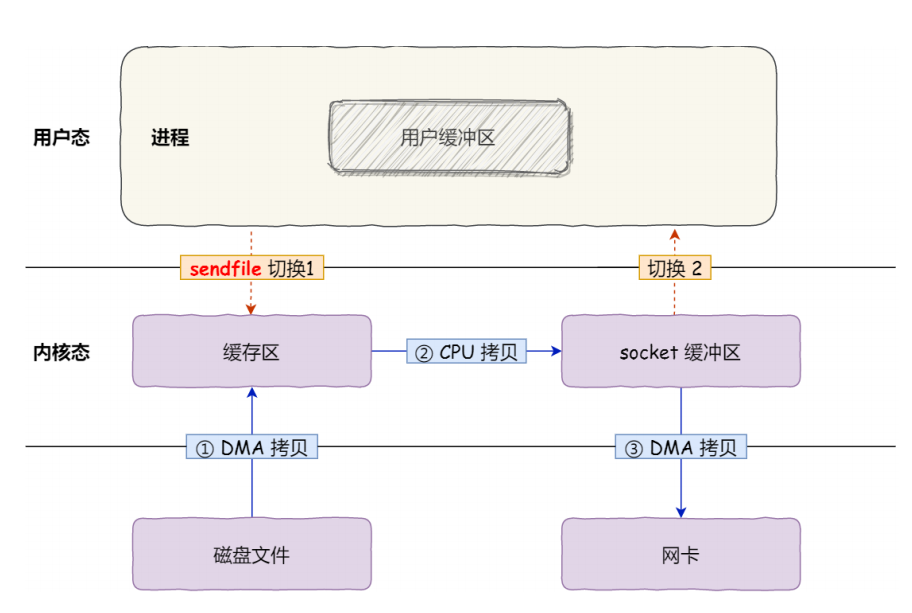
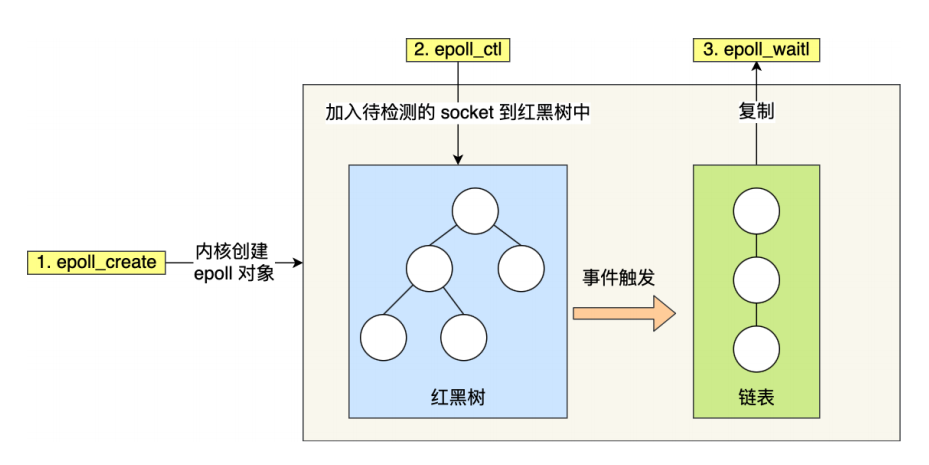

# 1 零拷贝了解吗？

假如需要文件传输，使用传统 I/O，数据读取和写入是用户空间到内核空间来回赋值，而内核空间的数据是通过操作系统的 I/O 接口从磁盘读取或者写入，这期间发生了多次用户态和内核态的上下文切换，以及多次数据拷贝。

为了提升 I/O 性能，就需要**减少用户态与内核态的上下文切换**和**内存拷贝的次数**。

这就用到了我们零拷贝的技术，零拷贝技术实现主要有两种：

## 1.1 mmap + write
mmap() 系统调⽤函数会直接把内核缓冲区⾥的数据「**映射**」到⽤户空间，这样，操作系统内核与⽤户空间就不需要再进⾏任何的数据拷⻉操作。

## 1.2 sendfile

在 Linux 内核版本 2.1 中，提供了⼀个专⻔发送⽂件的系统调⽤函数 sendfile() 。
⾸先，它可以替代前⾯的 read() 和 write() 这两个系统调⽤，这样就可以减少⼀次系统调⽤，也就减少了 2 次上下⽂切换的开销。
其次，该系统调⽤，可以直接把内核缓冲区⾥的数据拷⻉到 socket 缓冲区⾥，不再拷⻉到⽤户态，这样就只有 2 次上下⽂切换，和 3 次数据拷⻉。

很多开源项目如 Kafka、RocketMQ 都采用了零拷贝技术来提升 IO 效率。

# 2 聊聊阻塞与⾮阻塞 IO、 同步与异步 IO？

## 2.1 同步调⽤

**阻塞 I/O**
先来看看**阻塞** **I/O**，当⽤户程序执⾏ read ，线程会被阻塞，⼀直等到内核数据准备好，并把数据从内核缓冲区拷⻉到应⽤程序的缓冲区中，当拷⻉过程完成， read 才会返回。
注意，**阻塞等待的是`内核数据准备好`和`数据从内核态拷⻉到⽤户态`这两个过程**。

**非阻塞 I/O**
⾮阻塞的 read 请求在数据未准备好的情况下⽴即返回，可以继续往下执⾏，此时应⽤程序不断轮询内核，直到数据准备好，内核将数据拷⻉到应⽤程序缓冲区， read 调⽤才可以获取到结果。

基于非阻塞的 I/O 多路复用
我们上面的非阻塞 I/O 有一个问题，什么问题呢？应用程序要一直轮询，这个过程没法干其它事情，所以引入了**I/O** **多路复⽤**技术。
当内核数据准备好时，以事件通知应⽤程序进⾏操作。

**注意：**⽆论是阻塞 I/O、还是⾮阻塞 I/O、非阻塞 I/O 多路复用，都是同步调⽤。因为它们在 read 调⽤时，内核将数据从内核空间拷⻉到应⽤程序空间，过程都是需要等待的，也就是说这个过程是**同步**的，如果内核实现的拷⻉效率不⾼，read 调⽤就会在这个同步过程中等待⽐较⻓的时间。

## 2.2 异步 I/O

真正的**异步** **I/O** 是`内核数据准备好`和`数据从内核态拷⻉到⽤户态`这两个过程都不⽤等待。

发起 aio_read 之后，就⽴即返回，内核⾃动将数据从内核空间拷⻉到应⽤程序空间，这个拷⻉过程同样是异步的，内核⾃动完成的，和前⾯的同步操作不⼀样，应⽤程序并不需要主动发起拷⻉动作。

异步/IO

> 拿例子理解几种 I/O 模型

老三关注了很多 UP 主，有些 UP 主是老鸽子，到了更新的时间：

- 阻塞 I/O 就是，老三不干别的，就干等着，盯着 UP 的更新。
- 非阻塞 I/O 就是，老三发现 UP 没更，就去喝个茶什么的，过一会儿来盯一次，一直等到 UP 更新。
- 基于⾮阻塞的 I/O 多路复⽤好⽐，老三发现 UP 没更，就去干别的，过了一会儿 B 站推送消息了，老三一看，有很多条，就去翻动态，看看等的 UP 是不是更新了。
- 异步 I/O 就是，老三说 UP 你该更了，UP 赶紧爆肝把视频做出来，然后把视频亲自呈到老三面前，这个过程不用等待。

# 3 详细讲一讲 I/O 多路复用？

> 我们先了解什么是 I/O 多路复用？

我们在传统的 I/O 模型中，如果服务端需要支持多个客户端，我们可能要为每个客户端分配一个进程/线程。
不管是基于重一点的进程模型，还是轻一点的线程模型，假如连接多了，操作系统是扛不住的。

所以就引入了**I/O 多路复用** 技术。

简单说，就是一个进程/线程维护多个 Socket，这个多路复用就是多个连接复用一个进程/线程。

## 3.1 I/O 多路复用三种实现机制：

select 实现多路复⽤的⽅式是：
将已连接的 Socket 都放到⼀个**⽂件描述符集合**fd_set，然后调⽤ select 函数将 fd_set 集合拷⻉到内核⾥，让内核来检查是否有⽹络事件产⽣，检查的⽅式很粗暴，就是通过遍历 fd_set 的⽅式，当检查到有事件产⽣后，将此 Socket 标记为可读或可写， 接着再把整个 fd_set 拷⻉回⽤户态⾥，然后⽤户态还需要再通过遍历的⽅法找到可读或可写的 Socket，再对其处理。

select 使⽤固定⻓度的 BitsMap，表示⽂件描述符集合，⽽且所⽀持的⽂件描述符的个数是有限制的，在 Linux 系统中，由内核中的 FD_SETSIZE 限制， 默认最⼤值为 1024 ，只能监听 0~1023 的⽂件描述符。

select 机制的缺点：
（1）每次调用 select，都需要把 fd_set 集合从用户态拷贝到内核态，如果 fd_set 集合很大时，那这个开销也很大，比如百万连接却只有少数活跃连接时这样做就太没有效率。
（2）每次调用 select 都需要在内核遍历传递进来的所有 fd_set，如果 fd_set 集合很大时，那这个开销也很大。
（3）为了减少数据拷贝带来的性能损坏，内核对被监控的 fd_set 集合大小做了限制，一般为 1024，如果想要修改会比较麻烦，可能还需要编译内核。
（4）每次调用 select 之前都需要遍历设置监听集合，重复工作。

---

poll
poll 不再⽤ BitsMap 来存储所关注的⽂件描述符，取⽽代之⽤动态数组，以链表形式来组织，突破了 select 的⽂件描述符个数限制，当然还会受到系统⽂件描述符限制。
但是 poll 和 select 并没有太⼤的本质区别，都是使⽤线性结构存储进程关注的 Socket 集合，因此都需要遍历⽂件描述符集合来找到可读或可写的 Socket，时间复杂度为 O(n)，⽽且也需要在⽤户态与内核态之间拷⻉⽂件描述符集合，这种⽅式随着并发数上来，性能的损耗会呈指数级增⻓。

---

epoll
epoll 通过两个⽅⾯，很好解决了 select/poll 的问题。

第⼀点，epoll 在内核⾥使⽤**红⿊树来跟踪进程所有待检测的⽂件描述字**，把需要监控的 socket 通过 epoll_ctl() 函数加⼊内核中的红⿊树⾥，红⿊树是个⾼效的数据结构，增删查⼀般时间复杂度是 O(logn) ，通过对这棵⿊红树进⾏操作，这样就不需要像 select/poll 每次操作时都传⼊整个 socket 集合，只需要传⼊⼀个待检测的 socket，**减少了内核和⽤户空间⼤量的数据拷⻉和内存分配**。

第⼆点， epoll 使⽤事件驱动的机制，内核⾥**维护了⼀个链表来记录就绪事件**，当某个 socket 有事件发⽣时，通过回调函数，内核会将其加⼊到这个就绪事件列表中，当⽤户调⽤ epoll_wait() 函数时，只会返回有事件发⽣的⽂件描述符的个数，不需要像 select/poll 那样轮询扫描整个 socket 集合，⼤⼤提⾼了检测的效率。

epoll 的⽅式即使监听的 Socket 数量越多的时候，效率不会⼤幅度降低，能够同时监听的 Socket 的数⽬也⾮常的多了，上限就为系统定义的进程打开的最⼤⽂件描述符个数。因⽽，**epoll** **被称为解决** **C10K** **问题的利器**。
