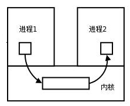
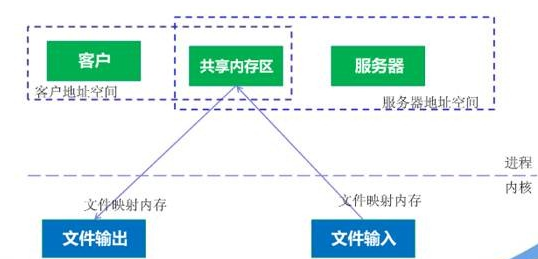
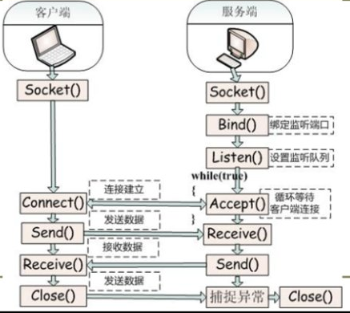

# 1 并行和并发有什么区别？

Parallelism and Concurrency

并发就是在一段时间内，多个任务都会被处理；但在某一时刻，只有一个任务在执行。单核处理器做到的并发，其实是利用时间片的轮转，例如有两个进程 A 和 B，A 运行一个时间片之后，切换到 B，B 运行一个时间片之后又切换到 A。因为切换速度足够快，所以宏观上表现为在一段时间内能同时运行多个程序。

并行就是在同一时刻，有多个任务在执行。这个需要多核处理器才能完成，在微观上就能同时执行多条指令，不同的程序被放到不同的处理器上运行，这个是物理上的多个进程同时进行。


并发和并行


# 2 进程

## 2.1 什么是进程上下文切换？

对于单核单线程 CPU 而言，在某一时刻只能执行一条 CPU 指令。上下文切换 (Context Switch) 是一种将 CPU 资源从一个进程分配给另一个进程的机制。从用户角度看，计算机能够并行运行多个进程，这恰恰是操作系统通过快速上下文切换造成的结果。在切换的过程中，操作系统需要先存储当前进程的状态 (包括内存空间的指针，当前执行完的指令等等)，再读入下一个进程的状态，然后执行此进程。

## 2.2 进程有哪些状态？

当一个进程开始运行时，它可能会经历下面这几种状态：
调度程序: scheduler

上图中各个状态的意义：
- 运⾏状态（_Runing_）：该时刻进程占⽤ CPU；
- 就绪状态（_Ready_）：可运⾏，由于其他进程处于运⾏状态⽽暂时停⽌运⾏；
- 阻塞状态（_Blocked_）：该进程正在等待某⼀事件发⽣（如等待输⼊/输出操作的完成）⽽暂时停⽌运⾏，这时，即使给它 CPU 控制权，它也⽆法运⾏；


进程3种状态

当然，进程还有另外两个基本状态：
- 创建状态（_new_）：进程正在被创建时的状态；
- 结束状态（_Exit_）：进程正在从系统中消失时的状态；


进程5种状态

## 2.3 Zombie Process and Orphan Process 

我们知道在unix/linux中，正常情况下，子进程是通过父进程创建的，子进程在创建新的进程。子进程的结束和父进程的运行是一个异步过程,即父进程永远无法预测子进程 到底什么时候结束。 当一个 进程完成它的工作终止之后，它的父进程需要调用wait()或者waitpid()系统调用取得子进程的终止状态。

1  僵尸进程 
僵尸进程是已完成且处于终止状态，但在进程表中却仍然存在的进程。
僵尸进程一般发生有父子关系的进程中，一个子进程的进程描述符在子进程退出时不会释放

一个进程使用fork创建子进程，如果子进程退出，而父进程并没有调用wait或waitpid获取子进程的状态信息，那么子进程的进程描述符仍然保存在系统中。这种进程称之为僵死进程。

只有当父进程通过 wait() 或 waitpid() 获取了子进程信息后才会释放。如果子进程退出，而父进程并没有调用 wait() 或 waitpid()，那么子进程的进程描述符仍然保存在系统中。

2  孤儿进程
一个父进程退出，而它的一个或多个子进程还在运行，那么那些子进程将成为孤儿进程。孤儿进程将被init进程(进程号为1)所收养，并由init进程对它们完成状态收集工作。因为孤儿进程会被 init 进程收养，所以孤儿进程不会对系统造成危害。


### 2.3.1 问题及危害

unix提供了一种机制可以保证只要父进程想知道子进程结束时的状态信息， 就可以得到。
这种机制就是: 在每个进程退出的时候,内核释放该进程所有的资源,包括打开的文件,占用的内存等。 但是仍然为其保留一定的信息(包括进程号the process ID,退出状态the termination status of the process,运行时间the amount of CPU time taken by the process等)。直到父进程通过wait / waitpid来取时才释放。 但这样就导致了问题，如果进程不调用wait / waitpid的话， 那么保留的那段信息就不会释放，其进程号就会一直被占用，但是系统所能使用的进程号是有限的，如果大量的产生僵死进程，将因为没有可用的进程号而导致系统不能产生新的进程. 此即为僵尸进程的危害，应当避免。

孤儿进程是没有父进程的进程，孤儿进程这个重任就落到了init进程身上，init进程就好像是一个民政局，专门负责处理孤儿进程的善后工作。每当出现一个孤儿进程的时候，内核就把孤 儿进程的父进程设置为init，而init进程会循环地wait()它的已经退出的子进程。这样，当一个孤儿进程凄凉地结束了其生命周期的时候，init进程就会代表党和政府出面处理它的一切善后工作。因此孤儿进程并不会有什么危害。

任何一个子进程 (init除外) 在exit()之后，并非马上就消失掉，而是留下一个称为僵尸进程(Zombie)的数据结构，等待父进程处理。这是每个 子进程在结束时都要经过的阶段。如果子进程在exit()之后，父进程没有来得及处理，这时用ps命令就能看到子进程的状态是“Z”。如果父进程能及时 处理，可能用ps命令就来不及看到子进程的僵尸状态，但这并不等于子进程不经过僵尸状态。  如果父进程在子进程结束之前退出，则子进程将由init接管。init将会以父进程的身份对僵尸状态的子进程进行处理。

僵尸进程危害场景：

例如有个进程，它定期的产生一个子进程，这个子进程需要做的事情很少，做完它该做的事情之后就退出了，因此这个子进程的生命周期很短，但是，父进程只管生成新的子进程，至于子进程 退出之后的事情，则一概不闻不问，这样，系统运行上一段时间之后，系统中就会存在很多的僵死进程，倘若用ps命令查看的话，就会看到很多状态为Z的进程。 严格地来说，僵死进程并不是问题的根源，罪魁祸首是产生出大量僵死进程的那个父进程。因此，当我们寻求如何消灭系统中大量的僵死进程时，答案就是把产生大 量僵死进程的那个元凶枪毙掉（也就是通过kill发送SIGTERM或者SIGKILL信号啦）。枪毙了元凶进程之后，它产生的僵死进程就变成了孤儿进 程，这些孤儿进程会被init进程接管，init进程会wait()这些孤儿进程，释放它们占用的系统进程表中的资源，这样，这些已经僵死的孤儿进程 就能瞑目而去了


### 2.3.2 僵尸进程解决办法

**（1）通过信号机制**
　　子进程退出时向父进程发送SIGCHILD信号，父进程处理SIGCHILD信号。在信号处理函数中调用wait进行处理僵尸进程。测试程序如下所示：

```C++
#include <stdio.h>
#include <unistd.h>
#include <errno.h>
#include <stdlib.h>
#include <signal.h>

static void sig_child(int signo);

int main()
{
    pid_t pid;
    //创建捕捉子进程退出信号
    signal(SIGCHLD,sig_child);
    pid = fork();
    if (pid < 0)
    {
        perror("fork error:");
        exit(1);
    }
    else if (pid == 0)
    {
        printf("I am child process,pid id %d.I am exiting.\n",getpid());
        exit(0);
    }
    printf("I am father process.I will sleep two seconds\n");
    //等待子进程先退出
    sleep(2);
    //输出进程信息
    system("ps -o pid,ppid,state,tty,command");
    printf("father process is exiting.\n");
    return 0;
}

static void sig_child(int signo)
{
     pid_t        pid;
     int        stat;
     //处理僵尸进程
     while ((pid = waitpid(-1, &stat, WNOHANG)) >0)
            printf("child %d terminated.\n", pid);
}
```


（2）fork两次
　　《Unix 环境高级编程》8.6节说的非常详细。原理是将子进程成为孤儿进程，从而其的父进程变为init进程，通过init进程可以处理僵尸进程。测试程序如下所示：
fork 一次就创建一次子进程 

``` c++
#include <stdio.h>
#include <stdlib.h>
#include <unistd.h>
#include <errno.h>

int main()
{
    pid_t  pid;
    //创建第一个子进程
    pid = fork();
    if (pid < 0)
    {
        perror("fork error:");
        exit(1);
    }
    //第一个子进程
    else if (pid == 0)
    {
        //子进程再创建子进程
        printf("I am the first child process.pid:%d\tppid:%d\n",getpid(),getppid());
        pid = fork();
        if (pid < 0)
        {
            perror("fork error:");
            exit(1);
        }
        //第一个子进程退出
        else if (pid >0)
        {
            printf("first procee is exited.\n");
            exit(0);
        }
        //第二个子进程
        //睡眠3s保证第一个子进程退出，这样第二个子进程的父亲就是init进程里
        sleep(3);
        printf("I am the second child process.pid: %d\tppid:%d\n",getpid(),getppid());
        exit(0);
    }
    //父进程处理第一个子进程退出
    if (waitpid(pid, NULL, 0) != pid)
    {
        perror("waitepid error:");
        exit(1);
    }
    exit(0);
    return 0;
}
```

## 2.4 进程有哪些调度算法？

进程调度是操作系统中的核心功能之一，它负责决定哪些进程在何时使用 CPU。这一决定基于系统中的进程调度算法。
Scheduling Algorithm


DIDA-lJ-进程调度算法

①、**先来先服务**

这是最简单的调度算法，也称为先进先出（FIFO）。进程按照请求 CPU 的顺序进行调度。这种方式易于实现，但可能会导致较短的进程等待较长进程执行完成，从而产生“饥饿”现象。


②、**短作业优先**

选择预计运行时间最短的进程优先执行。这种方式可以减少平均等待时间和响应时间，但缺点是很难准确预知进程的执行时间，并且可能因为短作业一直在执行，导致长作业持续被推迟执行。


三分恶面渣逆袭：短作业优先

③、**优先级调度**

在这种调度方式中，每个进程都被分配一个优先级。CPU 首先分配给优先级最高的进程。优先级调度可以是非抢占式的或抢占式的。在非抢占式优先级调度中，进程一旦开始执行将一直运行直到完成；在抢占式优先级调度中，更高优先级的进程可以中断正在执行的低优先级进程。


三分恶面渣逆袭：优先级调度

④、**时间片轮转**

时间片轮转调度为每个进程分配一个固定的时间段，称为时间片，进程可以在这个时间片内运行。如果进程在时间片结束时还没有完成，它将被放回队列的末尾。时间片轮转是公平的调度方式，可以保证所有进程得到公平的 CPU 时间，适用于共享系统。


三分恶面渣逆袭：时间片轮转

⑤、**最短剩余时间优先**

这是短作业优先的一种改进形式，它是抢占式的。即如果一个新进程的预计执行时间比当前运行进程的剩余时间短，调度器将暂停当前的进程，并切换到新进程。这种方法也可以最小化平均等待时间，但同样面临预测执行时间的困难。

⑥ **多级反馈队列**

一个进程需要执行100 哥时间片，如果采用时间片轮转调度算法，那么需要交互 100 次。

多级队列就是为这种需要连续执行多个时间片的进程考虑，它设置了多个队列，每个队列的时间片大小不同，比如 2,4,6,8······。进程在第一个队列没执行完，就会被移到下一个队列。

这种方式下，之前的进程只需要交换 7 次就可以了。每个队列优先权不一样，最上面的队列优先权最高。因此只有上一个队列没有进程在排队，才能调度当前队列上的进程。

可以将这种调度算法看成是时间片轮转调度算法与优先级调度算法的结合。


DIDA-lJ-多级反馈队列

## 2.5 进程间通信有哪些方式？

https://blog.csdn.net/universsky2015/article/details/120235397

推荐阅读：[编程十万问：进程间通信的方式有哪些？](https://www.nowcoder.com/discuss/536674147976470528)

进程是计算机系统分配资源的最小单位(严格说来是线程)。每个进程都有自己的一部分独立的系统资源，彼此是隔离的。为了能使不同的进程互相访问资源并进行协调工作，才有了进程间通信。通常，使用进程间通信的两个应用可以被分为客户端和服务器(见主从式架构)，客户端进程请求数据，服务端响应客户端的数据请求。有一些应用本身既是服务器又是客户端，这在分布式计算中，时常可以见到。这些进程可以运行在同一计算机上或网络连接的不同计算机上。

IPC对微内核和nano内核的设计过程非常重要。 微内核减少了内核提供的功能数量。 然后通过IPC与服务器通信获得这些功能，与普通的宏内核相比，IPC的数量大幅增加。

一、进程间通信的概念

每个进程各自有不同的用户地址空间，任何一个进程的全局变量在另一个进程中都看不到，所以进程之间要交换数据必须通过内核，在内核中开辟一块缓冲区，进程1把数据从用户空间拷到内核缓冲区，进程2再从内核缓冲区把数据读走，内核提供的这种机制称为进程间通信(IPC，InterProcess Communication)



----


进程间通信（IPC，Inter-Process Communication）的方式有管道 pipe、信号 signal、消息队列 Message queue 、共享内存 shared memory、信号量和套接字 socket


编程十万问：进程间通信

|Method|Short Description|Provided by ([operating systems](https://en.wikipedia.org/wiki/Operating_system "Operating system") or other environments)|
|---|---|---|
|[File](https://en.wikipedia.org/wiki/Computer_file "Computer file")|A record stored on disk, or a record synthesized on demand by a file server, which can be accessed by multiple processes.|Most operating systems|
|Communications file|A unique form of IPC in the late-1960s that most closely resembles [Plan 9](https://en.wikipedia.org/wiki/Plan_9_from_Bell_Labs "Plan 9 from Bell Labs")'s [9P protocol](https://en.wikipedia.org/wiki/9P_(protocol) "9P (protocol)")|[Dartmouth Time-Sharing System](https://en.wikipedia.org/wiki/Dartmouth_Time-Sharing_System "Dartmouth Time-Sharing System")|
|[Signal](https://en.wikipedia.org/wiki/Signal_(computing) "Signal (computing)"); also [Asynchronous System Trap](https://en.wikipedia.org/wiki/Asynchronous_System_Trap "Asynchronous System Trap")|A system message sent from one process to another, not usually used to transfer data but instead used to remotely command the partnered process.|Most operating systems|
|[Socket](https://en.wikipedia.org/wiki/Network_socket "Network socket")|Data sent over a network interface, either to a different process on the same computer or to another computer on the network. Stream-oriented ([TCP](https://en.wikipedia.org/wiki/Transmission_Control_Protocol "Transmission Control Protocol"); data written through a socket requires formatting to preserve message boundaries) or more rarely message-oriented ([UDP](https://en.wikipedia.org/wiki/User_Datagram_Protocol "User Datagram Protocol"), [SCTP](https://en.wikipedia.org/wiki/SCTP "SCTP")).|Most operating systems|
|[Unix domain socket](https://en.wikipedia.org/wiki/Unix_domain_socket "Unix domain socket")|Similar to an internet socket, but all communication occurs within the kernel. Domain sockets use the file system as their address space. Processes reference a domain socket as an [inode](https://en.wikipedia.org/wiki/Inode "Inode"), and multiple processes can communicate with one socket|All POSIX operating systems and Windows 10[[3]](https://en.wikipedia.org/wiki/Inter-process_communication#cite_note-3)|
|[Message queue](https://en.wikipedia.org/wiki/Message_queue "Message queue")|A data stream similar to a socket, but which usually preserves message boundaries. Typically implemented by the operating system, they allow multiple processes to read and write to the [message queue](https://en.wikipedia.org/wiki/Message_queue "Message queue") without being directly connected to each other.|Most operating systems|
|[Anonymous pipe](https://en.wikipedia.org/wiki/Anonymous_pipe "Anonymous pipe")|A unidirectional data channel using [standard input and output](https://en.wikipedia.org/wiki/Stdin "Stdin"). Data written to the write-end of the pipe is buffered by the operating system until it is read from the read-end of the pipe. Two-way communication between processes can be achieved by using two pipes in opposite "directions".|All [POSIX](https://en.wikipedia.org/wiki/POSIX "POSIX") systems, Windows|
|[Named pipe](https://en.wikipedia.org/wiki/Named_pipe "Named pipe")|A pipe that is treated like a file. Instead of using standard input and output as with an anonymous pipe, processes write to and read from a named pipe, as if it were a regular file.|All POSIX systems, Windows, AmigaOS 2.0+|
|[Shared memory](https://en.wikipedia.org/wiki/Shared_memory_(interprocess_communication) "Shared memory (interprocess communication)")|Multiple processes are given access to the same block of [memory](https://en.wikipedia.org/wiki/Memory_(computing) "Memory (computing)"), which creates a shared buffer for the processes to communicate with each other.|All POSIX systems, Windows|
|[Message passing](https://en.wikipedia.org/wiki/Message_passing "Message passing")|Allows multiple programs to communicate using message queues and/or non-OS managed channels. Commonly used in concurrency models.|Used in [LPC](https://en.wikipedia.org/wiki/Local_Inter-Process_Communication "Local Inter-Process Communication"), [RPC](https://en.wikipedia.org/wiki/Remote_procedure_call "Remote procedure call"), [RMI](https://en.wikipedia.org/wiki/Remote_method_invocation "Remote method invocation"), and [MPI](https://en.wikipedia.org/wiki/Message_Passing_Interface "Message Passing Interface") paradigms, [Java RMI](https://en.wikipedia.org/wiki/Java_RMI "Java RMI"), [CORBA](https://en.wikipedia.org/wiki/CORBA "CORBA"), [COM](https://en.wikipedia.org/wiki/Component_Object_Model "Component Object Model"), [DDS](https://en.wikipedia.org/wiki/Data_Distribution_Service "Data Distribution Service"), [MSMQ](https://en.wikipedia.org/wiki/Microsoft_Message_Queuing "Microsoft Message Queuing"), [MailSlots](https://en.wikipedia.org/wiki/MailSlot "MailSlot"), [QNX](https://en.wikipedia.org/wiki/QNX "QNX"), others|
|[Memory-mapped file](https://en.wikipedia.org/wiki/Memory-mapped_file "Memory-mapped file")|A file mapped to [RAM](https://en.wikipedia.org/wiki/RAM "RAM") and can be modified by changing memory addresses directly instead of outputting to a stream. This shares the same benefits as a standard [file](https://en.wikipedia.org/wiki/File_(computing) "File (computing)").|All POSIX systems, Windows|

### 2.5.1 管道 Pipe

管道可以理解成不同进程之间的传话筒，一方发声，一方接收，声音的介质可以是空气或者电缆。

**进程间的管道就是内核中的一串缓存**，从管道的一端写入数据，另一端读取。数据只能单向流动，遵循先进先出（FIFO）的原则。


编程十万问：管道

#### 2.5.1.1 **匿名管道** anonymous pipe：

允许具有亲缘关系的进程（如父子进程）进行通信。


特点:
- 管道是半双工的，数据只能向一个方向流动；需要双方通信时，需要建立起两个管道。
- 只能用于父子进程或者兄弟进程之间(具有亲缘关系的进程);
- 单独构成一种独立的文件系统：管道对于管道两端的进程而言，就是一个文件，但它不是普通的文件，它不属于某种文件系统，而是自立门户，单独构成一种文件系统，并且只存在与内存中。
- 数据的读出和写入：一个进程向管道中写的内容被管道另一端的进程读出。写入的内容每次都添加在管道缓冲区的末尾，并且每次都是从缓冲区的头部读出数据。


管道的实质：
- 管道的实质是一个内核缓冲区，进程以先进先出的方式从缓冲区存取数据，管道一端的进程顺序的将数据写入缓冲区，另一端的进程则顺序的读出数据。
- 该缓冲区可以看做是一个循环队列，读和写的位置都是自动增长的，不能随意改变，一个数据只能被读一次，读出来以后在缓冲区就不复存在了。
- 当缓冲区读空或者写满时，有一定的规则控制相应的读进程或者写进程进入等待队列，当空的缓冲区有新数据写入或者满的缓冲区有数据读出来时，就唤醒等待队列中的进程继续读写。

管道的局限：
- 管道的主要局限性正体现在它的特点上：
    - 只支持单向数据流；
    - 只能用于具有亲缘关系的进程之间；
    - 没有名字；
    - 管道的缓冲区是有限的(管道制存在于内存中，在管道创建时，为缓冲区分配一个页面大小)；
    - 管道所传送的是无格式字节流，这就要求管道的读出方和写入方必须事先约定好数据的格式，比如多少字节算作一个消息(或命令、或记录)等等；

#### 2.5.1.2 **命名管道** named pipe

允许无亲缘关系的进程通信，通过在文件系统中创建一个特殊类型的文件来实现。
缺点：管道的效率低，不适合进程间频繁地交换数据。

匿名管道，由于没有名字，只能用于亲缘关系的进程间通信。为了克服这个缺点，提出了有名管道(FIFO)。
有名管道不同于匿名管道之处在于它提供了一个路径名与之关联，以有名管道的文件形式存在于文件系统中，这样，即使与有名管道的创建进程不存在亲缘关系的进程，只要可以访问该路径，就能够彼此通过有名管道相互通信，因此，通过有名管道不相关的进程也能交换数据。
值的注意的是，有名管道严格遵循先进先出(first in first out),对匿名管道及有名管道的读总是从开始处返回数据，对它们的写则把数据添加到末尾。它们不支持诸如lseek()等文件定位操作。有名管道的名字存在于文件系统中，内容存放在内存中。


#### 2.5.1.3 匿名管道和有名管道总结

(1)管道是特殊类型的文件，在满足先入先出的原则条件下可以进行读写，但不能进行定位读写。
(2)匿名管道是单向的，只能在有亲缘关系的进程间通信；有名管道以磁盘文件的方式存在，可以实现本机任意两个进程通信。
(3)无名管道阻塞问题：无名管道无需显示打开，创建时直接返回文件描述符，在读写时需要确定对方的存在，否则将退出。如果当前进程向无名管道的一端写数据，必须确定另一端有某一进程。如果写入无名管道的数据超过其最大值，写操作将阻塞，如果管道中没有数据，读操作将阻塞，如果管道发现另一端断开，将自动退出。
(4)有名管道阻塞问题：有名管道在打开时需要确实对方的存在，否则将阻塞。即以读方式打开某管道，在此之前必须一个进程以写方式打开管道，否则阻塞。此外，可以以读写(O_RDWR)模式打开有名管道，即当前进程读，当前进程写，不会阻塞。


### 2.5.2 信号 signal

信号可以理解成以前的 BB 机，用于通知接收进程某件事情发生了，是一种较为简单的通信方式，主要用于处理异步事件。
比如`kill -9 1050`就表示给 PID 为 1050 的进程发送`SIGKIL`信号。

信号是Linux系统中用于进程间互相通信或者操作的一种机制，信号可以在任何时候发给某一进程，而无需知道该进程的状态。
如果该进程当前并未处于执行状态，则该信号就有内核保存起来，直到该进程回复执行并传递给它为止。
如果一个信号被进程设置为阻塞，则该信号的传递被延迟，直到其阻塞被取消是才被传递给进程。

这里顺带普及一下 Linux 中常用的信号：
- SIGHUP：当我们退出终端（Terminal）时，由该终端启动的所有进程都会接收到这个信号，系统缺省状态下对该信号的处理是终止进程。。
- SIGINT：程序终止（interrupt）信号。按 `Ctrl+C` 时发出，大家应该在操作终端时有过这种操作。
- SIGQUIT：和 SIGINT 类似，按 `Ctrl+\` 键将发出该信号。它会产生核心转储文件，将内存映像和程序运行时的状态记录下来。
- SIGKILL：强制杀死进程，本信号不能被阻塞和忽略。
- SIGTERM：与 SIGKILL 不同的是该信号可以被阻塞和处理。通常用来要求程序自己正常退出。
- SIGBUS和SIGSEGV：进程访问非法地址
- SIGFPE：运算中出现致命错误，如除零操作、数据溢出等。
- SIGALRM：定时器信号。
- SIGCLD：子进程退出信号。如果其父进程没有忽略该信号也没有处理该信号，则子进程退出后将形成僵尸进程。


**信号来源**
信号是软件层次上对中断机制的一种模拟，是一种异步通信方式，信号可以在用户空间进程和内核之间直接交互，内核可以利用信号来通知用户空间的进程发生了哪些系统事件，信号事件主要有两个来源：

    硬件来源：用户按键输入Ctrl+C退出、硬件异常如无效的存储访问等。
    软件终止：终止进程信号、其他进程调用kill函数、软件异常产生信号。

**信号生命周期和处理流程**
(1)信号被某个进程产生，并设置此信号传递的对象(一般为对应进程的pid)，然后传递给操作系统；
(2)操作系统根据接收进程的设置(是否阻塞)而选择性的发送给接收者，如果接收者阻塞该信号(且该信号是可以阻塞的)，操作系统将暂时保留该信号，而不传递，直到该进程解除了对此信号的阻塞(如果对应进程已经退出，则丢弃此信号)，如果对应进程没有阻塞，操作系统将传递此信号。
(3)目的进程接收到此信号后，将根据当前进程对此信号设置的预处理方式，暂时终止当前代码的执行，保护上下文(主要包括临时寄存器数据，当前程序位置以及当前CPU的状态)、转而执行中断服务程序，执行完成后在回复到中断的位置。当然，对于抢占式内核，在中断返回时还将引发新的调度。


### 2.5.3 消息队列 message queue

In computer science, message passing is a technique for invoking behavior (i.e., running a program) on a computer. The invoking program sends a message to a process (which may be an actor or object) and relies on that process and its supporting infrastructure to then select and run some appropriate code. Message passing differs from conventional programming where a process, subroutine, or function is directly invoked by name. Message passing is key to some models of concurrency and object-oriented programming.

消息队列是保存在内核中的消息链表，按照消息的类型进行消息传递，具有较高的可靠性和稳定性。

消息队列是存放在内核中的消息链表，每个消息队列由消息队列标识符表示。
与管道(无名管道：只存在于内存中的文件；命名管道：存在于实际的磁盘介质或者文件系统)不同的是消息队列存放在内核中，只有在内核重启(即，操作系统重启)或者显示地删除一个消息队列时，该消息队列才会被真正的删除。
另外与管道不同的是，消息队列在某个进程往一个队列写入消息之前，并不需要另外某个进程在该队列上等待消息的到达。


**消息队列特点总结**
(1)消息队列是消息的链表,具有特定的格式,存放在内存中并由消息队列标识符标识.
(2)消息队列允许一个或多个进程向它写入与读取消息.
(3)管道和消息队列的通信数据都是先进先出的原则。
(4)消息队列可以实现消息的随机查询,消息不一定要以先进先出的次序读取,也可以按消息的类型读取.比管道FIFO更有优势。
(5)消息队列克服了信号承载信息量少，管道只能承载无格式字 节流以及缓冲区大小受限等缺。
(6)目前主要有两种类型的消息队列：POSIX消息队列以及System V消息队列，系统V消息队列目前被大量使用。系统V消息队列是随内核持续的，只有在内核重起或者人工删除时，该消息队列才会被删除

消息传递是一种通信范型，在这种模型中，由一个传信者，将消息(messages)送给一个，或多个收信者。消息的形式，根据操作系统与编程语言的支持，而有所不同，常见的有方法(method)，信号(signals)与数据包(data packets)。

著名的消息传递系统有开放网络运算远程过程调用(ONC RPC)、CORBA、Java RMI、Distributed COM、SOAP。

**缺点**
消息体有一个最大长度的限制，不适合比较大的数据传输；存在用户态与内核态之间的数据拷贝开销。


### 2.5.4 简单说说共享内存 shared memory

允许两个或多个进程共享一个给定的内存区，一个进程写⼊的东西，其他进程⻢上就能看到. 
共享内存是最快的进程间通信方式，它是针对其他进程间通信方式运行效率低而专门设计的. 

使得多个进程可以可以直接读写同一块内存空间，是最快的可用IPC形式。是针对其他通信机制运行效率较低而设计的。

为了在多个进程间交换信息，内核专门留出了一块内存区，可以由需要访问的进程将其映射到自己的私有地址空间。进程就可以直接读写这一块内存而不需要进行数据的拷贝，从而大大提高效率。

由于多个进程共享一段内存，因此需要依靠某种同步机制(如信号量)来达到进程间的同步及互斥。延伸阅读：Linux支持的主要三种共享内存方式：mmap()系统调用、Posix共享内存，以及System V共享内存实践

> 内存映射文件(Memory-mapped file)，或称“文件映射”、“映射文件”，是一段虚内存逐字节对应于一个文件或类文件的资源，使得应用程序处理映射部分如同访问主内存。





**缺点**
当多进程竞争同一个共享资源时，会造成数据错乱的问题。

### 2.5.5 简单说说信号量 semaphore

信号量可以理解成红绿灯，红灯停（信号量为零），绿灯行（信号量非零）。**它本质上是一个计数器**，用来控制对共享资源的访问数量。


它常作为一种锁机制，防止某进程正在访问共享资源时，其他进程也访问该资源。Java 中的 [java.util.concurrent.Semaphore 类](https://javabetter.cn/thread/CountDownLatch.html#semaphore) 就实现了类似的功能。

信号量是一个计数器，用于多进程对共享数据的访问，信号量的意图在于进程间同步。
为了获得共享资源，进程需要执行下列操作：
- 创建一个信号量：这要求调用者指定初始值，对于二值信号量来说，它通常是1，也可是0。
- 等待一个信号量 (进程希望获取资源时, 会执行 **P操作**, wait操作, 减操作)：该操作会测试这个信号量的值，
    - 信号量是非负整型变量, 不可能小于0 
    - 如果等于0，表示没有可用资源 就阻塞。 0 代表没有信号量了, 没有可用资源了, 进程调用不了这个信号了.  进程进入等待状态，直到信号量的值变为大于 0. 
    - 如果 大于0, 表示有资源可以用, 那进程就把这个信号拿走去用了, 信号量的值减1 
    - 挂出一个信号量 (当进程释放资源时，它会执行 **V操作 **)
        - 该操作将信号量的值加1，也称为V操作。如果有其他进程因为等待该资源而被阻塞，这时会唤醒其中一个进程。


为了正确地实现信号量，信号量值的测试及减1操作应当是原子操作。为此，信号量通常是在内核中实现的。Linux环境中，有三种类型：Posix(可移植性操作系统接口)有名信号量(使用Posix IPC名字标识)、Posix基于内存的信号量(存放在共享内存区中)、System V信号量(在内核中维护)。这三种信号量都可用于进程间或线程间的同步。


信号量与普通整型变量的区别：
    (1)信号量是非负整型变量，除了初始化之外，它只能通过两个标准原子操作：wait(semap) ,, signal(semap) ; 来进行访问；
    (2)操作也被成为PV原语(P来源于荷兰语proberen"测试"，V来源于荷兰语verhogen"增加"，P表示通过的意思，V表示释放的意思)，而普通整型变量则可以在任何语句块中被访问

信号量与互斥量之间的区别：
    (1)互斥量用于线程的互斥，信号量用于线程的同步。这是互斥量和信号量的根本区别，也就是互斥和同步之间的区别。互斥 mutually exclusive：是指某一资源同时只允许一个访问者对其进行访问，具有唯一性和排它性。但互斥无法限制访问者对资源的访问顺序，即访问是无序的。同步 Synchronous：是指在互斥的基础上(大多数情况)，通过其它机制实现访问者对资源的有序访问。
    在大多数情况下，同步已经实现了互斥，特别是所有写入资源的情况必定是互斥的。少数情况是指可以允许多个访问者同时访问资源
    (2)互斥量值只能为0/1，信号量值可以为非负整数。
    也就是说，一个互斥量只能用于一个资源的互斥访问，它不能实现多个资源的多线程互斥问题。信号量可以实现多个同类资源的多线程互斥和同步。当信号量为单值信号量是，也可以完成一个资源的互斥访问。
    (3)互斥量的加锁和解锁必须由同一线程分别对应使用，信号量可以由一个线程释放，另一个线程得到。

### 2.5.6 套接字 Socket

 套接字是一种通信机制，凭借这种机制，客户/服务器(即要进行通信的进程)系统的开发工作既可以在本地单机上进行，也可以跨网络进行。也就是说它可以让不在同一台计算机但通过网络连接计算机上的进程进行通信。

套接字是支持TCP/IP的网络通信的基本操作单元，可以看做是不同主机之间的进程进行双向通信的端点，简单的说就是通信的两方的一种约定，用套接字中的相关函数来完成通信过程。


这个和 Java 中的 Socket 很相似，提供网络通信的端点，可以让不同机器上运行的进程之间进行双向通信。


套接字特性
套接字的特性由3个属性确定，它们分别是：域、端口号、协议类型。
(1)套接字的域 
它指定套接字通信中使用的网络介质，最常见的套接字域有两种：一是AF_INET，它指的是Internet网络。当客户使用套接字进行跨网络的连接时，它就需要用到服务器计算机的IP地址和端口来指定一台联网机器上的某个特定服务，所以在使用socket作为通信的终点，服务器应用程序必须在开始通信之前绑定一个端口，服务器在指定的端口等待客户的连接。另一个域AF_UNIX，表示UNIX文件系统，它就是文件输入/输出，而它的地址就是文件名。

(2)套接字的端口号
每一个基于TCP/IP网络通讯的程序(进程)都被赋予了唯一的端口和端口号，端口是一个信息缓冲区，用于保留Socket中的输入/输出信息，端口号是一个16位无符号整数，范围是0-65535，以区别主机上的每一个程序(端口号就像房屋中的房间号)，低于256的端口号保留给标准应用程序，比如pop3的端口号就是110，每一个套接字都组合进了IP地址、端口，这样形成的整体就可以区别每一个套接字。

(3)套接字协议类型
因特网提供三种通信机制，一是流套接字，流套接字在域中通过TCP/IP连接实现，同时也是AF_UNIX中常用的套接字类型。流套接字提供的是一个有序、可靠、双向字节流的连接，因此发送的数据可以确保不会丢失、重复或乱序到达，而且它还有一定的出错后重新发送的机制。二个是数据报套接字，它不需要建立连接和维持一个连接，它们在域中通常是通过UDP/IP协议实现的。它对可以发送的数据的长度有限制，数据报作为一个单独的网络消息被传输,它可能会丢失、复制或错乱到达，UDP不是一个可靠的协议，但是它的速度比较高，因为它并一需要总是要建立和维持一个连接。三是原始套接字，原始套接字允许对较低层次的协议直接访问，比如IP、 ICMP协议，它常用于检验新的协议实现，或者访问现有服务中配置的新设备，因为RAW SOCKET可以自如地控制Windows下的多种协议，能够对网络底层的传输机制进行控制，所以可以应用原始套接字来操纵网络层和传输层应用。比如，我们可以通过RAW SOCKET来接收发向本机的ICMP、IGMP协议包，或者接收TCP/IP栈不能够处理的IP包，也可以用来发送一些自定包头或自定协议的IP包。网络监听技术很大程度上依赖于SOCKET_RAW。

**原始套接字与标准套接字的区别在于：**  
原始套接字可以读写内核没有处理的IP数据包，而流套接字只能读取TCP协议的数据，数据报套接字只能读取UDP协议的数据。因此，如果要访问其他协议发送数据必须使用原始套接字。


**套接字通信的建立**



服务器端
(1)首先服务器应用程序用系统调用socket来创建一个套接字，它是系统分配给该服务器进程的类似文件描述符的资源，它不能与其他的进程共享。
(2)然后，服务器进程会给套接字起个名字 (变成了 命名套接字)，我们使用系统调用bind来给套接字命名。然后服务器进程就开始等待客户连接到这个套接字。
(3)接下来，系统调用listen来创建一个队列并将其用于存放来自客户的进入连接。
(4)最后，服务器通过系统调用accept来接受客户的连接。它会创建一个与原有的命名套接不同的新套接字，这个套接字只用于与这个特定客户端进行通信，而命名套接字(即原先的套接字)则被保留下来继续处理来自其他客户的连接(建立客户端和服务端的用于通信的流，进行通信)。

客户端
(1)客户应用程序首先调用socket来创建一个未命名的套接字，然后将服务器的命名套接字作为一个地址来调用connect与服务器建立连接。
(2)一旦连接建立，我们就可以像使用底层的文件描述符那样用套接字来实现双向数据的通信(通过流进行数据传输)。延伸阅读 ：Java socket编程


## 2.6 线程和进程的联系：

**线程是进程当中的⼀条执⾏流程。**

同⼀个进程内多个线程之间可以共享代码段、数据段、打开的⽂件等资源，但每个线程各⾃都有⼀套独⽴的寄存器和栈，这样可以确保线程的控制流是相对独⽴的。

线程与进程的⽐较如下：
- 调度：**进程是资源（包括内存、打开的⽂件等）分配的单位**，**线程是 CPU 调度的单位**；
- 资源：进程拥有⼀个完整的资源平台，⽽线程只独享必不可少的资源，如寄存器和栈；
- 拥有资源：线程同样具有就绪、阻塞、执⾏三种基本状态，同样具有状态之间的转换关系；
- 系统开销：线程能减少并发执⾏的时间和空间开销——创建或撤销进程时，系统都要为之分配或回收系统资源，如内存空间，I/O 设备等，OS 所付出的开销显著大于在创建或撤销线程时的开销，进程切换的开销也远大于线程切换的开销。

# 3 线程

## 3.1 14、线程上下文切换了解吗？

这还得看线程是不是属于同⼀个进程：
- 当两个线程不是属于同⼀个进程，则切换的过程就跟进程上下⽂切换⼀样；
- **当两个线程是属于同⼀个进程，因为虚拟内存是共享的，所以在切换时，虚拟内存这些资源就保持不动，只需要切换线程的私有数据、寄存器等不共享的数据**；

所以，线程的上下⽂切换相⽐进程，开销要⼩很多。

