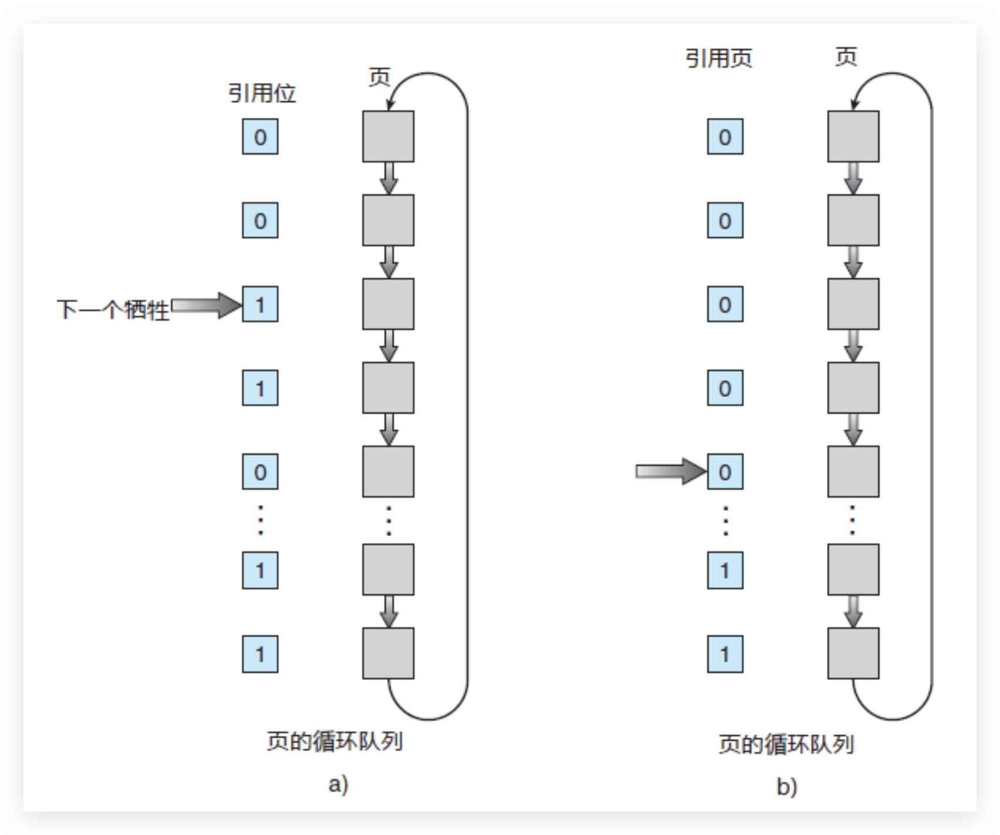

# 1 什么是虚拟内存？

我们实际的物理内存主要是主存，但是物理主存空间有限，所以一般现代操作系统都会想办法把一部分内存块放到磁盘中，用到的时候再装入主存，但是对用户程序而言，是不需要注意实际的物理内存的，为什么呢？因为有`虚拟内存`的机制。

**简单说，虚拟内存是操作系统提供的⼀种机制，将不同进程的虚拟地址和不同内存的物理地址映射起来。**
每个进程都有自己独立的地址空间，再由操作系统映射到到实际的物理内存。

于是，这⾥就引出了两种地址的概念：
程序所使⽤的内存地址叫做**虚拟内存地址**（_Virtual Memory Address_）
实际存在硬件⾥⾯的空间地址叫**物理内存地址**（_Physical Memory Address_）。

虚拟内存

# 2 什么是内存分段？

程序是由若⼲个逻辑分段组成的，如可由代码分段、数据分段、栈段、堆段组成。不同的段是有不同的属性的，所以就⽤分段（Segmentation）的形式把这些段分离出来。
分段机制下的虚拟地址由两部分组成，**段号**和**段内偏移量**。
虚拟地址和物理地址通过段表映射，段表主要包括**段号**、`段的界限`。

虚拟地址、段表、物理地址

我们来看一个映射，虚拟地址：段 3、段偏移量 500 ----> 段基地址 7000+段偏移量 500 ----> 物理地址：8700+。

段虚拟地址映射

# 3 什么是内存分页？

**分⻚是把整个虚拟和物理内存空间切成⼀段段固定尺⼨的⼤⼩**。这样⼀个连续并且尺⼨固定的内存空间，我们叫**⻚**（_Page_）。在 Linux 下，每⼀⻚的⼤⼩为 4KB 。
访问分页系统中内存数据需要两次的内存访问 ：一次是从内存中访问页表，从中找到指定的物理页号，加上页内偏移得到实际物理地址，第二次就是根据第一次得到的物理地址访问内存取出数据。

内存分页

# 4 多级页表知道吗？

操作系统可能会有非常多进程，如果只是使用简单分页，可能导致的后果就是页表变得非常庞大。
所以，引入了多级页表的解决方案。

所谓的多级页表，就是把我们原来的单级页表再次分页，这里利用了`局部性原理`，除了顶级页表，其它级别的页表一来可以在需要的时候才被创建，二来内存紧张的时候还可以被置换到磁盘中。

多级页表示意图

# 5 什么是快表？

同样利用了`局部性原理`，即在⼀段时间内，整个程序的执⾏仅限于程序中的某⼀部分。相应地，执⾏所访问的存储空间也局限于某个内存区域。

利⽤这⼀特性，把最常访问的⼏个⻚表项存储到访问速度更快的硬件，于是计算机科学家们，就在 CPU 芯⽚中，加⼊了⼀个专⻔存放程序最常访问的⻚表项的 Cache，这个 Cache 就是 TLB（_Translation Lookaside Buffer_） ，通常称为⻚表缓存、转址旁路缓存、快表等。

# 6 分段和分页有什么区别
- 段是信息的逻辑单位，它是根据用户的需要划分的，因此段对用户是可见的 ；页是信息的物理单位，是为了管理主存的方便而划分的，对用户是透明的。
- 段的大小不固定，有它所完成的功能决定；页的大小固定，由系统决定
- 段向用户提供二维地址空间；页向用户提供的是一维地址空间
- 段是信息的逻辑单位，便于存储保护和信息的共享，页的保护和共享受到限制。

# 7 什么是交换空间？ swap space

操作系统把物理内存(Physical RAM)分成一块一块的小内存，每一块内存被称为页(page)。

当内存资源不足时，Linux 把某些页的内容转移至磁盘上的一块空间上，以释放内存空间。
磁盘上的那块空间叫做交换空间(swap space)，而这一过程被称为交换(swapping)。物理内存和交换空间的总容量就是虚拟内存的可用容量。

用途
- 物理内存不足时一些不常用的页可以被交换出去，腾给系统。
- 程序启动时很多内存页被用来初始化，之后便不再需要，可以交换出去。

# 8 什么是缺页中断？Page Fault

> 2024 年 03 月 29 日增补

缺页中断（Page Fault）是虚拟内存管理的一个重要概念。当一个程序访问的页（页面）不在物理内存中时，就会发生缺页中断。操作系统需要从磁盘上的交换区（或页面文件）中将缺失的页调入内存。

举个例子，你正在一间图书馆（内存）里查找一本特定的书（数据/程序页），图书馆的书架（内存空间）能放的书是有限的。现在，如果你找的那本书正好在书架上，那太好了，直接拿来阅读（内存命中）。

但如果书架上没有（缺页），你需要先去找图书管理员。

图书管理员（操作系统）注意到书架上缺了这本书，然后去仓库里帮你找（缺页中断）。找到书之后，管理员发现书架已经满了，需要先从书架上拿掉一本书（页面置换算法决定哪本书被拿掉），然后把新找到的书放上去，最后把书递给你。

这个过程中，“去仓库找书并换回来”的这一过程就像是发生了缺页中断，而决定哪本书被移出书架以腾出位置放新书的规则，就是页面置换算法在做的事情。

这么做的目的是尽量确保你常读的书都能在书架（内存）上直接找到，避免每次都要去仓库（硬盘）搜寻，因为去仓库找书的过程比较耗时。

# 9 页面置换算法有哪些？ Page Replacement Algorithms

https://www.cnblogs.com/Leophen/p/11397699.html
https://www.geeksforgeeks.org/page-replacement-algorithms-in-operating-systems/

推荐阅读：[页面置换算法详解](https://www.cnblogs.com/Leophen/p/11397699.html)

页面置换算法的目标是最小化缺页中断的次数，常见的页面置换算法有最佳⻚⾯置换算法（_OPT_）、先进先出置换算法（_FIFO_）、最近最久未使⽤的置换算法（_LRU_）和时钟页面置换算法等。

三分恶面渣逆袭：常见页面置换算法

## 9.1 **先进先出置换算法** FIFO

基本思路是，优先淘汰最早进入内存的页面。FIFO 算法维护一个队列，新来的页面加入队尾，当发生页面置换时，队头的页面（即最早进入内存的页面）被移出。

三分恶面渣逆袭：按照进入内存早晚构建的页面链表

FIFO 算法是最简单的页面置换算法。FIFO 页面置换算法为每个页面记录了调到内存的时间，当必须置换页面时会选择最旧的页面
“FIFO 算法当进程分配到的页面数增加时，缺页中断的次数可能增加也可能减少”

FIFO 算法基于队列实现，不是堆栈类算法
注意，并不需要记录调入页面的确切时间，可以创建一个 FIFO 队列，来管理所有的内存页面。置换的是队列的首个页面。当需要调入页面到内存时，就将它加到队列的尾部
FIFO 页面置换算法易于理解和编程。然而，它的性能并不总是十分理想：
    其一，所置换的页面可以是很久以前使用过但现已不再使用的初始化模块
    其二，所置换的页面可以包含一个被大量使用的变量，它早就初始化了，但仍在不断使用

----

****1. First In First Out (FIFO):**** This is the simplest page replacement algorithm. In this algorithm, the operating system keeps track of all pages in the memory in a queue, the oldest page is in the front of the queue. When a page needs to be replaced page in the front of the queue is selected for removal. 

****Example 1:**** Consider page reference string 1, 3, 0, 3, 5, 6, 3 with 3 page frames.Find the number of page faults. 

Initially, all slots are empty, so when 1, 3, 0 came they are allocated to the empty slots —> ****3 Page Faults.****   
when 3 comes, it is already in memory so —> ****0 Page Faults.**** Then 5 comes, it is not available in memory so it replaces the oldest page slot i.e 1. —>****1 Page Fault.**** 6 comes, it is also not available in memory so it replaces the oldest page slot i.e 3 —>****1 Page Fault.**** Finally, when 3 come it is not available so it replaces 0 ****1 page fault.**** 

[****Belady’s anomaly****](https://www.geeksforgeeks.org/operating-system-beladys-anomaly/) proves that it is possible to have more page faults when increasing the number of page frames while using the First in First Out (FIFO) page replacement algorithm.  For example, if we consider reference strings 3, 2, 1, 0, 3, 2, 4, 3, 2, 1, 0, 4, and 3 slots, we get 9 total page faults, but if we increase slots to 4, we get 10-page faults.

## 9.2 **最佳⻚⾯置换算法** OPT Optimal Page replacement:

基本思路是，淘汰以后不会使用的页面。这是理论上的最佳算法，因为它可以保证最低的缺页率。但在实际应用中，由于无法预知未来的访问模式，OPT 通常无法实现。
发现 Belady 异常的一个结果是寻找最优页面置换算法，这个算法具有所有算法的最低的缺页错误率，并且不会遭受 Belady 异常。这种算法确实存在，它被称为 OPT 或 MIN

这种页面置换算法确保对于给定数量的帧会产生最低的可能的缺页错误率
FIFO 和 OPT 算法的区别在于：除了在时间上向后或向前看之外，FIFO 算法使用的是页面调入内存的时间，OPT 算法使用的是页面将来使用的时间

----

In this algorithm, pages are replaced which would not be used for the longest duration of time in the future. 

****Example-2:**** Consider the page references 7, 0, 1, 2, 0, 3, 0, 4, 2, 3, 0, 3, 2, 3 with 4 page frame. Find number of page fault. 

Initially, all slots are empty, so when 7 0 1 2 are allocated to the empty slots —> ****4 Page faults****   
0 is already there so —> ****0 Page fault.**** when 3 came it will take the place of 7 because it is not used for the longest duration of time in the future.—>****1 Page fault.**** 0 is already there so —> ****0 Page fault.**** 4 will takes place of 1 —> ****1 Page Fault.**** 

Now for the further page reference string —> ****0 Page fault**** because they are already available in the memory.   
Optimal page replacement is perfect, but not possible in practice as the operating system cannot know future requests. The use of Optimal Page replacement is to set up a benchmark so that other replacement algorithms can be analyzed against it.

## 9.3 **最近的最少被使⽤(最长时没有被使用)的置换算法**  LRU   Least Recently Used

基本思路是，淘汰最近没有使用的页面。LRU 算法根据页面的访问历史来进行置换，最长时间未被访问的页面将被置换出去。
相对更接近最优算法的效果，因为最近未使用的页面可能在将来也不会被使用。但 LRU 算法的实现需要跟踪页面的访问历史，可能会增加系统的开销。

选择最近最长时间未访问过的页面予以淘汰，它认为过去一段时间内未访问过的页面，在最近的将来可能也不会被访问。该算法为每个页面设置一个访问字段，来记录页面自上次被访问以来所经历的时间，淘汰页面时选择现有页面中值最大的予以淘汰

OPT 和 LRU 算法的区别在于：LRU 算法根据各页以前的情况，是“向前看”的，而最佳置换算法则根据各页以后的使用情况，是“向后看”的  
LRU 性能较好，但需要寄存器和栈的硬件支持

LRU 是堆栈类的算法，理论上可以证明，堆栈类算法不可能出现 Belady 异常

----

In this algorithm, page will be replaced which is least recently used. 

****Example-3:**** Consider the page reference string 7, 0, 1, 2, 0, 3, 0, 4, 2, 3, 0, 3, 2, 3 with 4 page frames. Find number of page faults. 

Initially, all slots are empty, so when 7 0 1 2 are allocated to the empty slots —> ****4 Page faults****   
0 is already their so —> ****0 Page fault.**** when 3 came it will take the place of 7 because it is least recently used —>****1 Page fault****   
0 is already in memory so —> ****0 Page fault****.   
4 will takes place of 1 —> ****1 Page Fault****   
Now for the further page reference string —> ****0 Page fault**** because they are already available in the memory.

## 9.4 **时钟页面置换算法** CLOCK

时钟算法是 LRU 的一种近似和实现简单的形式。它通过一个循环列表（类似时钟的指针）遍历页面，每个页面有一个使用位，当页面被访问时，使用位设置为 1。

当需要页面置换时，时钟指针会顺时针移动，直到找到使用位为 0 的页面进行置换。这个过程类似于给每个页面一个二次机会。算法执行时，会先将使用位从 1 清零，如果该页面再次被访问，它的使用位再次被设置为 1。

简单的 CLOCK 算法是给每一帧关联一个附加位，称为使用位。
当某一页首次装入主存时，该帧的使用位设置为1;
当该页随后再被访问到时，它的使用位也被置为1。

对于页替换算法，用于替换的候选帧集合看做一个循环缓冲区，并且有一个指针与之相关联。
当某一页被替换时，该指针被设置成指向缓冲区中的下一帧。
当需要替换一页时，操作系统扫描缓冲区，以查找使用位被置为0的一帧。
==每当遇到一个使用位为1的帧时，操作系统就将该位重新置为0；==
如果在这个过程开始时，缓冲区中所有帧的使用位均为0，则选择遇到的第一个帧替换；
如果所有帧的使用位均为1,则指针在缓冲区中完整地循环一周，把所有使用位都置为0，并且停留在最初的位置上，替换该帧中的页。
由于该算法循环地检查各页面的情况，故称为 CLOCK 算法，又称为最近未用( Not Recently Used, NRU )算法。

## 9.5 **最不常⽤置换算法**  LFU 

根据页面被访问的频率进行置换，访问次数最少的页面最先被置换。实现较为复杂，需要记录每个页面的访问频率。

最不经常使用（LFU）页面置换算法要求置换具有最小计数的页面。

这种选择的原因是，积极使用的页面应当具有大的引用计数。然而，当一个页面在进程的初始阶段大量使用但是随后不再使用时，会出现问题。由于被大量使用，它有一个大的计数，即使不再需要却仍保留在内存中。一种解决方案是，定期地将计数右移 1 位，以形成指数衰减的平均使用计数。

## 9.6 MFU（最常使用算法）

最经常使用（MFU）页面置换算法是基于如下论点：
具有最小计数的页面可能刚刚被引入并且尚未使用。

MFU 和 LFU 置换都不常用。这些算法的实现是昂贵的，并且它们不能很好地近似 OPT 置换。

## 9.7 Most Recently Used (MRU)

In this algorithm, page will be replaced which has been used recently. Belady’s anomaly can occur in this algorithm.

Initially, all slots are empty, so when 7 0 1 2 are allocated to the empty slots —> ****4 Page faults**** 

0 is already their so–> ****0 page fault****

when 3 comes it will take place of 0 because it is most recently used —>****1 Page fault**** 

when 0 comes it will take place of 3  —>****1 Page fault**** 

when 4 comes it will take place of 0  —>****1 Page fault**** 

2 is already in memory so —> ****0 Page fault****

when 3 comes it will take place of 2  —>****1 Page fault**** 

when 0 comes it will take place of 3  —>****1 Page fault**** 

when 3 comes it will take place of 0  —>****1 Page fault**** 

when 2 comes it will take place of 3  —>****1 Page fault**** 

when 3 comes it will take place of 2  —>****1 Page fault****