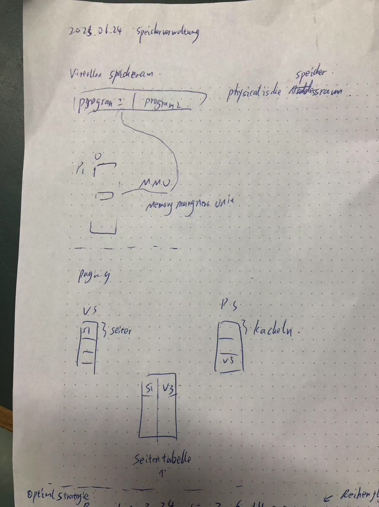
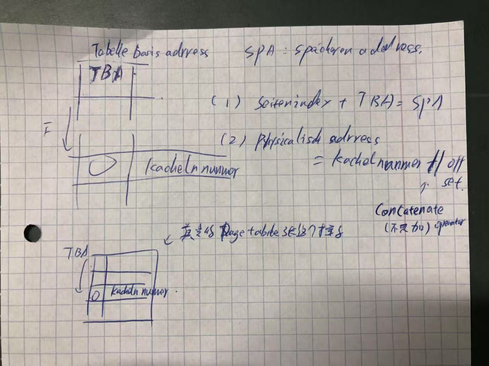
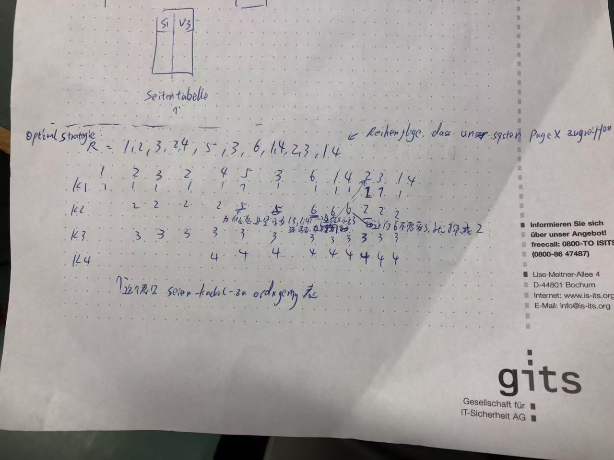
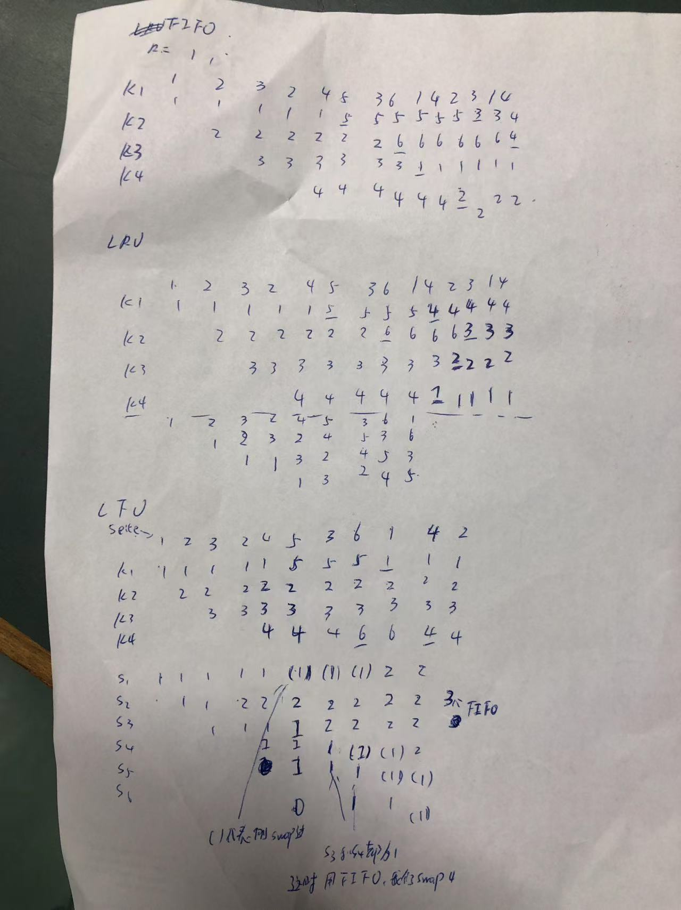

# 1 Segmentierung und Paging in Speicherbereiche

当然可以！我们来详细解释一下 **Segmentierung（段式管理）** 和 **Paging（分页管理）**，它们都是现代操作系统中用于 **内存管理（Speicherverwaltung）** 的机制，用来将程序逻辑地址转换为实际的物理地址，并且提高内存的利用率与安全性。

**Segmentierung 与 Paging 的共同目的：**
- 把程序从连续的大块内存需求中“解放”出来    
- 提供更灵活、更高效的内存使用方式
- 实现虚拟地址空间 → 物理地址空间的映射

| 比较项     | Segmentierung（段式） | Paging（分页）     |
| ------- | ----------------- | -------------- |
| 内存单位    | 可变大小的段（逻辑结构）      | 固定大小的页（物理结构）   |
| 地址结构    | 段号 + 段内偏移         | 页号 + 页内偏移      |
| 是否支持模块化 | ✅ 是               | ❌ 否（分页不理解程序结构） |
| 碎片类型    | 外部碎片              | 内部碎片           |
| 管理复杂度   | 较高                | 较低             |
|         |                   |                |
|         |                   |                |

## 1.1 Paging

- 将 **虚拟地址空间** 和 **物理内存** 分别划分成大小一致的块：
    
    - **虚拟页（Page）**
        
    - **物理块 / 页框（Frame）**
        
- 程序访问的虚拟地址通过页表（Page Table）转换为物理地址。

| 虚拟页号   | →   | 页表查找 → 对应页框号 | →   | 物理地址             |
| ------ | --- | ------------ | --- | ---------------- |
| Page 2 | →   | Frame 5      | →   | Frame 5 + Offset |

✅ 优点：
    避免外部碎片（External Fragmentation）
    地址空间分配简单统一（所有页大小一致）
    易于实现虚拟内存

❌ 缺点：
    可能出现内部碎片（一个页最后没用完）

## 1.2 **Segmentierung（段式管理）

——将内存按逻辑功能划分为“段”**

- 把程序划分为逻辑模块（**段**），每个段表示某类内容，例如：
    - 代码段（Code Segment）
    - 数据段（Data Segment）
    - 堆栈段（Stack Segment）
- 每个段可以大小不同，并独立增长。
- 虚拟地址由两部分组成：
    - **段号（Segment Number）**
    - **段内偏移（Offset）**
- 段表（Segment Table）用于记录每个段的基地址（起始物理地址）和段长。

| 虚拟地址 = 段号 + 偏移 | → | 段表查找 → 得到段起始地址 | → | 物理地址 = 起始地址 + 偏移 |

优点：
- 更贴近程序结构（模块化）
- 各段独立管理，方便保护与共享
- 无内部碎片（段按需大小分配）

缺点：
- 易产生 **外部碎片**
- 段大小不固定，管理相对复杂

## 1.3 **分页段式（Segmented Paging）**

现代操作系统（如 x86 架构）常采用 **分页+段式结合的方式**：

- 先通过段表确定段的起始页表
- 然后再用页表进行分页管理  
    → 既支持逻辑结构划分，又实现了分页的物理内存效率。

## 1.4 Page Fault and Segementation Fault 

|Fehlerart|Beschreibung|
|---|---|
|**Page Fault**|Seite ist nicht im RAM – Betriebssystem lädt sie nach.|
|**Segmentation Fault**|Verbotener Speicherzugriff – Prozess wird beendet.|

### 1.4.1 Page Fault

Ein **Page Fault** (Seitenfehler) tritt auf, wenn ein Prozess auf eine **Seite zugreift**, die sich **nicht im Hauptspeicher** befindet.

 Ablauf bei einem Page Fault:

1. Prozess greift auf eine virtuelle Seite `X` zu.
2. MMU sieht: Seite `X` ist **nicht im RAM**
3. → Betriebssystem löst **Page Fault** aus.
4. Seite `X` wird aus der Festplatte (Swap) in den RAM geladen.
5. Falls nötig: Eine andere Seite wird **ausgelagert** (nach Replacement-Strategie).  (就是这个 Seite 从 Seite 中被抛弃 )
6. Zugriff wird wiederholt, jetzt erfolgreich.

Zusammenhang mit Paging:

- Page Faults sind ein **normaler Teil des Paging-Mechanismus**, aber **zu viele Page Faults** (Thrashing) machen das System sehr langsam.

### 1.4.2 **Segmentation Fault（段错误）

Ein **Segmentation Fault** (kurz: **Segfault**) ist ein **Laufzeitfehler**, der auftritt, wenn ein Programm **unerlaubt auf einen Speicherbereich zugreift**, z. B. eine Speicheradresse, die **nicht zugewiesen** oder **geschützt** ist.

Das Programm versucht, in einen Speicherbereich zu **lesen oder schreiben**, den es **nicht benutzen darf** – und das Betriebssystem **stoppt** es sofort.

# 2 **Paging**: Zusammenhang mit virtuelle Addresse 

Welche Aufgabe übernimmt das Paging in diesem Zusammenhang?**
- Teilt den virtuellen Speicher und den physischen Speicher in gleich große Blöcke (Seiten bzw. Kacheln/Frames).
- Die Zuordnung zwischen virtuellen Seiten und physischen Kacheln erfolgt durch eine **Seitentabelle**.
- Beim Zugriff auf eine virtuelle Adresse wird geprüft, ob die entsprechende Seite im RAM ist (Page Hit). Wenn nicht, kommt es zu einem **Seitenfehler (Page Fault)**, und das Betriebssystem lädt die Seite in eine Kachel (ggf. mit Verdrängung einer anderen Seite).

Seitentabelle: map the seite in virturelle speicher raum into   kacheln in pyhsicallische Speicher raum 

In einem **Paging-System** wird der virtuelle Speicher in **Seiten (Pages)** und der physische Speicher in **Kacheln (Frames)** unterteilt. Die **Seitentabelle (Page Table)** ist eine **Datenstruktur**, die diese beiden Welten miteinander verbindet.

Die Seitentabelle wird vom **Betriebssystem** verwendet, um **virtuelle Adressen in physische Adressen** umzuwandeln.

## 2.1 Virtuelle Speicheradressen

In einem **Paging-System** wird der virtuelle Speicher in **Seiten (Pages)** und der physische Speicher in **Kacheln (Frames)** unterteilt. Die **Seitentabelle (Page Table)** ist eine **Datenstruktur**, die diese beiden Welten miteinander verbindet.

**Warum ist es sinnvoll, virtuelle Speicheradressen zu verwenden? 
**Virtuelle Speicheradressen** ermöglichen es einem Betriebssystem, Speicher effizienter und sicherer zu verwalten. Die wichtigsten Vorteile sind:

1. **Abstraktion des physischen Speichers**: Jeder Prozess kann so tun, als hätte er einen zusammenhängenden, exklusiven Speicherbereich – unabhängig vom physischen RAM.
2. **Schutz**: Prozesse können nicht auf den Speicher anderer Prozesse zugreifen.
3. **Speicherverwaltung**: Der Speicher kann fragmentiert sein, aber durch Paging lässt sich diese Fragmentierung verstecken.
4. **Swapping**: Teile von Programmen können auf die Festplatte ausgelagert werden, wenn der RAM voll ist.

Vorteil von virtuelle Speicheraddres 
- Speicherschutz
- Frogmentierung 
    - einfachere Speicherverantwortung 
- Erweiterung von Speicher 

## 2.2 Page table: Virtuelle Adresse → Physische Adresse:

| Merkmal     | Beschreibung                                              |
| ----------- | --------------------------------------------------------- |
| Zweck       | Übersetzt virtuelle Seiten in physische Frames            |
| Speicherort | Hauptspeicher, manchmal teilweise im TLB (Cache)          |
| Benutzt von | MMU (Memory Management Unit)                              |
| Enthält     | Frame-Nummer, Statusbits (valid, dirty, protection, etc.) |
| Wichtig für | Speicher                                                  |

Eine virtuelle Adresse besteht aus:
- **Seitenummer (Page Number)**: Index in der Seitentabelle.
- **Offset**: Position innerhalb der Seite (bleibt gleich).

Die Seitentabelle sagt dem System:
- **In welchem Frame** (physischer Speicherblock) sich die Seite befindet.
- Ob die Seite überhaupt **geladen** ist (Valid Bit).
- Ob sie **verändert (dirty)** wurde.
- Zugriffsschutz (nur lesen? nur schreiben?).

---

Beispiel einer Seitentabelle 

|Virtuelle Seite|Physischer Frame|Valid Bit|Zugriffsschutz|
|---|---|---|---|
|0|5|1|Lesen/Schreiben|
|1|–|0|–|
|2|3|1|Nur Lesen|
|3|1|1|Lesen/Schreiben|

→ Wenn ein Prozess auf Seite 1 zugreift, gibt's einen **Seitenfehler**, weil sie nicht im Speicher ist (Valid Bit = 0). Das Betriebssystem muss die Seite laden.

---

**Wie wird die Seitentabelle verwendet?**
1. CPU erzeugt virtuelle Adresse z. B. `Seite 2 + Offset 50`
2. MMU (Memory Management Unit) sieht in der Seitentabelle nach → Seite 2 liegt im Frame 3.
3. Offset bleibt gleich → Physische Adresse = `Frame 3 + Offset 50`

**Schutzmechanismen durch die Seitentabelle**
- Verhindert, dass ein Prozess auf Speicherbereiche eines anderen Prozesses zugreift.
- Markiert Seiten als "nur lesbar", "nicht ausführbar" usw.
- Ermöglicht **Copy-on-Write** oder **Memory-Mapped Files**.

 Varianten der Seitentabelle
1. **Einfache flache Seitentabelle**
    - Für kleine Adressräume.
    - Jedes Page Table Entry (PTE) verweist direkt auf einen Frame.
2. **Mehrstufige Seitentabelle**
    - Spart Speicher bei großen Adressräumen (z. B. bei 64-bit CPUs).
    - Mehrere Tabellenstufen, um Platz zu sparen.
3. **Inverted Page Table**
    - Statt für **jede virtuelle Seite** eine Zeile, gibt es pro **physischem Frame** einen Eintrag.
    - Spart Platz bei großen virtuellen Adressräumen.

## 2.3 **Page Replacement Strategies**

When a page needs to be loaded into memory but all page frames are full, the system must decide **which page to remove**. This decision is made using a **replacement strategy**.

---

 **Optimal (OPT)**
- **Idea**: Replace the page that will **not be used for the longest time in the future**.
- **Usage**: Only for theoretical comparison — requires future knowledge, so not practical.
- **Best possible strategy** (lowest number of page faults).

✅ **Pros**: Minimum number of page faults  
❌ **Cons**: Not implementable in real systems

---

 **FIFO (First-In, First-Out)**
- **Idea**: Remove the **oldest loaded page** — the one that has been in memory the longest.
- **Simple queue-based implementation.**

✅ **Pros**: Simple to implement  
❌ **Cons**: Can remove frequently used pages (bad decisions)

---

 **LRU (Least Recently Used)**
- **Idea**: Remove the page that has **not been used for the longest time**.
- Assumes that pages used recently will likely be used again soon (**temporal locality**).
✅ **Pros**: Performs well in practice  
❌ **Cons**: More complex to implement (needs timestamps or stack)

langeste Zeit: in Computer   , gibt es eine list, 最近使用的page 下沉,  , 最近 没有被使用的 会上升 

---

**LFU (Least Frequently Used)**

- **Idea**: Remove the page that has been **used the least often**.
    
- Tracks how many times each page is accessed.
    

✅ **Pros**: Favors frequently used pages  
❌ **Cons**: Can keep old but rarely used pages if they were used often long ago (aging needed)

## 2.4 Auslagerungs Strategien

optimal : Ersetze die Seite, die **in Zukunft am längsten nicht mehr benötigt wird**.
FIFO (First-In, First-Out): :  swap the oldest page
LRU (Least Recently Used):: swap Seite, die am langsten nich benutzt wurde 
LFU (Least Frequently Used):: swap Seite die am wenigsten haeufig genutzt wurde 

gegeben sei ein physikalischer Speicher mit vier Kacheln. Auf folgende Seiten wird nacheinander
zugegriffen:
R = 1, 2, 3, 2, 4, 5, 3, 6, 1, 4, 2, 3, 1, 4
Geben Sie f¨ur jeden Speicherzugriff die jeweilige Seiten-Kachel-Zuordnung, alle notwendigen Da-
tenstrukturen (-, n¨achste Kachel, Stack, Z¨ahler) sowie die Anzahl der Seitenfehler (ohne Initialisie-
rungsfehler) f¨ur die Verdr¨angungsstrategien Optimal, FIFO, LRU und LFU an. Orientieren Sie sich
an den Beispielen in der Vorlesung

in welche kacheln wird das xx page gespeichern: Am Anfang, einen raodon leer Kacheln auswahlen 

---
optimale replacement steategy : 

---

FIFO:  swap the oldest page
LRU: swap Seite, die am langsten nich benutzt wurde 
LFU: swap Seite die am wenigsten haeufig genutzt wurde 

# 3 Adress uebersetzungsverfahren

virtuale address -> physichal address umwandeln 

Tabellenbasis addresse: 0x9E
Grosse der SeitenTabelle  2^4 = 16 Eintrag 
Bsp: Virtuelle addr 0xFF -> 11111111,  first F seiteindex 1111,  second F : offset 1111 

first F:  从 seite 的startindex 向下 平移 F (15) 个, 然后 在这个 speicherzeile 中的 kacheln nummer + offsert (15 ) 

## 3.1 Beispiel 

Aufgabe 5.2: Adress¨ubersetzungsverfahren (Tafel¨ubung)
a) Beschreiben Sie anhand der folgenden Grafik, wie das Adress¨ubersetzungsverfahren mittels einer
Seitentabelle funktioniert.

b) Ordnen Sie mithilfe der Seitentabelle den folgenden virtuellen Adressen ihre physische Adresse zu.
Der (physische) Speicher hat eine Gr¨oße von 28 = 256 Bytes. Die Seitentabelle liegt im (physischen)
Speicher an der Adresse 0x9E (Tabellenbasisadresse) und hat 24 = 16 Eintr¨age

virtuelle addresse-> physicalishe 
- 0x2B:   0x2B -> 0xFB      :    0x9E +0x2 = 0xA0  ,  0xF || 0xB   -> 0xFB .  0xF is die Daten im Seitentabelle an Stelle 0xA0     (  0xA0 is the stelle in Seitentablle )    0xF  是这 0xA0 对应的 kachelen 中藏有值   0xF  ,   但是 加上 offset B 才是对应才有的值   0xFB 
• 0xAF:       0x9F
• 0xC0:      0x60
• 0x03      0x03

Hinweis: Ermitteln Sie zun¨achst wie viel Bit f¨ur die Seitennummer bzw. f¨ur den Offset ben¨otigt
werden.

# 4 Speicherbelegungsstrategien 

|Strategie|Beschreibung|
|---|---|
|**First Fit**|Sucht den **ersten freien Block**, der groß genug ist.|
|**Best Fit**|Sucht den **kleinsten** passenden freien Block → spart Speicher, kann aber Fragmentierung erzeugen.|
|**Worst Fit**|Sucht den **größten** freien Block → Idee: genug Platz für spätere Nutzung.|
|**Next Fit**|Wie First Fit, aber die Suche beginnt **ab der letzten Einfügestelle**.|

|Ursache|Beispiel (in C)|
|---|---|
|Zugriff auf `NULL`-Zeiger|`int *p = NULL; *p = 10;`|
|Zugriff außerhalb eines Arrays|`int a[3]; a[10] = 5;`|
|Benutzung von bereits freigegebenem Speicher|`free(p); *p = 3;`|
|Stack Overflow (z. B. Endlosschleife in Rekursion)|`void f() { f(); }`|

 **Was macht das Betriebssystem dabei?**
Das Betriebssystem schützt Speicherbereiche durch Segmentierung und Paging. Wenn ein Programm versucht, diesen Schutz zu verletzen, z. B. in Speicher zu schreiben, der **read-only** oder **nicht zugeordnet** ist, wird ein **Segmentation Fault (SIGSEGV)** ausgelöst.

**Wie kann man Segfaults vermeiden?**

- Pointer immer initialisieren.
- Vor Zugriff prüfen, ob Pointer `NULL` ist.
- Speicher mit `malloc()` korrekt anfordern und mit `free()` freigeben.
- Tools wie **Valgrind** oder **AddressSanitizer** verwende
